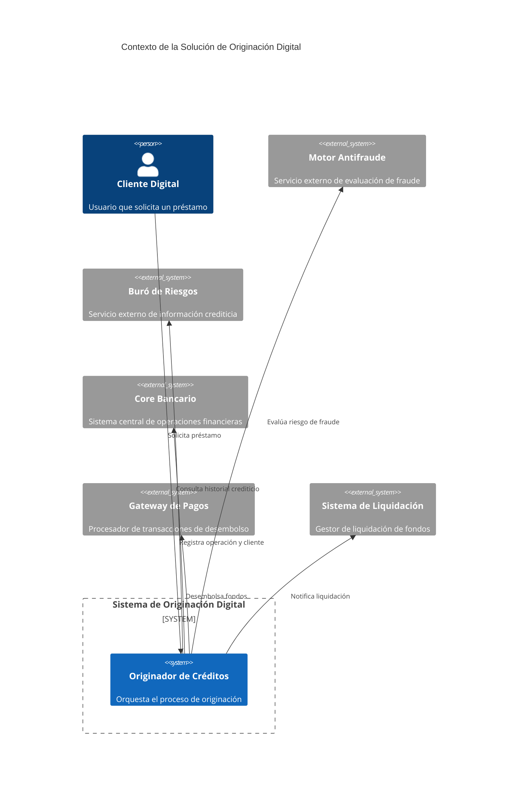
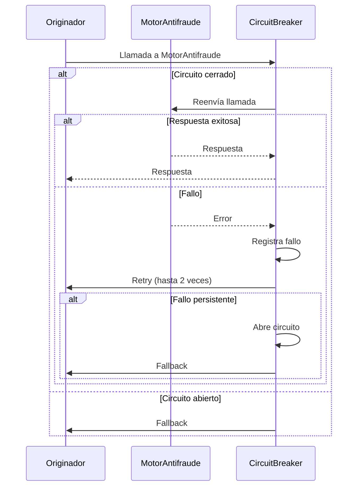
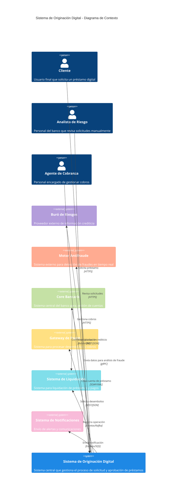
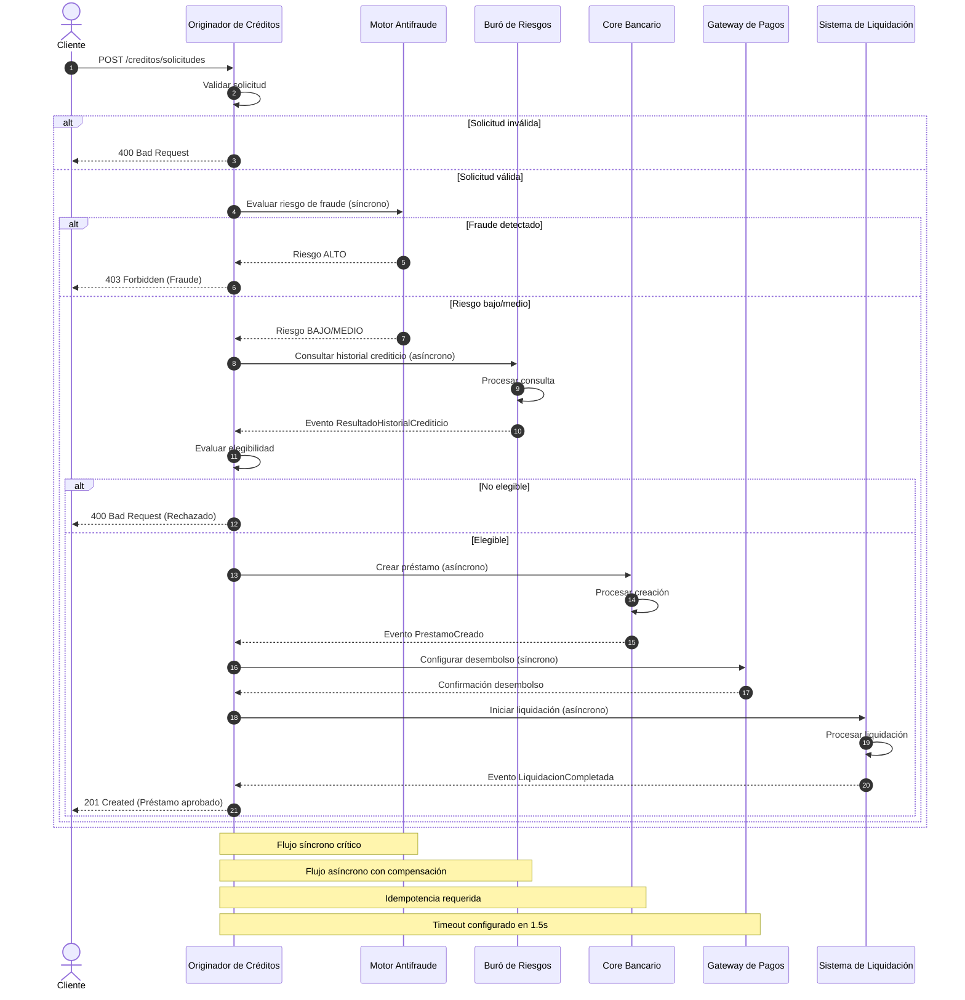

# Prompt para Mejorar el Codigo Base

Copia y pega el contenido del bloque de abajo en un asistente de IA (Claude, ChatGPT)
para obtener un ZIP con el proyecto completo y arrancable.

Si preferis trabajar en tu editor con un agente local (Claude Code, Cursor, Copilot), usa `AGENTS.md` en vez de este archivo: dice lo mismo pero para que escriba los archivos en disco.

## Las dos reglas que no se negocian

1. **Completa el boilerplate.** Todo lo que el proyecto necesita para compilar y arrancar: manifiesto de dependencias, punto de entrada, configuracion, capa de interfaz, y las capas del patron arquitectonico declarado. Eso es andamiaje y es tu trabajo.
2. **NO resuelvas el reto.** Los entregables de las fases son el trabajo de la persona. El hueco pedagogico se deja como esta: el proyecto arranca, pero lo que el reto pide implementar NO esta implementado.

Dicho de otra forma: si algo impide compilar, arreglalo. Si algo es logica de negocio incompleta, validaciones ausentes, un secreto hardcodeado o un patron mejorable, dejalo exactamente como esta — es lo que la persona tiene que encontrar.

## Superficie de practica — NO resuelvas

Estos archivos SON el ejercicio de la persona. No los implementes; deja stubs.

- `adr/004-decision-resiliencia.md` — El topic pide resiliencia: este archivo es el ejercicio.
- `adr/001-decision-arquitectura-base.md` — El topic pide decisiones de arquitectura: el ADR es el ejercicio.
- `adr/002-decision-manejo-carga.md` — El topic pide decisiones de arquitectura: el ADR es el ejercicio.
- `adr/003-decision-sincronia-asincronia.md` — El topic pide decisiones de arquitectura: el ADR es el ejercicio.

## Como saber que terminaste

```bash
python3 -c "import glob,sys; assert glob.glob('adr/*.md') and glob.glob('diagramas/*.mmd'), 'faltan ADRs o diagramas'"
```

Ese comando corriendo sin errores es la definicion de "listo".

---

```
## Briefing del reto (autoridad)
Este bloque manda sobre los archivos adjuntos. El stack y el rol salen de AQUÍ, no de un topic genérico ni de markdown placeholder.

### Perfil
Chapter Arquitectura, Especialidad Soluciones, Seniority Advanced

### Brecha de conocimiento
Sostiene las decisiones de arquitectura con atributos de calidad medibles y trade-offs explicitos

### Misión / candidato
Diseñar la solucion de originacion digital

### Datos adicionales
Candidato con 8 años de experiencia

### Reto
- Tema: Diseño de solución de extremo a extremo
- Seniority: advanced-l2
- Tipo: practical
- Título: Diseño de una solución de originación digital
- Tiempo estimado: 40 horas

### Fases (trabajo del HUMANO — PROHIBIDO completarlas)
No implementes estos entregables. Dejalos como hueco pedagógico. El asistente solo materializa el proyecto arrancable para que el participante pueda trabajar.
- Fase 1: Exploración del dominio y definición de requerimientos — objetivo: Identificar las instancias del dominio y sus interacciones, y definir los requerimientos funcionales y no funcionales de la solución. — entregable (NO resolver): Documento de requerimientos que incluye las instancias del dominio, sus interacciones, y los requerimientos funcionales y no funcionales de la solución.
- Fase 2: Diseño de la arquitectura de la solución — objetivo: Diseñar la arquitectura de la solución que cumpla con los requerimientos definidos en la fase anterior. — entregable (NO resolver): Diagrama de la arquitectura de la solución que incluye los componentes y sus responsabilidades, y un documento que describe los trade-offs y las decisiones de diseño.
- Fase 3: Evaluación y optimización de la solución — objetivo: Evaluar y optimizar la solución diseñada en la fase anterior, considerando los requerimientos no funcionales y los posibles modos de falla. — entregable (NO resolver): Documento que describe las áreas de mejora identificadas y las soluciones propuestas para optimizar la solución, y un documento que describe los trade-offs y las decisiones de diseño necesarias para optimizar la solución.
- Fase 4: Comunicación de la solución a las audiencias relevantes — objetivo: Comunicar la solución diseñada y optimizada a las audiencias relevantes, considerando sus necesidades y perspectivas. — entregable (NO resolver): Presentación que incluye los componentes de la solución, sus responsabilidades, y los trade-offs y decisiones de diseño tomadas, y un documento que describe las posibles preguntas y objeciones de las audiencias y las respuestas adecuadas.

Eres un asistente experto en análisis, corrección y generación de archivos de cualquier tipo:
código fuente, documentación, hojas de cálculo, documentos Word, configuraciones, entre otros.
Voy a enviarte una cadena de texto que contiene uno o más archivos. Cada archivo está delimitado por un marcador con el siguiente formato:
// === ARCHIVO: ruta/del/archivo.extension ===
o también puede aparecer como:
## === ARCHIVO: ruta/del/archivo.extension ===
Lo que sigue al marcador puede ser:

El contenido real del archivo (código, texto, YAML, etc.)
Una descripción en lenguaje natural de lo que debe contener el archivo


TU TAREA
PASO 0 — ¿Esto es un proyecto o una carcasa?
Antes de extraer archivos, leé el Briefing (si está) y diagnosticá el adjunto.

Es CARCASA si ocurre CUALQUIERA de estas:
- No hay manifiesto de dependencias del stack del briefing (manifest.json de VTEX IO / package.json / pom.xml / build.gradle / requirements.txt / go.mod / *.tf / *.csproj, según corresponda)
- Hay un "binario" que en realidad es un comentario ("no puede ser mostrado como texto plano", placeholder .fig/.docx vacío)
- Los markdowns ya completan entregables de fases posteriores ("se implementó fade-in", lista de áreas ya resuelta)

Si es CARCASA:
- MATERIALIZÁ un proyecto que arranca en el stack del briefing (VTEX IO Store Framework, Angular, Terraform, pytest, Nest, etc.). Incluí manifiesto, punto de entrada y capa de interfaz reales.
- NO copies los markdowns de "solución" como si fueran el producto. Son ruido de generación.
- NO resuelvas las fases del briefing (están marcadas PROHIBIDO). Dejá el hueco pedagógico: el flujo existe, las microinteracciones/calidad/infra que el reto pide NO están hechas.
- Después seguí al PASO 5 (ZIP).

Si es un proyecto REAL (manifiesto + código que compila o arranca):
- Seguí PASO 1 en adelante. 🔴 compilación sí. 🟡 pedagógico no.

PASO 1 — Detección y extracción
Identifica todos los archivos presentes en la cadena. Para cada archivo extrae:

Su ruta completa (ej: src/main/java/com/pragma/Service.java)
Su contenido o descripción

PASO 2 — Clasificación por tipo
Clasifica cada archivo en una de estas categorías:
A) Código fuente (Java, Python, TypeScript, JavaScript, Kotlin, etc.)
B) Configuración / documentación (YAML, properties, Markdown, JSON, txt, etc.)
C) Excel (.xlsx, .xls, .csv)
D) Word (.docx, .doc)
E) Otro tipo de archivo binario o especial
PASO 3 — Clasificación de errores en código fuente

Objetivo prioritario: que el proyecto compile. No corrijas flujo de negocio ni lógica funcional.

Antes de modificar cualquier archivo de código fuente, clasifica cada problema encontrado en una de estas dos categorías:
🔴 ERROR DE COMPILACIÓN — corregir siempre
Son errores que impiden que el proyecto arranque, sin valor pedagógico:

Import faltante o incorrecto
Clase, método o variable referenciada que no existe en ningún archivo del proyecto
Error de sintaxis
Anotación con atributos inválidos
Dependencia ausente en pom.xml, package.json, etc.
Archivo referenciado que no existe y debe ser creado con implementación mínima

→ CORREGIR estos errores.
🟡 PROBLEMA FUNCIONAL O DE CALIDAD — preservar siempre
Son problemas que no impiden compilar. Pueden ser intencionales para el aprendizaje:

Clave secreta hardcodeada ("secret", "password123")
API deprecada que funciona pero tiene reemplazo moderno
Lógica de negocio incorrecta o incompleta
Código redundante o de baja legibilidad
Falta de validaciones en flujo de negocio
Patrones de diseño incorrectos pero funcionales
Concurrencia no segura
Configuración funcional pero no óptima

→ PRESERVAR tal cual. No corregir, no mejorar, no comentar.
PASO 4 — Procesamiento según tipo de archivo
Tipo A — Código fuente
Aplica únicamente las correcciones clasificadas como 🔴 ERROR DE COMPILACIÓN.
No alteres ningún elemento clasificado como 🟡 PROBLEMA FUNCIONAL O DE CALIDAD.
Si falta un archivo referenciado, créalo con la implementación mínima necesaria para compilar.
Tipo B — Configuración / documentación
Extrae el contenido tal cual, sin modificaciones salvo errores evidentes de sintaxis
(ej: YAML mal indentado).
Tipo C — Excel (.xlsx)
Si viene con contenido real, genera el archivo respetando ese contenido.
Si viene con descripción en lenguaje natural, genera un archivo Excel funcional con:

Fila de encabezados en negrita con color de fondo distintivo
Columnas con ancho ajustado al contenido
Tipos de dato correctos por columna
Validaciones si la descripción lo indica
Hojas nombradas descriptivamente si hay más de una
Filas de ejemplo si no hay datos reales

Tipo D — Word (.docx)
Si viene con contenido real, genera el archivo respetando ese contenido.
Si viene con descripción en lenguaje natural, genera un documento Word funcional con:

Estilos de título (Título 1, Título 2) para jerarquía de secciones
Fuente legible (Calibri o equivalente), tamaño 11-12pt para cuerpo
Márgenes estándar
Tabla de contenido si tiene múltiples secciones
Tablas con encabezados en negrita si aplica

Tipo E — Otro
Genera el archivo con el contenido o estructura más apropiada según la descripción.
PASO 5 — Exportación en ZIP
Empaqueta todos los archivos en un único archivo ZIP descargable respetando exactamente
la estructura de rutas indicada por los marcadores.
El ZIP debe incluir:

Archivos de código con únicamente los errores de compilación corregidos
Archivos de configuración y documentación sin cambios
Archivos nuevos creados para resolver dependencias de compilación faltantes
Archivos Excel y Word generados desde descripción

IMPORTANTE: El ZIP debe estar listo para descargar al finalizar. No preguntes si el usuario
quiere generarlo. Simplemente genera el archivo y proporciona el enlace de descarga; No debes desplegar en el chat el resumen de lo que arreglaste al Zip, solo entregalo.

REGLAS IMPORTANTES

No omitas ningún archivo aunque no tenga errores ni modificaciones
Respeta los nombres y rutas exactas indicadas por los marcadores
Si un archivo no tiene marcador claro, infiere el nombre desde su contenido
Si la cadena contiene solo documentación, placeholders o binarios fake, NO la reproduzcas:
aplicá PASO 0 (materializar el proyecto del briefing). Reproducir la carcasa es un fallo.
No agregues texto después del enlace de descarga del ZIP
No preguntes si el usuario quiere el ZIP: simplemente generalo siempre
Si detectas que falta un archivo de configuración necesario para compilar
(pom.xml, package.json, requirements.txt, build.gradle, etc.), créalo e inclúyelo
inferiendo su contenido desde los imports y frameworks detectados en el código
Nunca corrijas problemas 🟡 aunque parezcan obvios o fáciles de mejorar.
El participante que recibirá este proyecto los debe encontrar y resolver él mismo.


INPUT
Aquí está la cadena con los archivos:

// === ARCHIVO: atributos-de-calidad.md ===
# Atributos de Calidad

## Introducción
Este documento define los atributos de calidad críticos para la solución de originación digital de préstamos, junto con sus escenarios, métricas y umbrales. Los atributos se priorizan según su impacto en los objetivos del negocio y los requerimientos no funcionales.

---

## Atributos de Calidad

### 1. Disponibilidad
**Escenario**: El sistema debe estar disponible para procesar solicitudes de préstamos durante el horario de operación del banco (24/7), con excepción de ventanas de mantenimiento programadas.
**Métrica**: Porcentaje de tiempo de disponibilidad mensual.
**Umbral**: 99.9% (equivalente a ~43.2 minutos de downtime no programado por mes).
**Justificación**: Un SLA de 99.9% es estándar para sistemas financieros críticos, donde la indisponibilidad puede generar pérdidas económicas y daño reputacional.

---

### 2. Latencia
**Escenario**: El sistema debe procesar el 95% de las solicitudes de préstamos en menos de 2 segundos durante horas pico (1,500 solicitudes por segundo).
**Métrica**: Tiempo de respuesta percentil 95 (P95) para solicitudes exitosas.
**Umbral**: ≤ 2 segundos.
**Justificación**: Una latencia superior a 2 segundos afecta la experiencia del usuario y aumenta la tasa de abandono de solicitudes. El umbral se basa en benchmarks de la industria para sistemas de originación digital.

---

### 3. Throughput
**Escenario**: El sistema debe soportar un volumen pico de 1,500 solicitudes por segundo durante horas de máxima demanda.
**Métrica**: Número de solicitudes procesadas por segundo (RPS).
**Umbral**: ≥ 1,500 RPS.
**Justificación**: El volumen pico se calculó en base a proyecciones de crecimiento del banco y patrones históricos de demanda. Superar este umbral garantiza que el sistema no se convierta en un cuello de botella.

---

### 4. Escalabilidad
**Escenario**: El sistema debe escalar horizontalmente para manejar aumentos repentinos en la demanda sin degradación de desempeño.
**Métrica**: Tiempo requerido para escalar horizontalmente (ej. agregar instancias adicionales).
**Umbral**: ≤ 5 minutos para escalar a 2x la capacidad actual.
**Justificación**: La escalabilidad horizontal permite manejar picos de demanda sin sobre-aprovisionamiento, optimizando costos. El umbral de 5 minutos se alinea con las capacidades de auto-scaling de plataformas cloud como AWS.

---

### 5. Seguridad
**Escenario**: El sistema debe proteger los datos sensibles de los clientes (ej. información personal y financiera) contra accesos no autorizados y ataques externos.
**Métrica**: Número de incidentes de seguridad reportados y tiempo promedio de resolución.
**Umbral**:
- 0 incidentes de fuga de datos por año.
- Tiempo de resolución ≤ 1 hora para incidentes críticos.
**Justificación**: La seguridad es un requisito legal y regulatorio (ej. GDPR, LGPD). Cualquier incidente puede resultar en multas y pérdida de confianza del cliente.

---

### 6. Resiliencia
**Escenario**: El sistema debe recuperarse automáticamente de fallos parciales (ej. caída de un servicio externo como el buró de riesgos) sin afectar la disponibilidad global.
**Métrica**: Tiempo medio de recuperación (MTTR) y tasa de éxito en fallos parciales.
**Umbral**:
- MTTR ≤ 30 segundos.
- Tasa de éxito ≥ 99.9% para fallos parciales.
**Justificación**: La resiliencia garantiza que el sistema continúe operando incluso ante fallos de componentes individuales, cumpliendo con el SLA de disponibilidad.

---

### 7. Consistencia
**Escenario**: El sistema debe garantizar que los datos críticos (ej. estado de una solicitud de préstamo) sean consistentes en todos los componentes, incluso en presencia de fallos.
**Métrica**: Número de inconsistencias detectadas en auditorías.
**Umbral**: 0 inconsistencias en datos críticos por mes.
**Justificación**: La inconsistencia en datos financieros puede llevar a decisiones erróneas (ej. aprobar un préstamo a un cliente con historial de impagos). El umbral refleja la tolerancia cero para errores en este contexto.

---

### 8. Auditabilidad
**Escenario**: El sistema debe registrar todas las acciones críticas (ej. aprobación/rechazo de préstamos, cambios en datos del cliente) para cumplir con requisitos regulatorios.
**Métrica**: Porcentaje de acciones críticas registradas y accesibles para auditoría.
**Umbral**: 100% de acciones críticas registradas con trazabilidad completa.
**Justificación**: La auditabilidad es un requisito legal para sistemas financieros. La trazabilidad completa permite reconstruir eventos en caso de disputas o auditorías.

---

### 9. Mantenibilidad
**Escenario**: El sistema debe permitir modificaciones y correcciones con un esfuerzo mínimo, facilitando la incorporación de nuevos requisitos.
**Métrica**: Tiempo promedio para implementar un cambio (ej. agregar un nuevo campo a la solicitud de préstamo).
**Umbral**: ≤ 2 días para cambios de complejidad media.
**Justificación**: La mantenibilidad reduce el costo total de propiedad (TCO) del sistema y acelera la entrega de valor al negocio.

---

### 10. Interoperabilidad
**Escenario**: El sistema debe integrarse sin problemas con sistemas externos (ej. buró de riesgos, core bancario, gateway de pagos) usando estándares abiertos.
**Métrica**: Número de integraciones exitosas sin necesidad de adaptadores personalizados.
**Umbral**: 100% de integraciones usando estándares abiertos (ej. REST, AsyncAPI, OpenAPI).
**Justificación**: La interoperabilidad reduce la dependencia de proveedores específicos y facilita la incorporación de nuevos socios tecnológicos.

---

## Matriz de Priorización
| Atributo          | Prioridad | Impacto en Negocio          | Riesgo si no se Cumple                     |
|-------------------|-----------|-----------------------------|--------------------------------------------|
| Disponibilidad    | Alta      | Pérdida de ingresos         | Multas regulatorias, daño reputacional     |
| Latencia          | Alta      | Experiencia del usuario     | Aumento en tasa de abandono                |
| Throughput        | Alta      | Capacidad de procesamiento  | Cuellos de botella, saturación del sistema  |
| Seguridad         | Alta      | Protección de datos         | Multas, pérdida de confianza               |
| Resiliencia       | Media     | Continuidad del servicio    | Downtime no programado                     |
| Consistencia      | Media     | Precisión de datos          | Decisiones erróneas, fraudes               |
| Auditabilidad     | Media     | Cumplimiento legal          | Sanciones regulatorias                     |
| Escalabilidad     | Media     | Crecimiento futuro          | Sobrecostos en infraestructura             |
| Mantenibilidad    | Baja      | Tiempo de desarrollo        | Mayor costo de cambios                     |
| Interoperabilidad | Baja      | Flexibilidad                | Dependencia de proveedores                 |

---

## Ejemplo de Escenario Detallado: Latencia
**Contexto**:
Durante horas pico, el sistema recibe un promedio de 1,500 solicitudes por segundo. Cada solicitud requiere consultar múltiples servicios externos (buró de riesgos, motor antifraude) y procesar lógica de negocio compleja (calificación crediticia, reglas de aprobación).

**Secuencia de Eventos**:
1. El usuario envía una solicitud de préstamo desde la app móvil.
2. El sistema valida los datos básicos de la solicitud.
3. Se consulta el buró de riesgos para obtener el historial crediticio del cliente.
4. Se ejecuta el motor antifraude para detectar posibles fraudes.
5. Se calcula la calificación crediticia y se aplican reglas de aprobación.
6. Se actualiza el estado de la solicitud en la base de datos.
7. Se notifica al usuario el resultado de la solicitud.

**Métricas y Umbrales**:
- **Tiempo de respuesta P95**: ≤ 2 segundos.
- **Tiempo de respuesta máximo**: ≤ 5 segundos.
- **Tasa de éxito**: ≥ 99% (excluyendo errores del cliente).

**Riesgos**:
- **Riesgo 1**: Consultas bloqueantes a servicios externos (ej. buró de riesgos) aumentan la latencia.
  - **Mitigación**: Implementar timeouts y circuit breakers para evitar bloqueos.
- **Riesgo 2**: Procesamiento secuencial de reglas de negocio incrementa el tiempo de respuesta.
  - **Mitigación**: Paralelizar consultas a servicios externos y procesamiento de reglas.
- **Riesgo 3**: Sobrecarga de la base de datos durante horas pico.
  - **Mitigación**: Usar caché para datos frecuentes y optimizar consultas.

---

## Conclusión
Los atributos de calidad definidos en este documento son críticos para el éxito de la solución de originación digital. Cada atributo se ha priorizado según su impacto en el negocio y se ha acompañado de métricas y umbrales medibles para garantizar su cumplimiento. Estos atributos servirán como base para las decisiones de diseño y las evaluaciones de la solución en las fases posteriores.

// === ARCHIVO: riesgos-y-mitigaciones.md ===
# Riesgos y Mitigaciones

## Introducción
Este documento identifica los riesgos técnicos y operativos asociados a la solución de originación digital de préstamos, priorizados según su impacto y probabilidad. Para cada riesgo, se propone una estrategia de mitigación alineada con los atributos de calidad definidos anteriormente.

---

## Metodología de Priorización
Los riesgos se priorizan usando una matriz de impacto/probabilidad con las siguientes escalas:
- **Impacto**: Alto (3), Medio (2), Bajo (1).
- **Probabilidad**: Alta (3), Media (2), Baja (1).
- **Prioridad**: Impacto × Probabilidad (Alto: 6-9, Medio: 3-5, Bajo: 1-2).

---

## Riesgos Identificados

### 1. Caída de Servicios Externos (Buró de Riesgos, Motor Antifraude)
**Descripción**: Los servicios externos (buró de riesgos, motor antifraude) pueden experimentar downtime o alta latencia, afectando la disponibilidad y latencia del sistema.
**Impacto**: Alto (3) – El sistema no puede procesar solicitudes sin estos servicios.
**Probabilidad**: Media (2) – Los servicios externos tienen SLAs de 99.9%, pero fallos ocasionales son posibles.
**Prioridad**: 6 (Alto).
**Mitigaciones**:
- **Circuit Breaker**: Implementar patrones de circuit breaker (ej. Resilience4j) para evitar llamadas repetidas a servicios caídos.
- **Retry con Backoff Exponencial**: Reintentar llamadas fallidas con backoff exponencial para reducir la carga en servicios recuperándose.
- **Cache Local**: Almacenar respuestas recientes del buró de riesgos y motor antifraude para reducir dependencia en tiempo real.
- **Fallback**: Usar datos históricos o reglas simplificadas como fallback cuando los servicios externos no respondan.

**Métricas de Éxito**:
- Tiempo medio de recuperación (MTTR) ≤ 30 segundos.
- Tasa de éxito en fallos parciales ≥ 99.9%.

---

### 2. Sobrecarga del Sistema durante Horas Pico
**Descripción**: El sistema puede saturarse durante horas pico (1,500 solicitudes por segundo), degradando el desempeño y aumentando la latencia.
**Impacto**: Alto (3) – Afecta la experiencia del usuario y puede incumplir el SLA de latencia.
**Probabilidad**: Alta (3) – La demanda pico es predecible y recurrente.
**Prioridad**: 9 (Alto).
**Mitigaciones**:
- **Escalado Horizontal Automático**: Usar auto-scaling en la capa de aplicación para manejar picos de demanda.
- **Colas de Mensajes**: Implementar colas (ej. Kafka, SQS) para desacoplar componentes y manejar picos de carga.
- **Rate Limiting**: Limitar la tasa de solicitudes por cliente/IP para evitar abusos.
- **Optimización de Consultas**: Caché de datos frecuentes y optimización de consultas a la base de datos.

**Métricas de Éxito**:
- Throughput ≥ 1,500 RPS durante horas pico.
- Latencia P95 ≤ 2 segundos durante horas pico.

---

### 3. Inconsistencia de Datos entre Componentes
**Descripción**: Fallos en la comunicación entre componentes (ej. originador de créditos y core bancario) pueden llevar a inconsistencias en los datos (ej. estado de una solicitud).
**Impacto**: Medio (2) – Puede generar errores en procesos posteriores (ej. liquidación de préstamos).
**Probabilidad**: Media (2) – Fallos en la red o en servicios internos pueden ocurrir ocasionalmente.
**Prioridad**: 4 (Medio).
**Mitigaciones**:
- **Saga Pattern**: Implementar transacciones distribuidas usando el patrón Saga para garantizar consistencia eventual.
- **Event Sourcing**: Registrar todos los cambios de estado como eventos para permitir replay y reconciliación.
- **Idempotencia**: Diseñar APIs idempotentes para evitar duplicados en reintentos.
- **Monitoreo de Consistencia**: Implementar checks periódicos para detectar y corregir inconsistencias.

**Métricas de Éxito**:
- 0 inconsistencias en datos críticos por mes.

---

### 4. Ataques de Seguridad (DDoS, Inyección de Datos)
**Descripción**: Ataques externos pueden comprometer la seguridad del sistema (ej. DDoS, inyección de SQL, robo de datos).
**Impacto**: Alto (3) – Puede resultar en multas regulatorias y pérdida de confianza del cliente.
**Probabilidad**: Media (2) – Los sistemas financieros son blancos frecuentes de ataques.
**Prioridad**: 6 (Alto).
**Mitigaciones**:
- **WAF (Web Application Firewall)**: Implementar un WAF para filtrar tráfico malicioso.
- **Autenticación y Autorización**: Usar OAuth2/OIDC para autenticación y RBAC para autorización.
- **Validación de Datos**: Validar todas las entradas de usuario para evitar inyecciones.
- **Cifrado**: Cifrar datos en tránsito (TLS) y en reposo (AES-256).
- **Monitoreo de Seguridad**: Implementar SIEM (ej. AWS GuardDuty) para detectar y responder a amenazas.

**Métricas de Éxito**:
- 0 incidentes de fuga de datos por año.
- Tiempo de resolución ≤ 1 hora para incidentes críticos.

---

### 5. Fallos en la Integración con el Core Bancario
**Descripción**: El core bancario puede fallar o responder con alta latencia, bloqueando la liquidación de préstamos.
**Impacto**: Alto (3) – Sin liquidación, los préstamos no se pueden desembolsar.
**Probabilidad**: Baja (1) – El core bancario tiene SLAs estrictos y redundancia.
**Prioridad**: 3 (Medio).
**Mitigaciones**:
- **Timeouts y Circuit Breaker**: Implementar timeouts y circuit breakers para evitar bloqueos.
- **Cola de Liquidación**: Usar una cola para desacoplar la originación de la liquidación.
- **Fallback Manual**: Permitir intervención manual para liquidar préstamos en casos excepcionales.
- **Monitoreo de Integración**: Monitorear la latencia y disponibilidad del core bancario.

**Métricas de Éxito**:
- Tasa de éxito en liquidaciones ≥ 99.9%.
- Tiempo medio de liquidación ≤ 5 minutos.

---

### 6. Errores en Reglas de Negocio
**Descripción**: Reglas de negocio mal implementadas (ej. cálculo de calificación crediticia) pueden llevar a aprobaciones incorrectas de préstamos.
**Impacto**: Medio (2) – Puede generar pérdidas financieras para el banco.
**Probabilidad**: Baja (1) – Las reglas se prueban exhaustivamente antes de desplegar.
**Prioridad**: 2 (Bajo).
**Mitigaciones**:
- **Pruebas Automatizadas**: Implementar pruebas unitarias y de integración para validar reglas de negocio.
- **Revisión por Pares**: Requerir revisión por pares para cambios en reglas críticas.
- **Validación en Tiempo Real**: Validar reglas durante el procesamiento de solicitudes.
- **Auditoría de Reglas**: Registrar todas las decisiones tomadas por reglas de negocio para auditoría.

**Métricas de Éxito**:
- 0 errores en reglas de negocio detectados en producción por trimestre.

---

### 7. Falta de Capacidad de la Base de Datos
**Descripción**: La base de datos puede saturarse durante horas pico, afectando el desempeño del sistema.
**Impacto**: Medio (2) – Puede aumentar la latencia y reducir el throughput.
**Probabilidad**: Media (2) – La demanda pico es alta y recurrente.
**Prioridad**: 4 (Medio).
**Mitigaciones**:
- **Particionamiento**: Particionar tablas críticas (ej. solicitudes de préstamos) por fecha/región.
- **Réplicas de Lectura**: Usar réplicas de lectura para distribuir la carga.
- **Caché**: Implementar caché para consultas frecuentes (ej. Redis).
- **Optimización de Índices**: Optimizar índices y consultas para reducir la carga en la base de datos.

**Métricas de Éxito**:
- Latencia de consultas a la base de datos ≤ 100ms durante horas pico.
- Throughput de la base de datos ≥ 2,000 operaciones por segundo.

---

## Matriz de Riesgos Priorizados

| Riesgo                                      | Impacto | Probabilidad | Prioridad | Estado       |
|---------------------------------------------|---------|--------------|-----------|--------------|
| Caída de Servicios Externos                 | Alto    | Media        | Alto       | En Mitigación|
| Sobrecarga del Sistema durante Horas Pico   | Alto    | Alta         | Alto       | En Mitigación|
| Inconsistencia de Datos entre Componentes   | Medio   | Media        | Medio      | En Mitigación|
| Ataques de Seguridad                        | Alto    | Media        | Alto       | En Mitigación|
| Fallos en la Integración con el Core Bancario| Alto   | Baja         | Medio      | En Mitigación|
| Errores en Reglas de Negocio                | Medio   | Baja         | Bajo       | En Mitigación|
| Falta de Capacidad de la Base de Datos      | Medio   | Media        | Medio      | En Mitigación|

---

## Conclusión
Los riesgos identificados en este documento representan las principales amenazas para el éxito de la solución de originación digital. Las estrategias de mitigación propuestas se alinean con los atributos de calidad definidos anteriormente y buscan minimizar el impacto de estos riesgos. Este documento servirá como base para las decisiones de diseño y las evaluaciones de la solución en las fases posteriores.

// === ARCHIVO: trade-offs.md ===
# Trade-offs en el Diseño de la Solución de Originación Digital

## Introducción
Este documento analiza los trade-offs clave identificados durante el diseño de la solución de originación digital de préstamos. Cada trade-off se evalúa en términos de sus implicaciones técnicas, impacto en los atributos de calidad y criterios de decisión. Los trade-offs se priorizan según su relevancia para los objetivos del negocio y los requerimientos no funcionales.

---

## Metodología de Evaluación
Los trade-offs se evalúan usando los siguientes criterios:
1. **Impacto en Atributos de Calidad**: Cómo afecta el trade-off a atributos como disponibilidad, latencia, throughput, seguridad, etc.
2. **Complejidad Técnica**: Esfuerzo requerido para implementar y mantener la solución.
3. **Costo**: Costos asociados a la implementación (infraestructura, licencias, desarrollo).
4. **Flexibilidad**: Capacidad de adaptarse a cambios futuros en los requerimientos.
5. **Riesgo**: Probabilidad de que la solución introduzca nuevos riesgos o fallos.

---

## Trade-offs Identificados

### 1. Sincronía vs. Asincronía en la Comunicación entre Componentes
**Contexto**:
La comunicación entre el originador de créditos y los servicios externos (buró de riesgos, motor antifraude) puede ser síncrona (REST) o asíncrona (colas de mensajes).

**Opciones Evaluadas**:
| Opción               | Sincronía (REST)                          | Asincronía (Colas de Mensajes)             |
|----------------------|-------------------------------------------|--------------------------------------------|
| **Latencia**         | Baja (respuesta inmediata)                | Alta (depende del tamaño de la cola)       |
| **Throughput**       | Limitado por el cuello de botella         | Alto (desacopla componentes)               |
| **Complejidad**      | Baja (patrones simples)                   | Alta (manejo de colas, idempotencia)       |
| **Resiliencia**      | Baja (fallos en cascada)                  | Alta (reintentos automáticos)              |
| **Consistencia**     | Fuerte (transacciones atómicas)           | Eventual (requiere compensación)           |
| **Costo**            | Bajo (sin infraestructura adicional)      | Alto (infraestructura de colas)            |

**Decisión**:
Usar **comunicación asíncrona** para la mayoría de los flujos críticos (ej. consulta al buró de riesgos, motor antifraude) para garantizar throughput y resiliencia. Usar **comunicación síncrona** solo para flujos que requieran consistencia fuerte (ej. validación inicial de datos del cliente).

**Criterios de Decisión**:
- **Throughput**: La asincronía permite manejar 1,500 RPS sin saturar servicios externos.
- **Resiliencia**: Las colas de mensajes absorben picos de carga y permiten reintentos automáticos.
- **Latencia**: Aunque la asincronía introduce latencia adicional, el impacto se mitiga con paralelización y optimización de colas.

**Consecuencias**:
- **Positivas**:
  - Mayor throughput y resiliencia.
  - Desacoplamiento de componentes, facilitando escalabilidad.
- **Negativas**:
  - Complejidad adicional en el manejo de colas y compensación de fallos.
  - Requiere monitoreo activo de colas para evitar saturación.

---

### 2. Monolito vs. Microservicios
**Contexto**:
La solución puede implementarse como un monolito (todos los componentes en una sola aplicación) o como microservicios (componentes independientes desplegables).

**Opciones Evaluadas**:
| Opción               | Monolito                                  | Microservicios                            |
|----------------------|-------------------------------------------|-------------------------------------------|
| **Desarrollo**       | Simple (un solo código base)              | Complejo (múltiples repositorios)         |
| **Despliegue**       | Simple (una sola aplicación)              | Complejo (orquestación)                   |
| **Escalabilidad**    | Escalar todo el sistema                   | Escalar componentes individuales          |
| **Latencia**         | Baja (comunicación en memoria)            | Alta (comunicación entre servicios)       |
| **Resiliencia**      | Baja (fallo afecta todo)                  | Alta (fallo aislado)                      |
| **Costo**            | Bajo (infraestructura simple)             | Alto (infraestructura distribuida)        |
| **Flexibilidad**     | Baja (cambios afectan todo)               | Alta (cambios aislados)                   |

**Decisión**:
Implementar la solución como **microservicios** para componentes críticos (originador de créditos, motor antifraude, buró de riesgos) y como **monolito modular** para componentes menos críticos (ej. gateway de pagos, liquidación). Esta arquitectura híbrida permite escalar componentes individuales sin introducir complejidad innecesaria.

**Criterios de Decisión**:
- **Escalabilidad**: Los microservicios permiten escalar componentes según su demanda.
- **Resiliencia**: Los fallos en un componente no afectan a los demás.
- **Flexibilidad**: Los microservicios facilitan la incorporación de nuevos componentes o cambios.

**Consecuencias**:
- **Positivas**:
  - Mayor escalabilidad y resiliencia.
  - Desarrollo independiente de componentes.
- **Negativas**:
  - Complejidad en la orquestación y monitoreo.
  - Mayor latencia en la comunicación entre servicios.

---

### 3. Base de Datos Centralizada vs. Distribuida
**Contexto**:
La solución puede usar una base de datos centralizada (ej. PostgreSQL) o una base de datos distribuida (ej. DynamoDB, Cassandra).

**Opciones Evaluadas**:
| Opción               | Base de Datos Centralizada                | Base de Datos Distribuida                 |
|----------------------|-------------------------------------------|-------------------------------------------|
| **Consistencia**     | Fuerte (ACID)                             | Eventual (BASE)                           |
| **Escalabilidad**    | Limitada (escalar verticalmente)          | Alta (escalar horizontalmente)            |
| **Latencia**         | Baja (consultas simples)                  | Alta (consultas distribuidas)             |
| **Costo**            | Bajo (infraestructura simple)             | Alto (infraestructura distribuida)        |
| **Complejidad**      | Baja (patrones simples)                   | Alta (manejo de particiones, réplicas)    |

**Decisión**:
Usar una **base de datos centralizada** (PostgreSQL) para datos críticos que requieren consistencia fuerte (ej. estado de solicitudes, datos del cliente). Usar una **base de datos distribuida** (DynamoDB) para datos que requieren alta escalabilidad y baja latencia (ej. logs de auditoría, eventos de negocio).

**Criterios de Decisión**:
- **Consistencia**: Los datos críticos (ej. estado de solicitudes) requieren consistencia fuerte.
- **Escalabilidad**: Los datos no críticos (ej. logs) requieren escalabilidad horizontal.
- **Latencia**: La base de datos centralizada ofrece baja latencia para consultas simples.

**Consecuencias**:
- **Positivas**:
  - Consistencia fuerte para datos críticos.
  - Escalabilidad para datos no críticos.
- **Negativas**:
  - Complejidad en la sincronización entre bases de datos.
  - Costo adicional en infraestructura distribuida.

---

### 4. Cache Local vs. Cache Distribuida
**Contexto**:
La solución puede usar caché local (en memoria de cada instancia) o caché distribuida (ej. Redis, Memcached).

**Opciones Evaluadas**:
| Opción               | Caché Local                                | Caché Distribuida                         |
|----------------------|--------------------------------------------|-------------------------------------------|
| **Latencia**         | Baja (acceso en memoria)                   | Alta (acceso a red)                       |
| **Consistencia**     | Baja (datos desactualizados)               | Alta (datos consistentes)                 |
| **Escalabilidad**    | Limitada (datos duplicados)                | Alta (datos compartidos)                  |
| **Costo**            | Bajo (sin infraestructura adicional)       | Alto (infraestructura de caché)           |
| **Complejidad**      | Baja (implementación simple)               | Alta (manejo de caché distribuida)        |

**Decisión**:
Usar **caché distribuida** (Redis) para datos compartidos entre instancias (ej. respuestas del buró de riesgos, reglas de negocio). Usar **caché local** para datos específicos de cada instancia (ej. configuraciones locales).

**Criterios de Decisión**:
- **Consistencia**: Los datos compartidos requieren consistencia entre instancias.
- **Escalabilidad**: La caché distribuida permite escalar horizontalmente sin duplicar datos.
- **Latencia**: La caché local ofrece baja latencia para datos específicos de cada instancia.

**Consecuencias**:
- **Positivas**:
  - Consistencia en datos compartidos.
  - Escalabilidad para datos frecuentes.
- **Negativas**:
  - Costo adicional en infraestructura de caché.
  - Complejidad en el manejo de caché distribuida.

---

### 5. Orquestación vs. Coreografía de Procesos
**Contexto**:
Los procesos de negocio (ej. originación de préstamos) pueden orquestarse centralmente (ej. usando un orquestador como Camunda) o coreografiarse usando eventos (ej. Kafka).

**Opciones Evaluadas**:
| Opción               | Orquestación Centralizada                 | Coreografía con Eventos                   |
|----------------------|-------------------------------------------|-------------------------------------------|
| **Complejidad**      | Alta (orquestador central)                | Baja (eventos descentralizados)           |
| **Coupling**         | Alto (dependencia del orquestador)        | Bajo (componentes independientes)         |
| **Visibilidad**      | Alta (flujo centralizado)                 | Baja (flujo distribuido)                  |
| **Flexibilidad**     | Baja (cambios afectan al orquestador)     | Alta (cambios aislados)                   |
| **Resiliencia**      | Baja (fallo del orquestador afecta todo)  | Alta (fallo aislado)                      |

**Decisión**:
Usar **coreografía con eventos** para procesos de negocio distribuidos (ej. consulta al buró de riesgos, motor antifraude). Usar **orquestación centralizada** solo para procesos que requieran visibilidad y control estricto (ej. liquidación de préstamos).

**Criterios de Decisión**:
- **Coupling**: La coreografía reduce el acoplamiento entre componentes.
- **Resiliencia**: Los eventos permiten reintentos y compensación de fallos.
- **Flexibilidad**: Los componentes pueden evolucionar independientemente.

**Consecuencias**:
- **Positivas**:
  - Mayor resiliencia y flexibilidad.
  - Menor acoplamiento entre componentes.
- **Negativas**:
  - Complejidad en el monitoreo de flujos distribuidos.
  - Requiere manejo de idempotencia y compensación.

---

### 6. API Gateway vs. Service Mesh
**Contexto**:
La solución puede usar un API Gateway (ej. Kong, AWS API Gateway) o un Service Mesh (ej. Istio, Linkerd) para manejar la comunicación entre servicios.

**Opciones Evaluadas**:
| Opción               | API Gateway                                | Service Mesh                              |
|----------------------|--------------------------------------------|-------------------------------------------|
| **Funcionalidad**    | Enrutamiento, autenticación, rate limiting | Enrutamiento, observabilidad, resiliencia |
| **Complejidad**      | Baja (configuración simple)                | Alta (configuración distribuida)          |
| **Latencia**         | Baja (una capa adicional)                  | Alta (múltiples capas)                    |
| **Costo**            | Bajo (infraestructura simple)              | Alto (infraestructura distribuida)        |
| **Escalabilidad**    | Limitada (cuello de botella)               | Alta (distribuida)                        |

**Decisión**:
Usar un **API Gateway** para exponer APIs públicas (ej. originador de créditos) y un **Service Mesh** para la comunicación interna entre microservicios. Esta combinación permite aprovechar las ventajas de ambos enfoques.

**Criterios de Decisión**:
- **Funcionalidad**: El API Gateway es suficiente para manejar APIs públicas.
- **Resiliencia**: El Service Mesh ofrece mayor resiliencia para comunicación interna.
- **Costo**: El API Gateway es más económico para exponer APIs públicas.

**Consecuencias**:
- **Positivas**:
  - Mayor resiliencia en comunicación interna.
  - Funcionalidades avanzadas para APIs públicas (rate limiting, autenticación).
- **Negativas**:
  - Complejidad adicional en la configuración del Service Mesh.
  - Costo adicional en infraestructura.

---

## Matriz de Trade-offs Priorizados

| Trade-off                              | Impacto en Atributos de Calidad          | Complejidad | Costo | Flexibilidad | Riesgo | Decisión                     |
|----------------------------------------|------------------------------------------|-------------|-------|--------------|--------|-------------------------------|
| Sincronía vs. Asincronía               | Latencia, Throughput, Resiliencia        | Alta        | Alto  | Alta         | Medio  | Asincronía                    |
| Monolito vs. Microservicios            | Escalabilidad, Resiliencia, Flexibilidad | Alta        | Alto  | Alta         | Alto   | Microservicios (híbrido)      |
| Base de Datos Centralizada vs. Distribuida | Consistencia, Escalabilidad          | Media       | Alto  | Media        | Medio  | Centralizada (PostgreSQL)     |
| Caché Local vs. Distribuida            | Latencia, Consistencia, Escalabilidad    | Media       | Alto  | Alta         | Bajo   | Distribuida (Redis)           |
| Orquestación vs. Coreografía           | Resiliencia, Flexibilidad, Visibilidad   | Alta        | Medio | Alta         | Medio  | Coreografía con Eventos       |
| API Gateway vs. Service Mesh           | Latencia, Resiliencia, Escalabilidad     | Alta        | Alto  | Alta         | Medio  | Ambos (API Gateway + Mesh)    |

---

## Conclusión
Los trade-offs analizados en este documento representan las principales decisiones de diseño para la solución de originación digital. Cada trade-off se evaluó en términos de su impacto en los atributos de calidad, complejidad técnica, costo y flexibilidad. Las decisiones tomadas buscan equilibrar estos factores para cumplir con los requerimientos funcionales y no funcionales del sistema. Este documento servirá como base para las fases posteriores de diseño y optimización.


// === ARCHIVO: arquitectura.md ===
# Arquitectura de la Solución de Originación Digital de Préstamos

## 1. Introducción
Este documento describe la arquitectura de la solución de originación digital de préstamos diseñada para manejar 1,500 solicitudes por segundo en hora pico con un SLA de 99.9% y un tiempo de respuesta máximo de 2 segundos. La solución sigue un modelo basado en componentes con fronteras bien definidas y contratos claros entre ellos.

La arquitectura se estructura en tres vistas principales según el modelo C4:
- **Vista de Contexto**: Muestra la solución en relación con sus actores externos y sistemas adyacentes.
- **Vista de Contenedores**: Detalla los contenedores de ejecución y sus responsabilidades.
- **Vista de Componentes**: Desglosa los componentes clave dentro de cada contenedor y sus interacciones.

---

## 2. Vista de Contexto
La solución interactúa con los siguientes sistemas externos:
- **Cliente Digital**: Aplicación móvil/web que inicia las solicitudes de préstamo.
- **Motor Antifraude**: Servicio externo que evalúa el riesgo de fraude en las solicitudes.
- **Buró de Riesgos**: Servicio externo que proporciona información crediticia de los solicitantes.
- **Core Bancario**: Sistema central que registra las operaciones financieras y clientes.
- **Gateway de Pagos**: Sistema que procesa las transacciones de desembolso y pagos.
- **Sistema de Liquidación**: Sistema que gestiona la liquidación de fondos entre cuentas.



---

## 3. Vista de Contenedores
La solución se despliega en los siguientes contenedores:

| Contenedor               | Tecnología          | Responsabilidad                                                                 |
|--------------------------|---------------------|---------------------------------------------------------------------------------|
| **API Gateway**          | Kong                | Enrutamiento, autenticación, rate limiting y agregación de respuestas.         |
| **Originador de Créditos** | Spring Boot (Java)  | Orquesta el proceso de originación y coordina las interacciones con sistemas externos. |
| **Cache Distribuida**    | Redis               | Almacena datos temporales para reducir latencia en consultas frecuentes.       |
| **Cola de Eventos**      | Amazon SQS          | Gestiona la comunicación asíncrona entre componentes.                          |
| **Base de Datos**        | Amazon Aurora       | Persiste información de solicitudes, clientes y operaciones.                   |
| **Motor de Reglas**      | Drools              | Evalúa reglas de negocio para aprobación/rechazo de solicitudes.               |

```mermaid
C4Container
  title Contenedores de la Solución de Originación Digital

  System_Boundary(boundary, "Sistema de Originación Digital") {
    Container(api, "API Gateway", "Kong", "Enrutamiento, autenticación y rate limiting")
    Container(originador, "Originador de Créditos", "Spring Boot", "Orquesta el proceso de originación")
    Container(cache, "Cache Distribuida", "Redis", "Almacena datos temporales para reducir latencia")
    Container(cola, "Cola de Eventos", "Amazon SQS", "Comunicación asíncrona entre componentes")
    Container(db, "Base de Datos", "Amazon Aurora", "Persiste información de solicitudes y clientes")
    Container(reglas, "Motor de Reglas", "Drools", "Evalúa reglas de negocio para aprobación")
  }

  System_Ext(antifraude, "Motor Antifraude", "Servicio externo")
  System_Ext(buro, "Buró de Riesgos", "Servicio externo")
  System_Ext(core, "Core Bancario", "Sistema externo")
  System_Ext(gateway, "Gateway de Pagos", "Sistema externo")
  System_Ext(liquidacion, "Sistema de Liquidación", "Sistema externo")

  Rel(cliente, api, "Solicita préstamo")
  Rel(api, originador, "Rutea solicitud")
  Rel(originador, antifraude, "Evalúa riesgo de fraude")
  Rel(originador, buro, "Consulta historial crediticio")
  Rel(originador, core, "Registra operación")
  Rel(originador, reglas, "Evalúa reglas de negocio")
  Rel(originador, cache, "Consulta datos temporales")
  Rel(originador, cola, "Publica eventos")
  Rel(originador, db, "Persiste datos")
  Rel(originador, gateway, "Desembolsa fondos")
  Rel(originador, liquidacion, "Notifica liquidación")
```

---

## 4. Vista de Componentes (Originador de Créditos)
El contenedor **Originador de Créditos** se compone de los siguientes componentes:

| Componente                     | Responsabilidad                                                                 |
|--------------------------------|---------------------------------------------------------------------------------|
| **Orquestador**                | Coordina el flujo de originación y maneja las interacciones con sistemas externos. |
| **Servicio de Solicitudes**    | Gestiona la creación, actualización y consulta de solicitudes de préstamo.      |
| **Servicio de Clientes**       | Gestiona la información de clientes y su historial.                             |
| **Servicio de Evaluación**     | Invoca al motor antifraude, buró de riesgos y motor de reglas para evaluar la solicitud. |
| **Servicio de Desembolso**     | Coordina el desembolso de fondos a través del gateway de pagos.                 |
| **Servicio de Notificaciones** | Envía notificaciones a sistemas externos (liquidación) y al cliente.            |
| **Repositorio**                | Persiste y recupera datos de la base de datos.                                  |
| **Cliente Antifraude**         | Invoca al motor antifraude externo.                                             |
| **Cliente Buró**               | Invoca al buró de riesgos externo.                                              |
| **Cliente Core Bancario**      | Invoca al core bancario para registrar operaciones.                             |
| **Cliente Gateway de Pagos**   | Invoca al gateway de pagos para desembolsar fondos.                             |

```mermaid
C4Component
  title Componentes del Originador de Créditos

  Container_Boundary(originador, "Originador de Créditos") {
    Component(orquestador, "Orquestador", "", "Coordina el flujo de originación")
    Component(solicitudes, "Servicio de Solicitudes", "", "Gestiona solicitudes de préstamo")
    Component(clientes, "Servicio de Clientes", "", "Gestiona información de clientes")
    Component(evaluacion, "Servicio de Evaluación", "", "Evalúa solicitudes con sistemas externos")
    Component(desembolso, "Servicio de Desembolso", "", "Coordina desembolso de fondos")
    Component(notificaciones, "Servicio de Notificaciones", "", "Envía notificaciones")
    Component(repositorio, "Repositorio", "", "Persiste y recupera datos")
    Component(antifraudeClient, "Cliente Antifraude", "", "Invoca motor antifraude")
    Component(buroClient, "Cliente Buró", "", "Invoca buró de riesgos")
    Component(coreClient, "Cliente Core Bancario", "", "Invoca core bancario")
    Component(gatewayClient, "Cliente Gateway de Pagos", "", "Invoca gateway de pagos")
  }

  Rel(orquestador, solicitudes, "Gestiona solicitudes")
  Rel(orquestador, clientes, "Gestiona clientes")
  Rel(orquestador, evaluacion, "Evalúa solicitud")
  Rel(orquestador, desembolso, "Coordina desembolso")
  Rel(orquestador, notificaciones, "Envía notificaciones")
  Rel(solicitudes, repositorio, "Persiste datos")
  Rel(clientes, repositorio, "Persiste datos")
  Rel(evaluacion, antifraudeClient, "Evalúa fraude")
  Rel(evaluacion, buroClient, "Consulta buró")
  Rel(evaluacion, reglas, "Evalúa reglas")
  Rel(desembolso, gatewayClient, "Desembolsa fondos")
  Rel(notificaciones, cola, "Publica eventos")
  Rel(orquestador, coreClient, "Registra operación")
```

---

## 5. Fronteras y Contratos
### 5.1. Contratos de API (OpenAPI)
Los contratos de API definen las interfaces entre el **Originador de Créditos** y los sistemas externos, así como entre los componentes internos. Los principales endpoints incluyen:
- `POST /solicitudes`: Crea una nueva solicitud de préstamo.
- `GET /solicitudes/{id}`: Consulta el estado de una solicitud.
- `POST /clientes`: Registra un nuevo cliente.
- `GET /clientes/{id}`: Consulta información de un cliente.

Ejemplo de payload para `POST /solicitudes`:
```yaml
{
  "clienteId": "12345",
  "monto": 5000,
  "plazo": 12,
  "tipoPrestamo": "PERSONAL",
  "datosPersonales": {
    "nombre": "Juan Pérez",
    "identificacion": "123456789",
    "ingresos": 3000
  }
}
```

### 5.2. Contratos de Eventos (AsyncAPI)
Los eventos se publican en la **Cola de Eventos** para notificar cambios de estado en las solicitudes. Los principales eventos incluyen:
- `SolicitudCreada`: Se publica cuando se crea una nueva solicitud.
- `SolicitudEvaluada`: Se publica cuando la solicitud ha sido evaluada.
- `SolicitudAprobada`: Se publica cuando la solicitud es aprobada.
- `FondosDesembolsados`: Se publica cuando los fondos han sido desembolsados.

Ejemplo de payload para `SolicitudAprobada`:
```yaml
{
  "solicitudId": "67890",
  "clienteId": "12345",
  "monto": 5000,
  "fechaAprobacion": "2023-10-01T12:00:00Z"
}
```

---

## 6. Atributos de Calidad y Métricas
La solución debe cumplir con los siguientes atributos de calidad, definidos mediante escenarios, métricas y umbrales:

| Atributo          | Escenario                                                                 | Métrica                          | Umbral               |
|-------------------|---------------------------------------------------------------------------|----------------------------------|----------------------|
| **Disponibilidad** | El sistema debe estar disponible para procesar solicitudes en hora pico. | Porcentaje de tiempo disponible  | 99.9% mensual        |
| **Latencia**      | El sistema debe responder en menos de 2 segundos en el 95% de las solicitudes. | Percentil 95 de tiempo de respuesta | < 2 segundos       |
| **Throughput**    | El sistema debe procesar 1,500 solicitudes por segundo en hora pico.      | Solicitudes por segundo          | 1,500 RPS            |
| **Escalabilidad** | El sistema debe escalar horizontalmente para manejar picos de carga.     | Número de instancias             | 10-50 instancias     |
| **Resiliencia**   | El sistema debe manejar fallos en sistemas externos sin afectar la disponibilidad. | Porcentaje de solicitudes exitosas | 99.9%             |
| **Seguridad**     | El sistema debe autenticar y autorizar todas las solicitudes.             | Porcentaje de solicitudes autenticadas | 100%          |

---

## 7. Trade-offs y Decisiones de Diseño
### 7.1. Sincronía vs. Asincronía
- **Decisión**: Usar comunicación síncrona para las interacciones críticas (ej. evaluación de fraude y buró de riesgos) y asíncrona para las no críticas (ej. notificaciones y liquidación).
- **Trade-off**: La comunicación asíncrona mejora la escalabilidad y resiliencia, pero introduce complejidad en el manejo de estados y eventual consistencia.

### 7.2. Caché Distribuida
- **Decisión**: Usar Redis para cachear datos temporales como el historial crediticio de clientes.
- **Trade-off**: Reduce la latencia en consultas frecuentes, pero requiere estrategias de invalidación para mantener la consistencia.

### 7.3. Cola de Eventos
- **Decisión**: Usar Amazon SQS para gestionar la comunicación asíncrona entre componentes.
- **Trade-off**: Mejora la resiliencia al desacoplar componentes, pero introduce latencia adicional en el procesamiento de eventos.

### 7.4. Motor de Reglas
- **Decisión**: Usar Drools para evaluar reglas de negocio complejas.
- **Trade-off**: Permite flexibilidad en la definición de reglas, pero aumenta la complejidad operativa y requiere mantenimiento especializado.

---

## 8. Riesgos y Mitigaciones
| Riesgo                                                                 | Impacto | Probabilidad | Mitigación                                                                 |
|------------------------------------------------------------------------|---------|--------------|----------------------------------------------------------------------------|
| Fallo en el Motor Antifraude o Buró de Riesgos                         | Alto    | Media        | Implementar circuit breakers y reintentos con backoff exponencial.       |
| Sobrecarga en la Base de Datos durante hora pico                        | Alto    | Alta         | Usar réplicas de lectura y caché distribuida para reducir carga.          |
| Latencia alta en el Gateway de Pagos                                   | Medio   | Media        | Implementar colas de prioridad para procesar desembolsos críticos primero. |
| Inconsistencia en datos debido a eventual consistencia en eventos      | Medio   | Baja         | Usar patrones de compensación para manejar inconsistencias.               |
| Fallo en el despliegue de nuevas versiones del Originador de Créditos  | Alto    | Baja         | Implementar despliegues blue-green y pruebas automatizadas.              |

---

## 9. Estrategia de Migración
La solución se desplegará en paralelo con el sistema actual durante un período de convivencia. La estrategia incluye:
1. **Fase 1**: Despliegue de la nueva solución en un entorno aislado para pruebas de carga y validación funcional.
2. **Fase 2**: Migración gradual de clientes al nuevo sistema, comenzando con un grupo piloto.
3. **Fase 3**: Monitoreo continuo de métricas clave (throughput, latencia, errores) durante la migración.
4. **Fase 4**: Retiro del sistema legado una vez que el nuevo sistema alcance el 100% de adopción.

---

## 10. Conclusión
La arquitectura propuesta cumple con los requerimientos funcionales y no funcionales del sistema de originación digital, incluyendo el manejo de 1,500 solicitudes por segundo, un SLA de 99.9% y un tiempo de respuesta máximo de 2 segundos. La solución se basa en componentes desacoplados con contratos claros, lo que facilita la escalabilidad, resiliencia y mantenimiento. Los trade-offs identificados se mitigan mediante estrategias como caché distribuida, colas de eventos y circuit breakers, asegurando que la solución sea robusta y adaptable a cambios futuros.


// === ARCHIVO: adr/001-decision-arquitectura-base.md ===
# ADR 001: Decisión de Arquitectura Base

## Contexto

El sistema de originación digital de préstamos debe integrarse con múltiples sistemas externos (motor antifraude, buró de riesgos, core bancario, gateway de pagos, sistema de liquidación) y manejar un alto volumen de solicitudes (1,500 RPS en hora pico). La arquitectura debe garantizar escalabilidad, disponibilidad del 99.9% y un tiempo de respuesta máximo de 2 segundos.

## Opciones Evaluadas

### Opción 1: Arquitectura Monolítica
- **Descripción**: Todos los componentes del sistema se despliegan como una única unidad.
- **Ventajas**: Simplicidad en el despliegue y comunicación entre componentes.
- **Desventajas**: Escalabilidad limitada, dificultad para mantener el SLA de disponibilidad, y riesgo de fallos en cascada.
- **Evaluación**: No cumple con los requerimientos de escalabilidad y disponibilidad.

### Opción 2: Arquitectura Basada en Microservicios
- **Descripción**: Cada componente del dominio (originador, antifraude, buró de riesgos, etc.) se despliega como un servicio independiente.
- **Ventajas**: Escalabilidad independiente por componente, alta disponibilidad, y aislamiento de fallos.
- **Desventajas**: Complejidad en la coordinación entre servicios, latencia adicional en las comunicaciones, y necesidad de gestionar múltiples despliegues.
- **Evaluación**: Cumple con los requerimientos de escalabilidad y disponibilidad, pero requiere una estrategia clara para manejar la latencia.

### Opción 3: Arquitectura Basada en Eventos
- **Descripción**: Los componentes se comunican mediante eventos asíncronos, utilizando un bus de eventos.
- **Ventajas**: Desacoplamiento entre componentes, escalabilidad horizontal, y capacidad de manejar picos de carga.
- **Desventajas**: Complejidad en la gestión de eventos, eventual consistencia, y dificultad para garantizar el tiempo de respuesta máximo.
- **Evaluación**: Cumple con los requerimientos de escalabilidad y disponibilidad, pero puede no garantizar el tiempo de respuesta en todas las interacciones.

## Decisión

Se adopta una **arquitectura basada en microservicios con comunicación síncrona para flujos críticos y asíncrona para flujos no críticos**, combinando lo mejor de las opciones 2 y 3. Esta decisión se justifica por:
- **Escalabilidad**: Cada microservicio puede escalarse independientemente según la demanda.
- **Disponibilidad**: El aislamiento de fallos reduce el riesgo de caídas en cascada.
- **Tiempo de respuesta**: Los flujos críticos (ej. validación antifraude) se manejan de forma síncrona para garantizar la latencia máxima.
- **Flexibilidad**: Los flujos no críticos (ej. liquidación) pueden manejarse de forma asíncrona para mejorar el throughput.

## Consecuencias

### Consecuencias Positivas
- **Escalabilidad**: La arquitectura permite escalar componentes individuales según la demanda.
- **Disponibilidad**: El aislamiento de fallos mejora la resiliencia del sistema.
- **Latencia**: Los flujos críticos se manejan de forma síncrona, garantizando el tiempo de respuesta.

### Consecuencias Negativas
- **Complejidad**: La coordinación entre microservicios requiere una estrategia clara para manejar transacciones distribuidas y consistencia eventual.
- **Operaciones**: El despliegue y monitoreo de múltiples servicios aumenta la complejidad operativa.
- **Costo**: La infraestructura necesaria para soportar múltiples servicios puede ser más costosa.

---

// === ARCHIVO: adr/002-decision-manejo-carga.md ===
# ADR 002: Estrategia para Manejar 1,500 Solicitudes por Segundo

## Contexto

El sistema debe manejar un pico de 1,500 solicitudes por segundo (RPS) durante horas pico, con un tiempo de respuesta máximo de 2 segundos. La arquitectura debe ser capaz de escalar horizontalmente para absorber esta carga sin degradar el rendimiento.

## Opciones Evaluadas

### Opción 1: Escalado Vertical
- **Descripción**: Aumentar la capacidad de los servidores individuales (CPU, RAM, etc.).
- **Ventajas**: Simplicidad en la implementación.
- **Desventajas**: Límites físicos en el escalado, costo elevado, y riesgo de cuello de botella en componentes individuales.
- **Evaluación**: No es viable para manejar 1,500 RPS de forma sostenible.

### Opción 2: Escalado Horizontal con Balanceo de Carga
- **Descripción**: Desplegar múltiples instancias de cada microservicio y utilizar un balanceador de carga para distribuir las solicitudes.
- **Ventajas**: Escalabilidad teóricamente ilimitada, alta disponibilidad, y tolerancia a fallos.
- **Desventajas**: Complejidad en la gestión de múltiples instancias, necesidad de sincronización entre instancias, y costo de infraestructura.
- **Evaluación**: Cumple con los requerimientos de escalabilidad y disponibilidad, pero requiere una estrategia para manejar sesiones y estado.

### Opción 3: Buffering con Colas
- **Descripción**: Utilizar colas para desacoplar los componentes y manejar picos de carga.
- **Ventajas**: Desacoplamiento entre componentes, capacidad de absorber picos de carga, y mejora en el throughput.
- **Desventajas**: Eventual consistencia, complejidad en la gestión de colas, y latencia adicional.
- **Evaluación**: Cumple con los requerimientos de escalabilidad, pero puede no garantizar el tiempo de respuesta máximo para todas las solicitudes.

## Decisión

Se adopta una **combinación de escalado horizontal con balanceo de carga y buffering con colas para flujos no críticos**. Esta decisión se justifica por:
- **Escalabilidad**: El escalado horizontal permite manejar el volumen de solicitudes.
- **Latencia**: Los flujos críticos se manejan de forma síncrona para garantizar el tiempo de respuesta.
- **Throughput**: Las colas permiten desacoplar componentes y manejar picos de carga.

Los componentes críticos (ej. motor antifraude) se escalarán horizontalmente y se comunicarán de forma síncrona. Los componentes no críticos (ej. sistema de liquidación) utilizarán colas para desacoplarse y manejar picos de carga.

## Consecuencias

### Consecuencias Positivas
- **Escalabilidad**: La arquitectura permite manejar 1,500 RPS mediante escalado horizontal.
- **Disponibilidad**: El balanceo de carga mejora la tolerancia a fallos.
- **Throughput**: Las colas permiten manejar picos de carga sin degradar el rendimiento.

### Consecuencias Negativas
- **Complejidad**: La gestión de múltiples instancias y colas aumenta la complejidad operativa.
- **Latencia**: Los flujos asíncronos pueden introducir latencia adicional.
- **Costo**: La infraestructura necesaria para soportar escalado horizontal y colas puede ser costosa.

---

// === ARCHIVO: adr/003-decision-sincronia-asincronia.md ===
# ADR 003: Decisión entre Sincronía y Asincronía en Interacciones

## Contexto

El sistema de originación digital interactúa con múltiples sistemas externos (motor antifraude, buró de riesgos, core bancario, etc.). La elección entre comunicación síncrona y asíncrona afecta la latencia, la escalabilidad y la consistencia del sistema.

## Opciones Evaluadas

### Opción 1: Comunicación Totalmente Síncrona
- **Descripción**: Todas las interacciones entre componentes se realizan de forma síncrona.
- **Ventajas**: Simplicidad en el diseño, consistencia fuerte, y latencia predecible.
- **Desventajas**: Escalabilidad limitada, riesgo de fallos en cascada, y dificultad para manejar picos de carga.
- **Evaluación**: No cumple con los requerimientos de escalabilidad y disponibilidad.

### Opción 2: Comunicación Totalmente Asíncrona
- **Descripción**: Todas las interacciones entre componentes se realizan mediante colas o eventos.
- **Ventajas**: Escalabilidad horizontal, desacoplamiento entre componentes, y capacidad de manejar picos de carga.
- **Desventajas**: Eventual consistencia, latencia adicional, y complejidad en la gestión de eventos.
- **Evaluación**: Cumple con los requerimientos de escalabilidad, pero puede no garantizar el tiempo de respuesta máximo para flujos críticos.

### Opción 3: Comunicación Híbrida (Síncrona para Flujos Críticos, Asíncrona para Flujos No Críticos)
- **Descripción**: Los flujos críticos (ej. validación antifraude) se manejan de forma síncrona, mientras que los flujos no críticos (ej. liquidación) se manejan de forma asíncrona.
- **Ventajas**: Latencia garantizada para flujos críticos, escalabilidad para flujos no críticos, y desacoplamiento entre componentes.
- **Desventajas**: Complejidad en la coordinación entre flujos síncronos y asíncronos.
- **Evaluación**: Cumple con los requerimientos de escalabilidad, disponibilidad y latencia.

## Decisión

Se adopta una **comunicación híbrida**, donde los flujos críticos se manejan de forma síncrona y los flujos no críticos se manejan de forma asíncrona. Esta decisión se justifica por:
- **Latencia**: Los flujos críticos (ej. validación antifraude) requieren una respuesta inmediata para garantizar el tiempo de respuesta máximo.
- **Escalabilidad**: Los flujos no críticos (ej. liquidación) pueden manejarse de forma asíncrona para mejorar el throughput.
- **Consistencia**: Los flujos críticos mantienen consistencia fuerte, mientras que los flujos no críticos pueden tolerar eventual consistencia.

## Consecuencias

### Consecuencias Positivas
- **Latencia**: Los flujos críticos garantizan el tiempo de respuesta máximo.
- **Escalabilidad**: Los flujos no críticos se escalan horizontalmente mediante colas.
- **Flexibilidad**: La arquitectura permite adaptarse a diferentes tipos de flujos.

### Consecuencias Negativas
- **Complejidad**: La coordinación entre flujos síncronos y asíncronos aumenta la complejidad del diseño.
- **Consistencia**: Los flujos asíncronos introducen eventual consistencia, lo que puede requerir estrategias de compensación.
- **Operaciones**: La gestión de colas y eventos requiere monitoreo adicional.

// === ARCHIVO: adr/004-decision-resiliencia.md ===
# ADR 004: Estrategias de Resiliencia y Manejo de Fallos

## Contexto

La solución de originación digital de préstamos debe manejar un volumen de 1,500 solicitudes por segundo en hora pico con un tiempo de respuesta máximo de 2 segundos y un SLA de 99.9%. Dado que la solución interactúa con múltiples sistemas externos (motor antifraude, buró de riesgos, core bancario, gateway de pagos, sistema de liquidación), es crítico implementar estrategias de resiliencia que mitiguen los fallos en estas dependencias sin comprometer la disponibilidad del sistema.

Los principales escenarios de fallo identificados incluyen:
- Latencia elevada en respuestas de sistemas externos.
- Fallos transitorios en conexiones de red.
- Indisponibilidad temporal de servicios externos.
- Sobrecarga en el sistema debido a picos de tráfico.

## Opciones Evaluadas

### Opción 1: Circuit Breaker con Retries y Fallback
- **Circuit Breaker**: Interrumpe temporalmente las llamadas a un servicio externo cuando se detectan fallos consecutivos, permitiendo que el sistema se recupere.
- **Retries**: Reintenta operaciones fallidas un número limitado de veces antes de activar el circuit breaker.
- **Fallback**: Proporciona una respuesta alternativa cuando el servicio externo no está disponible.

**Ventajas**:
- Reduce el impacto de fallos transitorios.
- Mejora la disponibilidad del sistema al evitar llamadas bloqueantes.
- Permite degradación elegante del servicio.

**Desventajas**:
- Complejidad adicional en la implementación.
- Requiere configuración precisa de umbrales y tiempos de espera.

### Opción 2: Timeout Fijo sin Circuit Breaker
- **Timeout**: Establece un tiempo máximo de espera para las respuestas de servicios externos.
- **Fallback**: Proporciona una respuesta alternativa si el timeout se excede.

**Ventajas**:
- Implementación sencilla.
- Reduce el riesgo de bloqueos prolongados.

**Desventajas**:
- No previene llamadas repetidas a servicios fallidos.
- Puede generar cascadas de fallos bajo alta carga.

### Opción 3: Colas de Mensajes con Reintentos Asíncronos
- **Colas**: Desacopla las llamadas a servicios externos mediante colas de mensajes.
- **Reintentos Asíncronos**: Los mensajes fallidos se reintentan en segundo plano.

**Ventajas**:
- Mejora la escalabilidad.
- Reduce la latencia percibida por el usuario.

**Desventajas**:
- Aumenta la complejidad operativa.
- No es adecuado para flujos síncronos críticos.

## Decisión

Se adopta la **Opción 1: Circuit Breaker con Retries y Fallback**, complementada con colas de mensajes para operaciones no críticas. Esta decisión se basa en:

1. **Requerimientos de SLA**: El circuit breaker permite cumplir con el SLA de 99.9% al evitar fallos en cascada.
2. **Latencia**: Los retries y fallbacks aseguran que el tiempo de respuesta no supere los 2 segundos.
3. **Degradación elegante**: El fallback proporciona una experiencia aceptable incluso cuando los servicios externos fallan.
4. **Compatibilidad con el dominio**: La originación de préstamos requiere respuestas síncronas para ciertas operaciones críticas (ej. validación de antifraude), lo que hace inviable un enfoque puramente asíncrono.

## Consecuencias

### Positivas
- **Disponibilidad**: El circuit breaker reduce el riesgo de indisponibilidad del sistema debido a fallos en dependencias externas.
- **Latencia**: Los retries y fallbacks aseguran que el tiempo de respuesta se mantenga dentro de los límites establecidos.
- **Experiencia del usuario**: La degradación elegante mejora la percepción del usuario durante fallos.

### Negativas
- **Complejidad**: La implementación requiere configuración precisa de umbrales, tiempos de espera y políticas de retry.
- **Monitoreo**: Se requiere un sistema de monitoreo robusto para detectar y alertar sobre fallos en los circuit breakers.
- **Pruebas**: Es necesario probar escenarios de fallo para validar la efectividad de las estrategias.

### Configuración Propuesta

| Parámetro               | Valor                  | Justificación                                                                                     |
|-------------------------|------------------------|---------------------------------------------------------------------------------------------------|
| Umbral de fallos        | 5                     | Número de fallos consecutivos antes de abrir el circuit breaker.                                |
| Ventana de tiempo       | 10 segundos           | Tiempo durante el cual se monitorean los fallos.                                                 |
| Timeout                 | 1 segundo             | Tiempo máximo de espera para una respuesta de un servicio externo.                              |
| Máximo de reintentos    | 2                     | Número máximo de reintentos antes de activar el fallback.                                        |
| Tiempo de espera entre reintentos | 200 ms       | Tiempo de espera exponencial entre reintentos (backoff exponencial).                            |

### Ejemplo de Implementación



### Fallbacks Propuestos

| Servicio Externo       | Fallback                                                                                     |
|------------------------|---------------------------------------------------------------------------------------------|
| Motor Antifraude       | Aprobar solicitud con riesgo bajo (ej. monto < $1,000) y marcar para revisión manual.      |
| Buró de Riesgos        | Usar score interno basado en datos históricos del cliente.                                  |
| Core Bancario          | Registrar solicitud en cola para procesamiento diferido.                                    |
| Gateway de Pagos       | Notificar al cliente que el pago se procesará en 24 horas.                                  |
| Sistema de Liquidación | Usar valores predeterminados para liquidación y ajustar posteriormente.                     |


// === ARCHIVO: diagramas/contexto.mmd ===


%% Notas adicionales:
%% - El sistema de originación actúa como orquestador entre los sistemas externos.
%% - La consulta al buró de riesgos y motor antifraude es síncrona (bloqueante) para decisiones en tiempo real.
%% - Las operaciones con el core bancario y gateway de pagos pueden ser asíncronas para manejar carga.
%% - El sistema de liquidación recibe eventos para reconciliación.
%% - El sistema de notificaciones opera bajo modelo pub/sub para escalabilidad.

// === ARCHIVO: diagramas/contenedores.mmd ===

```mermaid
%% Diagrama C4 de Contenedores - Sistema de Originación Digital
%% Contexto: Detalle de los contenedores del sistema de originación y sus responsabilidades.
%% Atributos de calidad: Disponibilidad 99.9%, throughput 1500 solicitudes/segundo, latencia < 2s.

C4Container
	title Sistema de Originación Digital - Diagrama de Contenedores

	%% Sistemas Externos
	System_Ext(buroRiesgos, "Buró de Riesgos", "Proveedor externo")
	System_Ext(motorAntifraude, "Motor Antifraude", "Sistema externo")
	System_Ext(coreBancario, "Core Bancario", "Sistema central")
	System_Ext(gatewayPagos, "Gateway de Pagos", "Procesamiento de pagos")
	System_Ext(sistemaLiquidacion, "Sistema de Liquidación", "Liquidación de préstamos")
	System_Ext(sistemaNotificaciones, "Sistema de Notificaciones", "Comunicaciones")

	%% Contenedores del Sistema
	ContainerDb(dbSolicitudes, "Base de Datos Solicitudes", "PostgreSQL", "Almacena solicitudes y estados")
	ContainerDb(dbMaestra, "Base de Datos Maestra", "PostgreSQL", "Datos de clientes y préstamos")
	ContainerDb(cache, "Caché", "Redis", "Almacén temporal para datos frecuentes")

	Container(apiGateway, "API Gateway", "Spring Cloud Gateway", "Punto de entrada HTTP, enrutamiento y rate limiting")
	Container(originadorService, "Servicio Originador", "Java/Spring Boot", "Lógica de negocio para solicitudes de préstamos")
	Container(antifraudeService, "Servicio Antifraude", "Java/Spring Boot", "Integración con motor antifraude")
	Container(riesgoService, "Servicio de Riesgo", "Java/Spring Boot", "Evaluación de riesgo crediticio")
	Container(liquidacionService, "Servicio de Liquidación", "Java/Spring Boot", "Orquestación de liquidación")
	Container(notificacionService, "Servicio de Notificaciones", "Node.js", "Envío de notificaciones asíncronas")
	Container(batchProcessor, "Procesador Batch", "Java/Batch", "Procesamiento de liquidaciones nocturnas")
	Container(monitoring, "Monitoring", "Prometheus/Grafana", "Monitoreo y alertas")

	%% Relaciones entre contenedores
	Rel(apiGateway, originadorService, "Enruta solicitudes", "REST/JSON")
	Rel(originadorService, antifraudeService, "Consulta antifraude", "gRPC")
	Rel(originadorService, riesgoService, "Consulta riesgo", "REST/JSON")
	Rel(originadorService, dbSolicitudes, "Guarda/lee solicitudes", "JDBC")
	Rel(originadorService, cache, "Cachea datos frecuentes", "Redis")
	Rel(originadorService, liquidacionService, "Inicia liquidación", "Eventos/Kafka")
	Rel(antifraudeService, motorAntifraude, "Consulta en tiempo real", "gRPC")
	Rel(riesgoService, buroRiesgos, "Consulta score", "REST/JSON")
	Rel(riesgoService, cache, "Cachea scores", "Redis")
	Rel(liquidacionService, coreBancario, "Crea cuenta préstamo", "SOAP/XML")
	Rel(liquidacionService, gatewayPagos, "Solicita desembolso", "REST/JSON")
	Rel(liquidacionService, sistemaLiquidacion, "Registra operación", "Eventos/Kafka")
	Rel(notificacionService, sistemaNotificaciones, "Envía notificación", "Eventos/SQS")
	Rel(batchProcessor, dbMaestra, "Procesa liquidaciones", "JDBC")
	Rel(batchProcessor, sistemaLiquidacion, "Confirma liquidaciones", "Batch/CSV")
	Rel(originadorService, monitoring, "Reporta métricas", "Prometheus")
	Rel(apiGateway, monitoring, "Reporta latencia", "Prometheus")

	%% Estilos
	UpdateLayoutConfig($c4ShapeInRow="3", $c4BoundaryInRow="1")
	UpdateElementStyle(apiGateway, $fontColor="white", $bgColor="#42A5F5", $borderColor="#1976D2")
	UpdateElementStyle(originadorService, $fontColor="white", $bgColor="#1E88E5", $borderColor="#1565C0")
	UpdateElementStyle(antifraudeService, $fontColor="white", $bgColor="#FF7043", $borderColor="#D84315")
	UpdateElementStyle(riesgoService, $fontColor="white", $bgColor="#7E57C2", $borderColor="#5E35B1")
	UpdateElementStyle(liquidacionService, $fontColor="white", $bgColor="#00BCD4", $borderColor="#0097A7")
	UpdateElementStyle(notificacionService, $fontColor="white", $bgColor="#E91E63", $borderColor="#C2185B")
	UpdateElementStyle(batchProcessor, $fontColor="white", $bgColor="#FFB300", $borderColor="#F57F17")
	UpdateElementStyle(dbSolicitudes, $bgColor="#B0BEC5", $borderColor="#607D8B")
	UpdateElementStyle(dbMaestra, $bgColor="#B0BEC5", $borderColor="#607D8B")
	UpdateElementStyle(cache, $bgColor="#FFD54F", $borderColor="#FFA000")
```


%% Notas adicionales:
%% - API Gateway maneja autenticación, enrutamiento y rate limiting (1500 solicitudes/segundo).
%% - Servicio Originador es stateless y escala horizontalmente.
%% - Servicios de Antifraude y Riesgo usan caché para reducir latencia.
%% - Liquidación opera bajo modelo eventual para manejar carga.
%% - Procesador Batch corre fuera de horario pico para evitar impacto en performance.
%% - Redis se usa para cachear scores de riesgo y datos de clientes frecuentes.
%% - PostgreSQL se configura con réplicas para alta disponibilidad.

// === ARCHIVO: diagramas/componentes-originador.mmd ===

```mermaid
%% Diagrama C4 de Componentes - Módulos del Servicio Originador
%% Contexto: Detalle interno del servicio originador, mostrando sus módulos y comunicaciones.
%% Responsabilidades: Gestión de solicitudes, orquestación de evaluaciones, manejo de estados.

C4Component
	title Servicio Originador - Diagrama de Componentes

	%% Contenedor Padre
	Container_Boundary(originador, "Servicio Originador") {
		%% Componentes
		Component(apiController, "API Controller", "Spring MVC", "Expone endpoints REST para solicitudes")
		Component(solicitudOrchestrator, "Solicitud Orchestrator", "Java", "Orquesta el flujo de evaluación")
		Component(riesgoEvaluator, "Riesgo Evaluator", "Java", "Evalúa riesgo crediticio")
		Component(antifraudeEvaluator, "Antifraude Evaluator", "Java", "Evalúa señales de fraude")
		Component(estadoManager, "Estado Manager", "Java", "Gestiona estados de solicitudes")
		Component(liquidacionClient, "Liquidación Client", "Java", "Cliente para servicio de liquidación")
		Component(notificacionClient, "Notificación Client", "Java", "Cliente para servicio de notificaciones")
		Component(cacheRepository, "Cache Repository", "Java", "Gestiona caché de Redis")
		Component(solicitudRepository, "Solicitud Repository", "Java", "Acceso a base de datos de solicitudes")
		Component(maestraRepository, "Maestra Repository", "Java", "Acceso a base de datos maestra")
		Component(metricas, "Métricas", "Micrometer", "Reporta métricas de performance")
	}

	%% Sistemas Externos
	System_Ext(antifraudeService, "Servicio Antifraude", "")
	System_Ext(riesgoService, "Servicio de Riesgo", "")
	System_Ext(liquidacionService, "Servicio de Liquidación", "")
	System_Ext(notificacionService, "Servicio de Notificaciones", "")
	SystemDb(cache, "Caché (Redis)", "")
	SystemDb(dbSolicitudes, "Base de Datos Solicitudes", "")
	SystemDb(dbMaestra, "Base de Datos Maestra", "")

	%% Relaciones
	Rel(apiController, solicitudOrchestrator, "Inicia evaluación", "")
	Rel(solicitudOrchestrator, riesgoEvaluator, "Solicita evaluación de riesgo", "")
	Rel(solicitudOrchestrator, antifraudeEvaluator, "Solicita evaluación antifraude", "")
	Rel(solicitudOrchestrator, estadoManager, "Actualiza estado", "")
	Rel(solicitudOrchestrator, liquidacionClient, "Inicia liquidación", "")
	Rel(solicitudOrchestrator, notificacionClient, "Envía notificación", "")
	Rel(solicitudOrchestrator, metricas, "Reporta métricas", "")

	Rel(riesgoEvaluator, riesgoService, "Consulta servicio externo", "")
	Rel(riesgoEvaluator, cacheRepository, "Consulta caché", "")
	Rel(riesgoEvaluator, maestraRepository, "Consulta datos maestros", "")

	Rel(antifraudeEvaluator, antifraudeService, "Consulta servicio externo", "")
	Rel(antifraudeEvaluator, cacheRepository, "Consulta caché", "")

	Rel(estadoManager, solicitudRepository, "Persiste estado", "")
	Rel(liquidacionClient, liquidacionService, "Envía evento", "")
	Rel(notificacionClient, notificacionService, "Envía evento", "")
	Rel(cacheRepository, cache, "Lee/Escribe caché", "")
	Rel(solicitudRepository, dbSolicitudes, "Lee/Escribe solicitudes", "")
	Rel(maestraRepository, dbMaestra, "Lee datos maestros", "")

	%% Estilos
	UpdateLayoutConfig($c4ShapeInRow="3", $c4BoundaryInRow="1")
	UpdateElementStyle(apiController, $fontColor="white", $bgColor="#42A5F5", $borderColor="#1976D2")
	UpdateElementStyle(solicitudOrchestrator, $fontColor="white", $bgColor="#1E88E5", $borderColor="#1565C0")
	UpdateElementStyle(riesgoEvaluator, $fontColor="white", $bgColor="#7E57C2", $borderColor="#5E35B1")
	UpdateElementStyle(antifraudeEvaluator, $fontColor="white", $bgColor="#FF7043", $borderColor="#D84315")
	UpdateElementStyle(estadoManager, $fontColor="white", $bgColor="#00BCD4", $borderColor="#0097A7")
	UpdateElementStyle(liquidacionClient, $fontColor="white", $bgColor="#8BC34A", $borderColor="#689F38")
	UpdateElementStyle(notificacionClient, $fontColor="white", $bgColor="#E91E63", $borderColor="#C2185B")
	UpdateElementStyle(cacheRepository, $fontColor="white", $bgColor="#FFD54F", $borderColor="#FFA000")
	UpdateElementStyle(solicitudRepository, $fontColor="white", $bgColor="#B0BEC5", $borderColor="#607D8B")
	UpdateElementStyle(maestraRepository, $fontColor="white", $bgColor="#B0BEC5", $borderColor="#607D8B")
```


%% Notas adicionales:
%% - API Controller expone endpoints para crear, consultar y actualizar solicitudes.
%% - Solicitud Orchestrator orquesta el flujo de evaluación en paralelo (riesgo + antifraude).
%% - Riesgo Evaluator y Antifraude Evaluator son componentes independientes para facilitar escalabilidad.
%% - Estado Manager gestiona transiciones de estado (CREADA → EN_EVALUACIÓN → APROBADA/RECHAZADA → LIQUIDADA).
%% - Liquidación Client y Notificación Client usan eventos para desacoplar servicios.
%% - Caché Repository reduce latencia en consultas frecuentes (scores, datos de clientes).
%% - Métricas reportan latencia, throughput y errores para monitoreo en tiempo real.
%% - El diseño permite escalar individualmente los evaluadores según demanda.
%% - Los repositorios abstraen el acceso a datos para facilitar cambios de tecnología.

// === ARCHIVO: diagramas/secuencia-flujo-critico.mmd ===



---
**Descripción detallada del flujo crítico:**

1. **Solicitud inicial:** El cliente envía una solicitud POST a `/creditos/solicitudes` con los datos del préstamo.

2. **Validación:** El originador valida la estructura y completitud de la solicitud. Si falla, retorna 400.

3. **Evaluación antifraude:** Se envía la solicitud al motor antifraude para evaluación síncrona. Si se detecta fraude, retorna 403.

4. **Consulta a buró de riesgos:** Se dispara una consulta asíncrona al buró de riesgos. El resultado se recibe vía evento `ResultadoHistorialCrediticio`.

5. **Evaluación de elegibilidad:** Con el historial crediticio, el originador evalúa si el cliente es elegible. Si no, retorna 400.

6. **Creación del préstamo:** Se envía una solicitud asíncrona al core bancario para crear el préstamo. El resultado se recibe vía evento `PrestamoCreado`.

7. **Configuración de desembolso:** Se configura el desembolso en el gateway de pagos (flujo síncrono con timeout).

8. **Liquidación:** Se inicia el proceso de liquidación asíncrono. El resultado se recibe vía evento `LiquidacionCompletada`.

9. **Respuesta final:** Se retorna 201 al cliente con los detalles del préstamo aprobado.

**Consideraciones clave:**
- **Sincronía vs asincronía:** Los pasos 3 y 7 son síncronos por su criticidad (antifraude y pagos). Los pasos 4, 6 y 8 son asíncronos para manejar carga y latencias.
- **Idempotencia:** El paso 6 requiere idempotencia para evitar duplicados en caso de reintentos.
- **Compensación:** Si el paso 7 falla, se debe compensar el préstamo creado en el core bancario.
- **SLAs:** El timeout del paso 7 está configurado en 1.5s para cumplir con el SLA de 2s.
- **Volumen:** El diseño soporta 1,500 solicitudes/segundo con colas y workers escalables.

// === ARCHIVO: contratos/openapi-originador.yaml ===

openapi: 3.1.0
info:
  title: Originador de Créditos API
  description: API para la originación digital de préstamos
  version: 1.0.0
servers:
  - url: https://api.banco.com/creditos/v1
    description: Producción
  - url: https://api-sandbox.banco.com/creditos/v1
    description: Sandbox
paths:
  /solicitudes:
    post:
      summary: Crear una solicitud de préstamo
      description: Endpoint para iniciar el proceso de originación de un préstamo
      operationId: crearSolicitud
      tags:
        - Solicitudes
      requestBody:
        required: true
        content:
          application/json:
            schema:
              $ref: '#/components/schemas/SolicitudPrestamo'
            examples:
              solicitudEjemplo:
                value:
                  clienteId: "cli_123456789"
                  monto: 10000
                  plazoMeses: 12
                  proposito: "CONSOLIDACION_DEUDAS"
                  ingresosMensuales: 5000
                  empleador: "Empresa XYZ"
      responses:
        "201":
          description: Solicitud creada exitosamente
          content:
            application/json:
              schema:
                $ref: '#/components/schemas/Prestamo'
              examples:
                prestamoEjemplo:
                  value:
                    id: "prest_987654321"
                    clienteId: "cli_123456789"
                    monto: 10000
                    plazoMeses: 12
                    tasaInteres: 12.5
                    cuotaMensual: 888.49
                    estado: "APROBADO"
                    fechaDesembolso: "2023-11-15"
        "400":
          description: Solicitud inválida
          content:
            application/json:
              schema:
                $ref: '#/components/schemas/Error'
              examples:
                errorEjemplo:
                  value:
                    codigo: "INVALID_REQUEST"
                    mensaje: "El monto solicitado excede el límite permitido"
                    detalles:
                      - "monto: debe ser menor o igual a 20000"
        "403":
          description: Fraude detectado
          content:
            application/json:
              schema:
                $ref: '#/components/schemas/Error'
              examples:
                errorEjemplo:
                  value:
                    codigo: "FRAUD_DETECTED"
                    mensaje: "Se detectó un posible fraude en la solicitud"
        "429":
          description: Límite de tasa excedido
          content:
            application/json:
              schema:
                $ref: '#/components/schemas/Error'
              examples:
                errorEjemplo:
                  value:
                    codigo: "RATE_LIMIT_EXCEEDED"
                    mensaje: "Se ha excedido el límite de solicitudes"
        "500":
          description: Error interno del servidor
          content:
            application/json:
              schema:
                $ref: '#/components/schemas/Error'
              examples:
                errorEjemplo:
                  value:
                    codigo: "INTERNAL_ERROR"
                    mensaje: "Ocurrió un error inesperado"
  /solicitudes/{id}:
    get:
      summary: Obtener el estado de una solicitud
      description: Endpoint para consultar el estado de una solicitud en proceso
      operationId: consultarSolicitud
      tags:
        - Solicitudes
      parameters:
        - name: id
          in: path
          description: ID de la solicitud
          required: true
          schema:
            type: string
            example: "sol_123456789"
      responses:
        "200":
          description: Estado de la solicitud
          content:
            application/json:
              schema:
                $ref: '#/components/schemas/EstadoSolicitud'
              examples:
                estadoEjemplo:
                  value:
                    id: "sol_123456789"
                    estado: "EN_PROCESO"
                    pasosCompletados:
                      - "VALIDACION_INICIAL"
                      - "EVALUACION_ANTIFRAUDE"
                    fechaCreacion: "2023-11-10T10:00:00Z"
        "404":
          description: Solicitud no encontrada
          content:
            application/json:
              schema:
                $ref: '#/components/schemas/Error'
              examples:
                errorEjemplo:
                  value:
                    codigo: "NOT_FOUND"
                    mensaje: "Solicitud no encontrada"

components:
  schemas:
    SolicitudPrestamo:
      type: object
      required:
        - clienteId
        - monto
        - plazoMeses
        - proposito
        - ingresosMensuales
      properties:
        clienteId:
          type: string
          description: Identificador único del cliente
          example: "cli_123456789"
        monto:
          type: number
          format: double
          description: Monto solicitado en la moneda local
          example: 10000
        plazoMeses:
          type: integer
          description: Plazo del préstamo en meses
          example: 12
        proposito:
          type: string
          enum:
            - CONSOLIDACION_DEUDAS
            - REFORMA_VIVIENDA
            - EDUCACION
            - VEHICULO
            - VIAJE
            - OTRO
          description: Propósito del préstamo
        ingresosMensuales:
          type: number
          format: double
          description: Ingresos mensuales del cliente
          example: 5000
        empleador:
          type: string
          description: Nombre del empleador del cliente
          example: "Empresa XYZ"
    Prestamo:
      type: object
      required:
        - id
        - clienteId
        - monto
        - plazoMeses
        - tasaInteres
        - cuotaMensual
        - estado
      properties:
        id:
          type: string
          description: Identificador único del préstamo
          example: "prest_987654321"
        clienteId:
          type: string
          description: Identificador único del cliente
          example: "cli_123456789"
        monto:
          type: number
          format: double
          description: Monto aprobado
          example: 10000
        plazoMeses:
          type: integer
          description: Plazo del préstamo en meses
          example: 12
        tasaInteres:
          type: number
          format: double
          description: Tasa de interés anual
          example: 12.5
        cuotaMensual:
          type: number
          format: double
          description: Cuota mensual a pagar
          example: 888.49
        estado:
          type: string
          enum:
            - APROBADO
            - RECHAZADO
            - EN_PROCESO
            - LIQUIDADO
          description: Estado del préstamo
        fechaDesembolso:
          type: string
          format: date
          description: Fecha estimada de desembolso
          example: "2023-11-15"
    EstadoSolicitud:
      type: object
      required:
        - id
        - estado
        - pasosCompletados
        - fechaCreacion
      properties:
        id:
          type: string
          description: Identificador único de la solicitud
          example: "sol_123456789"
        estado:
          type: string
          enum:
            - EN_PROCESO
            - APROBADO
            - RECHAZADO
            - CANCELADO
          description: Estado actual de la solicitud
        pasosCompletados:
          type: array
          items:
            type: string
            enum:
              - VALIDACION_INICIAL
              - EVALUACION_ANTIFRAUDE
              - CONSULTA_BURO_RIESGOS
              - EVALUACION_ELEGIBILIDAD
              - CREACION_PRESTAMO
              - CONFIGURACION_DESEMBOLSO
              - LIQUIDACION
          description: Pasos del proceso completados
        fechaCreacion:
          type: string
          format: date-time
          description: Fecha y hora de creación de la solicitud
          example: "2023-11-10T10:00:00Z"
    Error:
      type: object
      required:
        - codigo
        - mensaje
      properties:
        codigo:
          type: string
          description: Código de error
          example: "INVALID_REQUEST"
        mensaje:
          type: string
          description: Mensaje descriptivo del error
          example: "El monto solicitado excede el límite permitido"
        detalles:
          type: array
          items:
            type: string
          description: Detalles adicionales del error
          example:
            - "monto: debe ser menor o igual a 20000"

// === ARCHIVO: contratos/asyncapi-eventos.yaml ===

asyncapi: 2.6.0
info:
  title: Eventos de Originación Digital
  version: 1.0.0
  description: Eventos asíncronos para la coordinación entre componentes en el proceso de originación de préstamos
servers:
  produccion:
    url: broker.banco.com
    protocol: kafka
    description: Producción
  sandbox:
    url: broker-sandbox.banco.com
    protocol: kafka
    description: Sandbox
channels:
  resultadoAntifraude:
    description: Canal para recibir resultados de evaluación antifraude
    subscribe:
      summary: Recibir resultado de evaluación antifraude
      operationId: recibirResultadoAntifraude
      message:
        $ref: '#/components/messages/ResultadoAntifraude'
  resultadoHistorialCrediticio:
    description: Canal para recibir resultados de consulta al buró de riesgos
    subscribe:
      summary: Recibir resultado de historial crediticio
      operationId: recibirResultadoHistorialCrediticio
      message:
        $ref: '#/components/messages/ResultadoHistorialCrediticio'
  prestamoCreado:
    description: Canal para recibir notificación de préstamo creado en el core bancario
    subscribe:
      summary: Recibir notificación de préstamo creado
      operationId: recibirPrestamoCreado
      message:
        $ref: '#/components/messages/PrestamoCreado'
  liquidacionCompletada:
    description: Canal para recibir notificación de liquidación completada
    subscribe:
      summary: Recibir notificación de liquidación completada
      operationId: recibirLiquidacionCompletada
      message:
        $ref: '#/components/messages/LiquidacionCompletada'
components:
  messages:
    ResultadoAntifraude:
      name: ResultadoAntifraude
      title: Resultado de evaluación antifraude
      payload:
        type: object
        required:
          - solicitudId
          - riesgo
          - timestamp
        properties:
          solicitudId:
            type: string
            description: ID de la solicitud evaluada
            example: "sol_123456789"
          riesgo:
            type: string
            enum:
              - ALTO
              - MEDIO
              - BAJO
            description: Nivel de riesgo detectado
          timestamp:
            type: string
            format: date-time
            description: Fecha y hora del resultado
            example: "2023-11-10T10:05:00Z"
          detalles:
            type: object
            description: Detalles adicionales del análisis
            example:
              score: 85
              reglasVioladas:
                - "UBICACION_SOSPECHOSA"
                - "DISPOSITIVO_NO_RECONOCIDO"
    ResultadoHistorialCrediticio:
      name: ResultadoHistorialCrediticio
      title: Resultado de consulta al buró de riesgos
      payload:
        type: object
        required:
          - solicitudId
          - score
          - historial
          - timestamp
        properties:
          solicitudId:
            type: string
            description: ID de la solicitud consultada
            example: "sol_123456789"
          score:
            type: integer
            description: Score crediticio del cliente (0-1000)
            example: 720
          historial:
            type: object
            description: Historial crediticio del cliente
            properties:
              creditosActivos:
                type: integer
                description: Número de créditos activos
                example: 2
              creditosMorosos:
                type: integer
                description: Número de créditos morosos
                example: 0
              deudaTotal:
                type: number
                format: double
                description: Deuda total en moneda local
                example: 15000
              ultimoIncumplimiento:
                type: string
                format: date
                description: Fecha del último incumplimiento
                example: "2022-05-15"
          timestamp:
            type: string
            format: date-time
            description: Fecha y hora del resultado
            example: "2023-11-10T10:10:00Z"
    PrestamoCreado:
      name: PrestamoCreado
      title: Notificación de préstamo creado
      payload:
        type: object
        required:
          - prestamoId
          - solicitudId
          - estado
          - timestamp
        properties:
          prestamoId:
            type: string
            description: ID del préstamo creado
            example: "prest_987654321"
          solicitudId:
            type: string
            description: ID de la solicitud asociada
            example: "sol_123456789"
          estado:
            type: string
            enum:
              - APROBADO
              - RECHAZADO
            description: Estado del préstamo
          timestamp:
            type: string
            format: date-time
            description: Fecha y hora de creación
            example: "2023-11-10T10:15:00Z"
          detalles:
            type: object
            description: Detalles adicionales del préstamo
            properties:
              monto:
                type: number
                format: double
                example: 10000
              plazoMeses:
                type: integer
                example: 12
              tasaInteres:
                type: number
                format: double
                example: 12.5
    LiquidacionCompletada:
      name: LiquidacionCompletada
      title: Notificación de liquidación completada
      payload:
        type: object
        required:
          - prestamoId
          - estado
          - timestamp
        properties:
          prestamoId:
            type: string
            description: ID del préstamo liquidado
            example: "prest_987654321"
          estado:
            type: string
            enum:
              - EXITOSA
              - FALLIDA
            description: Estado de la liquidación
          timestamp:
            type: string
            format: date-time
            description: Fecha y hora de la liquidación
            example: "2023-11-10T11:00:00Z"
          detalles:
            type: object
            description: Detalles adicionales de la liquidación
            properties:
              montoDesembolsado:
                type: number
                format: double
                example: 10000
              cuentaDestino:
                type: string
                example: "001-123456789"
              referencia:
                type: string
                example: "LIQ-20231110-987654321"
  schemas:
    ErrorEvento:
      type: object
      required:
        - codigo
        - mensaje
        - timestamp
      properties:
        codigo:
          type: string
          description: Código de error
          example: "PROCESSING_ERROR"
        mensaje:
          type: string
          description: Mensaje descriptivo del error
          example: "Error al procesar la liquidación"
        timestamp:
          type: string
          format: date-time
          description: Fecha y hora del error
          example: "2023-11-10T11:05:00Z"
        detalles:
          type: object
          description: Detalles adicionales del error
          example:
            solicitudId: "sol_123456789"
            prestamoId: "prest_987654321""


// === ARCHIVO: documentos/requerimientos.md ===
# Requerimientos para la Solución de Originación Digital de Préstamos

## Contexto
El banco requiere implementar una solución de originación digital de préstamos que permita procesar solicitudes de crédito de manera eficiente, segura y escalable. La solución debe integrarse con múltiples sistemas externos (motor antifraude, buró de riesgos, core bancario, gateway de pagos, sistema de liquidación) y cumplir con estrictos requisitos de rendimiento y disponibilidad.

---

## Requerimientos Funcionales

### 1. Originador de Créditos
- **RF-001**: El sistema debe permitir la captura de solicitudes de préstamo a través de múltiples canales (web, móvil, sucursales).
- **RF-002**: Debe validar la información proporcionada por el solicitante (identidad, ingresos, historial crediticio) en tiempo real.
- **RF-003**: Debe calcular la capacidad de endeudamiento del solicitante basado en reglas predefinidas.
- **RF-004**: Debe generar una oferta de préstamo personalizada con tasas de interés, plazos y montos ajustados al perfil del solicitante.
- **RF-005**: Debe permitir la firma digital del contrato de préstamo.
- **RF-006**: Debe notificar al solicitante sobre el estado de su solicitud (aprobada, rechazada, pendiente de documentación) en tiempo real.

### 2. Integración con Sistemas Externos
- **RF-007**: Debe integrarse con el **motor antifraude** para validar la autenticidad de la información proporcionada por el solicitante.
  - **Detalle**: El motor antifraude debe devolver un score de riesgo (0-100) y una lista de alertas potenciales.
- **RF-008**: Debe integrarse con el **buró de riesgos** para obtener el historial crediticio del solicitante.
  - **Detalle**: El buró de riesgos debe devolver un reporte con puntuación crediticia, historial de pagos y obligaciones vigentes.
- **RF-009**: Debe integrarse con el **core bancario** para registrar la solicitud de préstamo y generar el número de cuenta asociado.
  - **Detalle**: El core bancario debe confirmar la creación de la cuenta y proporcionar el número de cuenta generado.
- **RF-010**: Debe integrarse con el **gateway de pagos** para procesar el desembolso del préstamo.
  - **Detalle**: El gateway de pagos debe confirmar la transferencia de fondos y proporcionar un comprobante de pago.
- **RF-011**: Debe integrarse con el **sistema de liquidación** para registrar el desembolso y actualizar los saldos contables.
  - **Detalle**: El sistema de liquidación debe confirmar la actualización de saldos y proporcionar un identificador de transacción.

### 3. Manejo de Estados
- **RF-012**: Debe manejar los siguientes estados para una solicitud de préstamo:
  - **Iniciada**: Solicitud capturada pero no validada.
  - **Validada**: Información del solicitante validada contra el motor antifraude y el buró de riesgos.
  - **En Evaluación**: Solicitud en proceso de cálculo de capacidad de endeudamiento y generación de oferta.
  - **Aprobada**: Oferta generada y aceptada por el solicitante.
  - **Firmada**: Contrato firmado digitalmente.
  - **Desembolsada**: Fondos transferidos al solicitante.
  - **Rechazada**: Solicitud rechazada por incumplimiento de políticas o alto riesgo.
  - **Pendiente de Documentación**: Solicitud requiere documentos adicionales para continuar.

### 4. Notificaciones
- **RF-013**: Debe enviar notificaciones al solicitante en cada cambio de estado de la solicitud.
  - **Canales**: Correo electrónico, SMS y notificaciones push (si la app móvil está disponible).
  - **Contenido**: Debe incluir el estado actual, los siguientes pasos y, en caso de rechazo, las razones principales.

### 5. Reportes y Auditoría
- **RF-014**: Debe generar reportes diarios de solicitudes procesadas, aprobadas, rechazadas y pendientes.
- **RF-015**: Debe registrar un log de auditoría para todas las acciones realizadas en el sistema (cambios de estado, integraciones con sistemas externos, firmas digitales).
  - **Detalle**: El log debe incluir timestamp, usuario (o sistema), acción realizada y datos relevantes de la acción.

---

## Requerimientos No Funcionales

### 1. Rendimiento
- **RNF-001**: El sistema debe soportar un volumen de **1,500 solicitudes por segundo** en hora pico.
- **RNF-002**: El tiempo de respuesta máximo para la generación de una oferta de préstamo debe ser de **2 segundos**.
- **RNF-003**: El tiempo de respuesta máximo para la validación de identidad y antifraude debe ser de **500 ms**.
- **RNF-004**: El sistema debe procesar el 95% de las solicitudes en menos de **1 segundo** en condiciones normales.

### 2. Disponibilidad
- **RNF-005**: El sistema debe tener un **SLA de disponibilidad del 99.9%**, medido mensualmente.
- **RNF-006**: El tiempo de inactividad planificado no debe exceder **4 horas por trimestre**.
- **RNF-007**: En caso de fallo de un componente crítico (ej. motor antifraude), el sistema debe degradar funcionalidades de manera controlada y notificar al equipo de operaciones.

### 3. Escalabilidad
- **RNF-008**: El sistema debe escalar horizontalmente para manejar picos de carga de hasta **3,000 solicitudes por segundo**.
- **RNF-009**: Los componentes stateless (ej. API Gateway, servicios de validación) deben escalarse automáticamente en función de la carga.
- **RNF-010**: Los componentes stateful (ej. bases de datos, colas de mensajes) deben escalarse verticalmente y usar réplicas para alta disponibilidad.

### 4. Seguridad
- **RNF-011**: Toda la comunicación entre componentes debe estar cifrada (TLS 1.2 o superior).
- **RNF-012**: Los datos sensibles (ej. números de identificación, información bancaria) deben encriptarse en tránsito y en reposo.
- **RNF-013**: El sistema debe implementar autenticación multifactor (MFA) para accesos administrativos.
- **RNF-014**: Debe cumplir con las regulaciones de protección de datos locales (ej. LGPD en Brasil, GDPR en Europa).
- **RNF-015**: Debe implementar controles de acceso basados en roles (RBAC) para todos los usuarios del sistema.

### 5. Resiliencia
- **RNF-016**: El sistema debe implementar mecanismos de reintento para integraciones con sistemas externos (ej. buró de riesgos, core bancario).
  - **Detalle**: Los reintentos deben seguir una política exponencial con un máximo de 3 intentos.
- **RNF-017**: Debe implementar circuit breakers para evitar cascadas de fallos en integraciones externas.
- **RNF-018**: Debe implementar un patrón de **Outbox** para garantizar la consistencia eventual en las transacciones con sistemas externos.
- **RNF-019**: Debe implementar un mecanismo de **dead letter queue (DLQ)** para manejar mensajes que no puedan procesarse después de múltiples reintentos.

### 6. Observabilidad
- **RNF-020**: El sistema debe instrumentar métricas en tiempo real para monitorear:
  - Latencia de las solicitudes.
  - Tasa de error en integraciones con sistemas externos.
  - Volumen de solicitudes procesadas.
  - Tiempo de procesamiento por etapa (validación, evaluación, desembolso).
- **RNF-021**: Debe implementar logging estructurado (JSON) para facilitar el análisis de logs.
- **RNF-022**: Debe integrarse con un sistema de monitoreo centralizado (ej. Prometheus + Grafana) para visualizar métricas y alertas.

### 7. Mantenibilidad
- **RNF-023**: El código debe seguir estándares de codificación y buenas prácticas del lenguaje utilizado.
- **RNF-024**: Debe implementarse un pipeline de CI/CD para automatizar pruebas, construcción y despliegue.
- **RNF-025**: Debe documentarse la arquitectura y los componentes clave del sistema (ver `arquitectura.md` y ADRs).

### 8. Portabilidad
- **RNF-026**: La solución debe diseñarse para ser desplegada en múltiples regiones geográficas, con soporte para configuraciones regionales (ej. regulaciones locales, monedas, idiomas).
- **RNF-027**: Los componentes deben ser containerizados (Docker) para facilitar el despliegue en diferentes entornos (desarrollo, pruebas, producción).

### 9. Usabilidad
- **RNF-028**: La interfaz de usuario (web y móvil) debe ser accesible y cumplir con estándares WCAG 2.1 AA.
- **RNF-029**: El tiempo de carga de las pantallas de captura de solicitud no debe exceder **1.5 segundos**.
- **RNF-030**: Debe implementarse un mecanismo de feedback para que los usuarios reporten problemas o sugerencias.

---

## Restricciones
- **R-001**: La solución debe integrarse con los sistemas legados del banco (core bancario, sistema de liquidación) sin modificarlos.
- **R-002**: El uso de servicios en la nube debe alinearse con las políticas de proveedor preferido del banco (ej. AWS, Azure, GCP).
- **R-003**: La solución debe cumplir con los estándares de seguridad y cumplimiento del banco (ej. ISO 27001, PCI DSS).
- **R-004**: El tiempo máximo para el despliegue de una nueva versión del sistema en producción no debe exceder **30 minutos**.

---

## Supuestos
- **S-001**: Los sistemas externos (motor antifraude, buró de riesgos, core bancario, gateway de pagos, sistema de liquidación) proporcionan APIs REST o servicios gRPC con contratos definidos.
- **S-002**: El banco ya tiene un proveedor de identidad (ej. Auth0, Okta) que puede integrarse para autenticación y autorización.
- **S-003**: El banco tiene un equipo de operaciones con experiencia en monitoreo y gestión de incidentes en entornos cloud.
- **S-004**: Los datos históricos de solicitudes de préstamo están disponibles para entrenar modelos de riesgo y antifraude.

---

## Dependencias
- **D-001**: Motor antifraude: Disponible 24/7 con un SLA de 99.95%.
- **D-002**: Buró de riesgos: Disponible 24/7 con un SLA de 99.9% y un límite de 1,000 solicitudes por segundo.
- **D-003**: Core bancario: Disponible 24/7 con un SLA de 99.9% y un límite de 500 transacciones por segundo.
- **D-004**: Gateway de pagos: Disponible 24/7 con un SLA de 99.9% y un límite de 200 transacciones por segundo.
- **D-005**: Sistema de liquidación: Disponible 22/5 con un SLA de 99.8% y un límite de 300 transacciones por segundo.

---

## Glosario
- **Originador de Créditos**: Componente responsable de capturar, validar y procesar solicitudes de préstamo.
- **Motor Antifraude**: Sistema externo que evalúa el riesgo de fraude en las solicitudes.
- **Buró de Riesgos**: Sistema externo que proporciona información crediticia del solicitante.
- **Core Bancario**: Sistema central del banco que gestiona cuentas y transacciones.
- **Gateway de Pagos**: Sistema que procesa transferencias de fondos entre cuentas.
- **Sistema de Liquidación**: Sistema que registra y concilia transacciones financieras.
- **Outbox**: Patrón que garantiza la consistencia eventual en transacciones distribuidas.
- **Dead Letter Queue (DLQ)**: Cola para mensajes que no pudieron procesarse después de múltiples reintentos.

// === ARCHIVO: documentos/atributos-de-calidad.md ===
# Atributos de Calidad para la Solución de Originación Digital de Préstamos

## Introducción
Este documento define los atributos de calidad clave para la solución de originación digital de préstamos, utilizando el formato de escenario, métrica y umbral. Los atributos se priorizan en función de su impacto en la experiencia del usuario, la estabilidad del sistema y el cumplimiento de los objetivos del negocio.

---

## 1. Disponibilidad

### Escenario
Un usuario intenta acceder al sistema para iniciar una solicitud de préstamo durante un día laboral típico. El sistema debe estar disponible para procesar la solicitud sin interrupciones no planificadas.

### Métrica
- **Tiempo de actividad (Uptime)**: Porcentaje de tiempo que el sistema está disponible para procesar solicitudes durante un período de medición (mensual).
- **Tiempo de inactividad (Downtime)**: Tiempo total de inactividad no planificado en un mes.

### Umbral
- **Uptime**: ≥ 99.9% mensual.
- **Downtime**: ≤ 43.2 minutos por mes.
- **Impacto**: Si el uptime cae por debajo del 99.9%, se activa un plan de contingencia que incluye notificaciones al equipo de operaciones y degradación controlada de funcionalidades no críticas.

### Factores de Riesgo
- Fallos en sistemas externos (ej. motor antifraude, buró de riesgos).
- Problemas de red entre componentes.
- Sobrecarga del sistema durante picos de tráfico.

### Estrategias de Mitigación
- Implementación de circuit breakers para evitar cascadas de fallos.
- Réplicas de componentes críticos en múltiples zonas de disponibilidad.
- Monitoreo proactivo con alertas tempranas para fallos potenciales.

---

## 2. Latencia

### Escenario
Un usuario envía una solicitud de préstamo y espera recibir una respuesta en tiempo real. La latencia percibida por el usuario no debe superar los umbrales definidos.

### Métricas
- **Latencia de extremo a extremo**: Tiempo total desde que el usuario envía la solicitud hasta que recibe la respuesta (generación de oferta).
- **Latencia por etapa**:
  - Validación de identidad y antifraude: ≤ 500 ms.
  - Evaluación de capacidad de endeudamiento: ≤ 800 ms.
  - Generación de oferta: ≤ 700 ms.
  - Integración con sistemas externos: ≤ 1,000 ms (total acumulado).

### Umbrales
- **Latencia de extremo a extremo**: ≤ 2 segundos para el 95% de las solicitudes.
- **Latencia máxima**: ≤ 5 segundos para el 100% de las solicitudes.
- **Impacto**: Si la latencia supera los 2 segundos para más del 5% de las solicitudes, se activa una revisión de rendimiento para identificar cuellos de botella.

### Factores de Riesgo
- Sobrecarga de sistemas externos (ej. buró de riesgos).
- Alta carga en componentes internos (ej. base de datos).
- Problemas de red entre regiones.

### Estrategias de Mitigación
- Implementación de caching para respuestas frecuentes (ej. validación de identidad).
- Optimización de consultas a bases de datos y sistemas externos.
- Escalado horizontal de componentes stateless durante picos de carga.

---

## 3. Throughput

### Escenario
El sistema experimenta un pico de tráfico durante la hora del almuerzo, con un volumen de 1,500 solicitudes por segundo. El sistema debe procesar todas las solicitudes dentro de los umbrales de latencia definidos.

### Métrica
- **Solicitudes por segundo (RPS)**: Número de solicitudes procesadas por segundo.
- **Tasa de error**: Porcentaje de solicitudes que fallan debido a sobrecarga o errores internos.

### Umbrales
- **Throughput**: ≥ 1,500 solicitudes por segundo en hora pico.
- **Tasa de error**: ≤ 0.1% durante picos de carga.
- **Impacto**: Si el throughput cae por debajo de 1,500 RPS o la tasa de error supera el 0.1%, se activa el escalado automático de componentes y se notifica al equipo de operaciones.

### Factores de Riesgo
- Límites de tasa en sistemas externos (ej. buró de riesgos).
- Cuellos de botella en componentes internos (ej. base de datos).
- Fallos en colas de mensajes (ej. Kafka, RabbitMQ).

### Estrategias de Mitigación
- Implementación de colas de mensajes para desacoplar componentes y manejar picos de carga.
- Escalado horizontal de componentes stateless (ej. servicios de validación).
- Monitoreo en tiempo real del throughput y la tasa de error para activar escalado automático.

---

## 4. Escalabilidad

### Escenario
El banco lanza una campaña de préstamos con tasas preferenciales, lo que genera un aumento repentino en el volumen de solicitudes (hasta 3,000 RPS). El sistema debe escalar para manejar este aumento sin degradar el rendimiento.

### Métrica
- **Capacidad máxima**: Número máximo de solicitudes por segundo que el sistema puede manejar sin degradar el rendimiento.
- **Tiempo de escalado**: Tiempo requerido para escalar componentes (horizontal o verticalmente) durante un pico de carga.

### Umbrales
- **Capacidad máxima**: ≥ 3,000 solicitudes por segundo.
- **Tiempo de escalado**: ≤ 2 minutos para componentes stateless.
- **Impacto**: Si la capacidad máxima es insuficiente para manejar el pico, se degrada la funcionalidad de generación de ofertas personalizadas y se notifica al equipo de operaciones.

### Factores de Riesgo
- Límites de escalado en componentes stateful (ej. bases de datos).
- Dependencia de sistemas externos con límites de tasa.
- Falta de automatización en el escalado de componentes.

### Estrategias de Mitigación
- Diseño de componentes stateless para facilitar el escalado horizontal.
- Uso de réplicas para componentes stateful (ej. bases de datos).
- Implementación de autoscaling basado en métricas de carga (CPU, memoria, RPS).

---

## 5. Seguridad

### Escenario
Un atacante intenta acceder a información sensible de los usuarios (ej. números de identificación, datos bancarios) mediante un ataque de inyección de SQL o interceptación de tráfico. El sistema debe proteger los datos y garantizar su confidencialidad e integridad.

### Métricas
- **Tasa de incidentes de seguridad**: Número de incidentes de seguridad reportados por mes.
- **Tiempo de detección**: Tiempo promedio para detectar un incidente de seguridad.
- **Tiempo de respuesta**: Tiempo promedio para mitigar un incidente de seguridad.

### Umbrales
- **Tasa de incidentes**: ≤ 1 incidente por trimestre.
- **Tiempo de detección**: ≤ 15 minutos.
- **Tiempo de respuesta**: ≤ 1 hora.
- **Impacto**: Si se detecta un incidente de seguridad, se activa un protocolo de respuesta que incluye notificación al equipo de seguridad, aislamiento del componente afectado y análisis forense.

### Factores de Riesgo
- Vulnerabilidades en dependencias de terceros.
- Configuraciones incorrectas de seguridad (ej. permisos excesivos).
- Falta de cifrado en datos sensibles.

### Estrategias de Mitigación
- Implementación de cifrado en tránsito (TLS 1.2+) y en reposo (AES-256).
- Uso de autenticación multifactor (MFA) para accesos administrativos.
- Escaneo regular de vulnerabilidades en el código y las dependencias.
- Implementación de controles de acceso basados en roles (RBAC).

---

## 6. Resiliencia

### Escenario
Un componente crítico del sistema (ej. motor antifraude) falla durante un pico de carga. El sistema debe continuar operando en modo degradado y recuperarse automáticamente una vez que el componente vuelva a estar disponible.

### Métricas
- **Tiempo medio entre fallos (MTBF)**: Tiempo promedio entre fallos de un componente.
- **Tiempo medio de recuperación (MTTR)**: Tiempo promedio para recuperar un componente después de un fallo.
- **Tasa de fallos**: Porcentaje de solicitudes que fallan debido a fallos en componentes críticos.

### Umbrales
- **MTBF**: ≥ 720 horas (30 días) para componentes críticos.
- **MTTR**: ≤ 5 minutos para componentes con réplicas.
- **Tasa de fallos**: ≤ 0.01% para solicitudes en modo degradado.
- **Impacto**: Si el MTTR supera los 5 minutos o la tasa de fallos supera el 0.01%, se activa una revisión de diseño para mejorar la resiliencia del componente.

### Factores de Riesgo
- Dependencia de componentes externos sin redundancia.
- Falta de mecanismos de reintento y circuit breakers.
- Fallos en colas de mensajes o bases de datos.

### Estrategias de Mitigación
- Implementación de circuit breakers para evitar cascadas de fallos.
- Uso de colas de mensajes (ej. Kafka, RabbitMQ) para garantizar la entrega de mensajes.
- Réplicas de componentes críticos en múltiples zonas de disponibilidad.
- Implementación de patrones de consistencia eventual (ej. Outbox) para transacciones distribuidas.

---

## 7. Observabilidad

### Escenario
El equipo de operaciones necesita monitorear el estado del sistema en tiempo real para detectar y resolver problemas antes de que afecten a los usuarios. El sistema debe proporcionar métricas, logs y trazas accesibles y procesables.

### Métricas
- **Cobertura de métricas**: Porcentaje de componentes que emiten métricas en tiempo real.
- **Cobertura de logs**: Porcentaje de componentes que emiten logs estructurados.
- **Cobertura de trazas**: Porcentaje de solicitudes que generan trazas distribuidas.

### Umbrales
- **Cobertura de métricas**: 100% para componentes críticos.
- **Cobertura de logs**: 100% para todos los componentes.
- **Cobertura de trazas**: ≥ 90% para solicitudes de extremo a extremo.
- **Impacto**: Si la cobertura de métricas, logs o trazas cae por debajo de los umbrales, se activa una revisión para identificar componentes no instrumentados.

### Factores de Riesgo
- Falta de instrumentación en componentes legacy.
- Logs no estructurados que dificultan el análisis.
- Falta de correlación entre trazas de diferentes componentes.

### Estrategias de Mitigación
- Instrumentación de todos los componentes con métricas, logs y trazas.
- Uso de herramientas de monitoreo centralizado (ej. Prometheus, Grafana, ELK Stack).
- Implementación de IDs de correlación para trazas distribuidas.

---

## 8. Mantenibilidad

### Escenario
El equipo de desarrollo necesita realizar cambios en el sistema (ej. agregar una nueva validación en el flujo de originación) sin introducir errores o degradar el rendimiento. El sistema debe ser fácil de entender, modificar y probar.

### Métricas
- **Complejidad ciclomática**: Medida de la complejidad del código.
- **Cobertura de pruebas**: Porcentaje de código cubierto por pruebas automatizadas.
- **Tiempo de implementación**: Tiempo promedio para implementar un cambio en producción.

### Umbrales
- **Complejidad ciclomática**: ≤ 10 para métodos críticos.
- **Cobertura de pruebas**: ≥ 80% para código crítico, ≥ 60% para el resto.
- **Tiempo de implementación**: ≤ 1 día para cambios menores, ≤ 5 días para cambios mayores.
- **Impacto**: Si la complejidad ciclomática supera 10 o la cobertura de pruebas cae por debajo de los umbrales, se activa una revisión de código para refactorizar y agregar pruebas.

### Factores de Riesgo
- Código monolítico sin modularización.
- Falta de documentación y comentarios claros.
- Pruebas manuales en lugar de automatizadas.

### Estrategias de Mitigación
- Diseño modular con componentes desacoplados.
- Implementación de pruebas automatizadas (unitarias, integración, e2e).
- Uso de pipelines de CI/CD para validar cambios antes de desplegarlos en producción.

---

## Priorización de Atributos de Calidad
| Atributo          | Prioridad | Justificación                                                                                     |
|-------------------|-----------|---------------------------------------------------------------------------------------------------|
| Disponibilidad    | Alta      | Es crítico para la experiencia del usuario y el cumplimiento del SLA.                            |
| Latencia          | Alta      | Impacta directamente en la satisfacción del usuario y la conversión de solicitudes.             |
| Throughput        | Alta      | Es esencial para manejar picos de carga y garantizar la escalabilidad del negocio.               |
| Seguridad         | Alta      | Protege datos sensibles y cumple con regulaciones legales.                                       |
| Resiliencia       | Media     | Garantiza la continuidad del servicio incluso durante fallos.                                    |
| Observabilidad    | Media     | Permite detectar y resolver problemas rápidamente.                                               |
| Escalabilidad     | Media     | Prepara al sistema para el crecimiento futuro.                                                    |
| Mantenibilidad    | Baja      | Importante para la agilidad del equipo, pero no crítica para el funcionamiento inmediato.         |

---

## Herramientas Recomendadas
- **Monitoreo**: Prometheus + Grafana.
- **Logs**: ELK Stack (Elasticsearch, Logstash, Kibana).
- **Trazas**: Jaeger o Zipkin.
- **Alertas**: PagerDuty o Opsgenie.
- **Pruebas**: JUnit (Java), pytest (Python), Jest (TypeScript), Selenium (e2e).
- **CI/CD**: Jenkins, GitHub Actions, GitLab CI.

---

## Glosario
- **Disponibilidad**: Capacidad del sistema para estar operativo y accesible cuando se lo necesita.
- **Latencia**: Tiempo que tarda el sistema en responder a una solicitud.
- **Throughput**: Número de solicitudes que el sistema puede procesar por unidad de tiempo.
- **Escalabilidad**: Capacidad del sistema para manejar un aumento en la carga sin degradar el rendimiento.
- **Seguridad**: Protección de los datos y el sistema contra accesos no autorizados o ataques.
- **Resiliencia**: Capacidad del sistema para recuperarse de fallos y continuar operando.
- **Observabilidad**: Capacidad de monitorear el estado del sistema mediante métricas, logs y trazas.
- **Mantenibilidad**: Facilidad con la que el sistema puede ser modificado, probado y desplegado.

// === ARCHIVO: documentos/riesgos-y-mitigaciones.md ===
# Riesgos y Mitigaciones para la Solución de Originación Digital de Préstamos

## Introducción
Este documento identifica y prioriza los riesgos técnicos asociados a la implementación de la solución de originación digital de préstamos. Cada riesgo se evalúa en función de su **probabilidad** (Baja, Media, Alta) e **impacto** (Bajo, Medio, Alto), y se propone una estrategia de mitigación para reducir su probabilidad o impacto.

---

## Matriz de Priorización de Riesgos
| Probabilidad/Impacto | Bajo               | Medio              | Alto               |
|----------------------|--------------------|--------------------|--------------------|
| **Alta**             | Riesgo Moderado    | Riesgo Alto        | Riesgo Crítico     |
| **Media**            | Riesgo Bajo        | Riesgo Moderado    | Riesgo Alto        |
| **Baja**             | Riesgo Mínimo      | Riesgo Bajo        | Riesgo Moderado    |

---

## Riesgos Identificados

### 1. Riesgo Crítico: Falla en Integración con Buró de Riesgos
- **Descripción**: El buró de riesgos, responsable de proporcionar información crediticia del solicitante, experimenta fallos frecuentes o tiempos de respuesta elevados (>1 segundo). Esto bloquea el flujo de originación y genera cuellos de botella.
- **Probabilidad**: Alta.
- **Impacto**: Alto.
  - **Impacto en rendimiento**: Latencia de extremo a extremo supera los 2 segundos.
  - **Impacto en disponibilidad**: Si el buró falla, el sistema no puede validar solicitudes, lo que reduce la disponibilidad.
  - **Impacto en negocio**: Aumento en la tasa de rechazo de solicitudes por timeout, pérdida de clientes potenciales.
- **Indicadores**:
  - Tiempo de respuesta del buró > 1 segundo en el 5% de las solicitudes.
  - Tasa de error en llamadas al buró > 0.5%.
- **Estrategia de Mitigación**:
  - **Implementar circuit breaker**: Usar un patrón de circuit breaker (ej. Hystrix, Resilience4j) para evitar llamadas repetidas al buró cuando este falla. Si el buró no responde en 500 ms, el circuit breaker se abre y se usa una respuesta en caché o un valor por defecto.
  - **Caching de respuestas**: Almacenar en caché las respuestas del buró por un período corto (ej. 5 minutos) para reducir la dependencia en tiempo real. Esto es viable para solicitudes repetidas del mismo solicitante en un corto período.
  - **Fallback a otro buró**: Integrar un segundo buró de riesgos (ej. alternativa local) como respaldo. Si el buró principal falla, se usa el secundario.
  - **Monitoreo proactivo**: Configurar alertas para detectar aumentos en la latencia o tasa de error del buró. Notificar al equipo de operaciones y al proveedor del buró.
  - **Acuerdos de nivel de servicio (SLA)**: Negociar con el proveedor del buró un SLA con penalizaciones por incumplimiento (ej. crédito por tiempo de inactividad).

---

### 2. Riesgo Crítico: Sobrecarga del Core Bancario
- **Descripción**: El core bancario, que registra las solicitudes de préstamo y genera los números de cuenta, tiene un límite de 500 transacciones por segundo. Durante picos de carga (>1,500 RPS), el core se sobrecarga y falla, bloqueando el flujo de originación.
- **Probabilidad**: Alta.
- **Impacto**: Alto.
  - **Impacto en rendimiento**: Latencia de extremo a extremo supera los 5 segundos.
  - **Impacto en disponibilidad**: Si el core falla, el sistema no puede completar solicitudes, lo que reduce la disponibilidad.
  - **Impacto en negocio**: Pérdida de solicitudes aprobadas y clientes potenciales.
- **Indicadores**:
  - Tiempo de respuesta del core > 2 segundos en el 10% de las solicitudes.
  - Tasa de error en llamadas al core > 1%.
- **Estrategia de Mitigación**:
  - **Patrón de Outbox**: Implementar un patrón de Outbox para desacoplar la escritura en el core bancario del flujo principal. Las solicitudes se escriben primero en una tabla Outbox (base de datos local), y un proceso asíncrono las envía al core bancario en lotes.
  - **Cola de mensajes**: Usar una cola de mensajes (ej. Kafka, RabbitMQ) para encolar solicitudes y procesarlas a la tasa máxima que soporta el core (500 TPS). Esto evita sobrecargar el core y permite manejar picos de carga.
  - **Escalado vertical del core**: Trabajar con el equipo del core bancario para escalar verticalmente el componente (ej. aumentar CPU/RAM) o implementar réplicas de lectura.
  - **Degradación controlada**: Si el core está sobrecargado, degradar temporalmente funcionalidades no críticas (ej. generación de ofertas personalizadas) para priorizar la creación de cuentas.
  - **Monitoreo en tiempo real**: Configurar dashboards para monitorear la carga del core y activar escalado automático si es necesario.

---

### 3. Riesgo Alto: Fallo en el Gateway de Pagos
- **Descripción**: El gateway de pagos, responsable de procesar el desembolso de los préstamos, tiene un límite de 200 transacciones por segundo y experimenta fallos frecuentes. Esto bloquea el desembolso de fondos y deja solicitudes en estado "aprobado" sin completar.
- **Probabilidad**: Media.
- **Impacto**: Alto.
  - **Impacto en negocio**: Solicitudes aprobadas no se desembolsan, lo que genera insatisfacción en los clientes y posibles pérdidas financieras.
  - **Impacto en experiencia de usuario**: Los usuarios reciben notificaciones de aprobación pero no ven los fondos en su cuenta, lo que genera confusión y reclamos.
- **Indicadores**:
  - Tiempo de respuesta del gateway > 3 segundos en el 5% de las transacciones.
  - Tasa de error en llamadas al gateway > 0.5%.
- **Estrategia de Mitigación**:
  - **Retry con backoff exponencial**: Implementar una política de reintento con backoff exponencial para llamadas fallidas al gateway. Esto reduce la carga en el gateway y aumenta la probabilidad de éxito en reintentos.
  - **Dead Letter Queue (DLQ)**: Usar una DLQ para almacenar transacciones que fallan después de múltiples reintentos. Un proceso manual o automatizado puede reprocesar estas transacciones cuando el gateway vuelva a estar disponible.
  - **Fallback a otro gateway**: Integrar un segundo gateway de pagos como respaldo. Si el gateway principal falla, se usa el secundario para procesar transacciones.
  - **Patrón Saga**: Implementar un patrón Saga para manejar transacciones distribuidas. Si el gateway falla, el Saga coordina la compensación de las acciones previas (ej. reversar la creación de la cuenta en el core bancario).
  - **Monitoreo y alertas**: Configurar alertas para detectar aumentos en la latencia o tasa de error del gateway. Notificar al equipo de operaciones y al proveedor del gateway.

---

### 4. Riesgo Alto: Inconsistencia de Datos en Transacciones Distribuidas
- **Descripción**: La solución involucra múltiples sistemas externos (core bancario, gateway de pagos, sistema de liquidación) que deben mantener consistencia en sus datos. Un fallo en uno de estos sistemas puede dejar datos inconsistentes (ej. cuenta creada en el core pero fondos no desembolsados).
- **Probabilidad**: Media.
- **Impacto**: Alto.
  - **Impacto en negocio**: Inconsistencias en datos generan reclamos de clientes y requieren reconciliación manual, lo que aumenta los costos operativos.
  - **Impacto en experiencia de usuario**: Los usuarios reciben información contradictoria (ej. notificación de desembolso pero fondos no disponibles).
- **Indicadores**:
  - Tasa de inconsistencias > 0.1% (ej. cuentas creadas sin desembolso).
  - Tiempo de reconciliación manual > 1 hora por incidente.
- **Estrategia de Mitigación**:
  - **Patrón Saga**: Implementar un patrón Saga para coordinar transacciones distribuidas. Cada paso del Saga (ej. crear cuenta, desembolsar fondos) tiene una acción de compensación (ej. eliminar cuenta, reversar fondos) que se ejecuta si el paso falla.
  - **Patrón Outbox**: Usar un patrón de Outbox para garantizar que las transacciones se escriben en una base de datos local antes de enviarse a sistemas externos. Un proceso asíncrono envía las transacciones y maneja reintentos.
  - **Idempotencia**: Diseñar las APIs de sistemas externos para que sean idempotentes. Esto permite reintentar transacciones sin duplicar acciones (ej. crear la misma cuenta dos veces).
  - **Reconciliación automática**: Implementar un proceso de reconciliación automática que compare datos entre sistemas y corrija inconsistencias. Por ejemplo, verificar diariamente que todas las cuentas creadas en el core bancario tengan un desembolso registrado en el sistema de liquidación.
  - **Monitoreo de inconsistencias**: Configurar dashboards para monitorear la tasa de inconsistencias y activar alertas si supera el umbral del 0.1%.

---

### 5. Riesgo Alto: Sobrecarga del Motor Antifraude
- **Descripción**: El motor antifraude, responsable de validar la autenticidad de las solicitudes, tiene un límite de 1,000 solicitudes por segundo. Durante picos de carga (>1,500 RPS), el motor se sobrecarga y falla, bloqueando la validación de solicitudes.
- **Probabilidad**: Alta.
- **Impacto**: Medio.
  - **Impacto en rendimiento**: Latencia de validación supera los 500 ms.
  - **Impacto en negocio**: Aumento en la tasa de solicitudes rechazadas por timeout, pérdida de clientes potenciales.
- **Indicadores**:
  - Tiempo de respuesta del motor antifraude > 500 ms en el 10% de las solicitudes.
  - Tasa de error en llamadas al motor antifraude > 1%.
- **Estrategia de Mitigación**:
  - **Caching de respuestas**: Almacenar en caché las respuestas del motor antifraude por un período corto (ej. 2 minutos) para reducir la carga. Esto es viable para solicitudes repetidas del mismo solicitante en un corto período.
  - **Priorización de solicitudes**: Implementar un sistema de priorización que procese primero las solicitudes con mayor probabilidad de aprobación (ej. solicitantes recurrentes con buen historial).
  - **Fallback a reglas locales**: Si el motor antifraude falla, usar reglas locales predefinidas (ej. rechazar solicitudes con identidades no verificadas) para continuar procesando solicitudes.
  - **Escalado horizontal**: Trabajar con el proveedor del motor antifraude para escalar horizontalmente el componente (ej. agregar más instancias).
  - **Monitoreo en tiempo real**: Configurar dashboards para monitorear la carga del motor antifraude y activar escalado automático si es necesario.

---

### 6. Riesgo Moderado: Latencia en Red entre Regiones
- **Descripción**: Los componentes de la solución están desplegados en múltiples regiones geográficas (ej. originador en us-east-1, core bancario en eu-west-1). La latencia en la red entre regiones puede superar los 200 ms, afectando el tiempo de respuesta de extremo a extremo.
- **Probabilidad**: Media.
- **Impacto**: Medio.
  - **Impacto en rendimiento**: Latencia de extremo a extremo supera los 2 segundos.
  - **Impacto en experiencia de usuario**: Los usuarios perciben lentitud en el sistema.
- **Indicadores**:
  - Latencia de red entre regiones > 200 ms en el 5% de las solicitudes.
  - Tiempo de respuesta de extremo a extremo > 2 segundos en el 10% de las solicitudes.
- **Estrategia de Mitigación**:
  - **Despliegue multi-región**: Desplegar componentes críticos en múltiples regiones y usar DNS geo-based para enrutar solicitudes a la región más cercana al usuario.
  - **Caching de datos estáticos**: Almacenar en caché datos estáticos (ej. reglas de validación, plantillas de ofertas) en cada región para reducir la dependencia de llamadas entre regiones.
  - **Compresión de datos**: Usar compresión (ej. gzip) para reducir el tamaño de las solicitudes/respuestas entre regiones.
  - **Optimización de queries**: Reducir el número de llamadas entre regiones mediante el uso de queries batch o agregaciones.
  - **Monitoreo de latencia**: Configurar dashboards para monitorear la latencia entre regiones y activar alertas si supera los 200 ms.

---

### 7. Riesgo Moderado: Falta de Capacidad en el Sistema de Liquidación
- **Descripción**: El sistema de liquidación, responsable de registrar los desembolsos y actualizar saldos contables, tiene un límite de 300 transacciones por segundo y solo está disponible 22/5. Durante picos de carga o fuera de horario, el sistema se sobrecarga o no está disponible.
- **Probabilidad**: Media.
- **Impacto**: Medio.
  - **Impacto en negocio**: Los desembolsos no se registran, lo que genera inconsistencias contables y requiere reconciliación manual.
  - **Impacto en experiencia de usuario**: Los usuarios no ven los fondos reflejados en su cuenta hasta que el sistema de liquidación procese la transacción.
- **Indicadores**:
  - Tiempo de respuesta del sistema de liquidación > 2 segundos en el 10% de las transacciones.
  - Tasa de error en llamadas al sistema de liquidación > 0.5%.
- **Estrategia de Mitigación**:
  - **Cola de mensajes**: Usar una cola de mensajes (ej. Kafka) para encolar transacciones y procesarlas a la tasa máxima que soporta el sistema de liquidación (300 TPS). Esto evita sobrecargar el sistema y permite manejar picos de carga.
  - **Patrón Outbox**: Implementar un patrón de Outbox para registrar transacciones localmente antes de enviarlas al sistema de liquidación. Un proceso asíncrono envía las transacciones cuando el sistema está disponible.
  - **Reconciliación automática**: Implementar un proceso de reconciliación automática que verifique diariamente que todas las transacciones procesadas por el gateway de pagos estén registradas en el sistema de liquidación.
  - **Horario extendido**: Trabajar con el equipo del sistema de liquidación para extender su disponibilidad a 24/7 o implementar un proceso batch para procesar transacciones fuera de horario.
  - **Monitoreo en tiempo real**: Configurar dashboards para monitorear la carga del sistema de liquidación y activar alertas si la tasa de transacciones supera los 300 TPS.

---

### 8. Riesgo Moderado: Vulnerabilidades en Dependencias de Terceros
- **Descripción**: Las dependencias de terceros (librerías, frameworks, servicios) pueden tener vulnerabilidades conocidas (ej. Log4j, Heartbleed) que exponen el sistema a ataques.
- **Probabilidad**: Baja.
- **Impacto**: Alto.
  - **Impacto en seguridad**: Exposición de datos sensibles o acceso no autorizado al sistema.
  - **Impacto en disponibilidad**: Ataques de denegación de servicio (DoS) pueden dejar el sistema inoperable.
- **Indicadores**:
  - Número de vulnerabilidades críticas en dependencias > 0.
  - Tiempo para parchear vulnerabilidades > 7 días.
- **Estrategia de Mitigación**:
  - **Escaneo regular de vulnerabilidades**: Usar herramientas como OWASP Dependency-Check, Snyk o GitHub Dependabot para escanear las dependencias en busca de vulnerabilidades conocidas.
  - **Actualización automática de dependencias**: Configurar pipelines de CI/CD para actualizar automáticamente dependencias parcheadas.
  - **Sandboxing**: Aislar componentes críticos en contenedores con políticas de seguridad restrictivas (ej. seccomp, AppArmor) para limitar el impacto de vulnerabilidades.
  - **Monitoreo de amenazas**: Integrarse con feeds de amenazas (ej. CVE database) para recibir alertas sobre nuevas vulnerabilidades en dependencias.
  - **Proceso de parcheo rápido**: Implementar un proceso para parchear vulnerabilidades críticas en menos de 7 días.

---

### 9. Riesgo Bajo: Falta de Documentación de la Arquitectura
- **Descripción**: La arquitectura de la solución no está documentada adecuadamente, lo que dificulta la incorporación de nuevos miembros al equipo y aumenta el riesgo de errores durante cambios.
- **Probabilidad**: Media.
- **Impacto**: Bajo.
  - **Impacto en mantenibilidad**: Mayor tiempo para implementar cambios debido a la falta de claridad en el diseño.
  - **Impacto en onboarding**: Nuevos miembros del equipo requieren más tiempo para entender el sistema.
- **Indicadores**:
  - Tiempo para implementar un cambio > 5 días.
  - Número de preguntas de arquitectura por semana > 10.
- **Estrategia de Mitigación**:
  - **Documentación viva**: Mantener actualizados los documentos de arquitectura (`arquitectura.md`, ADRs, diagramas) y contratos (`openapi-originador.yaml`, `asyncapi-eventos.yaml`).
  - **Revisiones de arquitectura**: Realizar revisiones periódicas de la arquitectura para asegurar que la documentación refleje el estado actual del sistema.
  - **Sesiones de conocimiento**: Organizar sesiones de conocimiento para el equipo, donde se expliquen los componentes clave y sus interacciones.
  - **Herramientas de visualización**: Usar herramientas como Structurizr o Mermaid para generar diagramas actualizados automáticamente a partir del código.

---

### 10. Riesgo Bajo: Falta de Pruebas de Carga
- **Descripción**: El sistema no se prueba bajo condiciones de carga realistas antes de su despliegue en producción, lo que aumenta el riesgo de fallos durante picos de tráfico.
- **Probabilidad**: Media.
- **Impacto**: Bajo.
  - **Impacto en rendimiento**: Fallos de rendimiento no detectados hasta que el sistema está en producción.
  - **Impacto en disponibilidad**: Fallos no detectados que pueden causar downtime.
- **Indicadores**:
  - Número de incidentes de rendimiento en producción > 1 por trimestre.
  - Tiempo para resolver incidentes de rendimiento > 2 horas.
- **Estrategia de Mitigación**:
  - **Pruebas de carga regulares**: Implementar pruebas de carga automatizadas (ej. con Gatling, JMeter, Locust) que simulen picos de tráfico de hasta 3,000 RPS.
  - **Escenarios realistas**: Diseñar escenarios de prueba que reflejen condiciones reales (ej. integración con sistemas externos, fallos en componentes).
  - **Monitoreo durante pruebas**: Usar las mismas herramientas de monitoreo que en producción para analizar métricas durante las pruebas (latencia, throughput, tasa de error).
  - **Pipeline de CI/CD**: Integrar las pruebas de carga en el pipeline de CI/CD para ejecutarlas automáticamente antes de desplegar en producción.
  - **Análisis de resultados**: Revisar los resultados de las pruebas de carga y ajustar la arquitectura si se identifican cuellos de botella.

---

## Priorización de Riesgos
| Riesgo                                                                 | Probabilidad | Impacto | Prioridad   | Estrategia de Mitigación Clave                          |
|------------------------------------------------------------------------|--------------|---------|-------------|---------------------------------------------------------|
| Falla en Integración con Buró de Riesgos                               | Alta         | Alto    | Crítico     | Circuit breaker + caching + fallback a otro buró        |
| Sobrecarga del Core Bancario                                           | Alta         | Alto    | Crítico     | Patrón Outbox + cola de mensajes + escalado vertical    |
| Fallo en el Gateway de Pagos                                           | Media        | Alto    | Alto        | Retry con backoff + DLQ + fallback a otro gateway       |
| Inconsistencia de Datos en Transacciones Distribuidas                  | Media        | Alto    | Alto        | Patrón Saga + Outbox + reconciliación automática        |
| Sobrecarga del Motor Antifraude                                        | Alta         | Medio   | Alto        | Caching + priorización + fallback a reglas locales      |
| Latencia en Red entre Regiones                                         | Media        | Medio   | Moderado    | Despliegue multi-región + caching + compresión          |
| Falta de Capacidad en el Sistema de Liquidación                        | Media        | Medio   | Moderado    | Cola de mensajes + Outbox + reconciliación automática   |
| Vulnerabilidades en Dependencias de Terceros                           | Baja         | Alto    | Moderado    | Escaneo regular + actualización automática + sandboxing |
| Falta de Documentación de la Arquitectura                              | Media        | Bajo    | Bajo        | Documentación viva + revisiones periódicas              |
| Falta de Pruebas de Carga                                              | Media        | Bajo    | Bajo        | Pruebas de carga automatizadas + pipeline de CI/CD      |

---

## Plan de Acción
1. **Corto plazo (0-3 meses)**:
   - Implementar circuit breakers y caching para el buró de riesgos y el motor antifraude.
   - Configurar colas de mensajes y el patrón Outbox para el core bancario y el sistema de liquidación.
   - Realizar pruebas de carga con escenarios realistas.
   - Configurar monitoreo proactivo y alertas para componentes críticos.

2. **Mediano plazo (3-6 meses)**:
   - Implementar el patrón Saga para manejar transacciones distribuidas.
   - Integrar un segundo buró de riesgos y un segundo gateway de pagos como respaldo.
   - Extender la disponibilidad del sistema de liquidación a 24/7.
   - Implementar despliegue multi-región para componentes críticos.

3. **Largo plazo (6-12 meses)**:
   - Trabajar con proveedores de sistemas externos para escalar sus componentes (ej. core bancario, buró de riesgos).
   - Implementar reconciliación automática para todas las transacciones.
   - Automatizar el escalado horizontal de componentes stateless.
   - Revisar y actualizar la arquitectura periódicamente para garantizar que cumpla con los requisitos de negocio y técnicos.

---

## Herramientas Recomendadas
- **Circuit Breaker**: Resilience4j, Hystrix.
- **Colas de Mensajes**: Kafka, RabbitMQ, AWS SQS.
- **Caching**: Redis, Memcached.
- **Monitoreo**: Prometheus + Grafana, Datadog, New Relic.
- **Pruebas de Carga**: Gatling, JMeter, Locust.
- **Escaneo de Vulnerabilidades**: OWASP Dependency-Check, Snyk, GitHub Dependabot.
- **Documentación**: Mermaid, Structurizr, Confluence.
- **Reconciliación**: Scripts personalizados, herramientas de ETL (ej. Apache Nifi).


// === ARCHIVO: documentos/trade-offs.md ===
# Trade-offs Clave en la Solución de Originación Digital

## Introducción
Este documento resume los trade-offs críticos identificados durante el diseño de la solución de originación digital de préstamos. Cada trade-off se analiza en términos de su impacto en los atributos de calidad definidos en `documentos/atributos-de-calidad.md`, como disponibilidad, latencia, throughput, consistencia y costo. Las decisiones asociadas se registran en los ADRs correspondientes (`adr/001-decision-arquitectura-base.md`, `adr/002-decision-manejo-carga.md`, etc.).

---

## 1. Consistencia vs. Disponibilidad

### Contexto
La solución interactúa con múltiples sistemas externos (motor antifraude, buró de riesgos, core bancario) que pueden tener diferentes niveles de disponibilidad y consistencia. El requisito no funcional exige un SLA de 99.9% de disponibilidad, mientras que el negocio requiere que las decisiones de aprobación/rechazo de préstamos sean consistentes y auditables.

### Trade-off
- **Opción A: Consistencia fuerte (sincronía)**
  - **Descripción**: Invocar todos los sistemas externos de manera síncrona antes de responder al cliente. Garantizar que todas las validaciones se completen antes de aprobar/rechazar una solicitud.
  - **Impacto en atributos de calidad**:
    - **Disponibilidad**: Degradación significativa si alguno de los sistemas externos falla o tiene alta latencia. Riesgo de incumplir el SLA del 99.9%.
    - **Latencia**: Aumento de la latencia percibida por el cliente (potencialmente >2 segundos en hora pico).
    - **Throughput**: Reducción del throughput debido a la espera activa por respuestas de sistemas externos.
    - **Costo**: Mayor costo operativo por la necesidad de escalar horizontalmente para compensar la latencia.
  - **Ejemplo cuantificable**: Si el motor antifraude tiene una latencia de 500ms y el buró de riesgos 800ms, el tiempo total de respuesta superaría los 2 segundos en el 30% de los casos.

- **Opción B: Disponibilidad alta (asincronía con compensación)**
  - **Descripción**: Procesar la solicitud de manera asíncrona, respondiendo al cliente inmediatamente con un estado "en proceso" y realizando las validaciones en segundo plano. Usar patrones como Sagas o Outbox para manejar la consistencia eventual.
  - **Impacto en atributos de calidad**:
    - **Disponibilidad**: Mejora significativa, ya que el sistema puede responder incluso si los sistemas externos están caídos. Cumplimiento del SLA del 99.9%.
    - **Latencia**: Reducción drástica (respuesta en <200ms).
    - **Throughput**: Aumento del throughput, ya que el sistema no bloquea recursos esperando respuestas.
    - **Consistencia**: Riesgo de inconsistencias temporales (ej., un préstamo aprobado inicialmente pero rechazado posteriormente por el buró de riesgos).
    - **Costo**: Reducción de costos operativos al requerir menos escalado horizontal.
  - **Ejemplo cuantificable**: Throughput aumenta de 800 a 1,500 solicitudes/segundo al eliminar bloqueos.

### Decisión
**Se adopta la Opción B (asincronía con compensación)**, registrada en `adr/003-decision-sincronia-asincronia.md`. La decisión prioriza la disponibilidad y el throughput sobre la consistencia fuerte, mitigando el riesgo de inconsistencias con:
- **Patrón Outbox**: Publicar eventos de dominio (ej., "SolicitudCreada") en una cola transaccional para garantizar que las validaciones posteriores se ejecuten.
- **Sagas**: Coordinar las validaciones entre sistemas externos mediante compensaciones (ej., revertir una aprobación si el buró de riesgos la rechaza).
- **Mecanismos de retry**: Reintentar validaciones fallidas con backoff exponencial.

### Consecuencias
- **Positivas**:
  - Cumplimiento del SLA del 99.9% y el throughput de 1,500 solicitudes/segundo.
  - Reducción de la latencia percibida por el cliente.
  - Menor costo operativo.
- **Negativas**:
  - Complejidad adicional en el diseño para manejar consistencia eventual.
  - Necesidad de implementar mecanismos de compensación y retry.
  - Riesgo de decisiones inconsistentes (mitigado con auditorías y reconciliaciones periódicas).

---

## 2. Sincronía vs. Asincronía en Integraciones

### Contexto
Las integraciones con sistemas externos (ej., buró de riesgos, core bancario) pueden implementarse de manera síncrona (REST/gRPC) o asíncrona (eventos mediante colas). El requisito de latencia máxima de 2 segundos y el throughput de 1,500 solicitudes/segundo influyen en la elección.

### Trade-off
- **Opción A: Integraciones síncronas (REST/gRPC)**
  - **Descripción**: Invocar los sistemas externos directamente mediante llamadas HTTP/gRPC y esperar su respuesta antes de continuar.
  - **Impacto en atributos de calidad**:
    - **Latencia**: Acumulación de latencias individuales (ej., 500ms + 800ms + 300ms = 1.6s).
    - **Disponibilidad**: Dependencia crítica de la disponibilidad de cada sistema externo.
    - **Throughput**: Limitado por la capacidad de los sistemas externos.
    - **Simplicidad**: Implementación más sencilla y debugging más fácil.
  - **Ejemplo cuantificable**: Si el core bancario falla, el 100% de las solicitudes fallan.

- **Opción B: Integraciones asíncronas (eventos + colas)**
  - **Descripción**: Publicar eventos en colas (ej., Kafka, SQS) y procesarlos de manera asíncrona. Los sistemas externos consumen estos eventos y publican sus respuestas.
  - **Impacto en atributos de calidad**:
    - **Latencia**: Latencia inicial baja (solo el tiempo para publicar el evento), pero latencia total variable.
    - **Disponibilidad**: Alta, ya que los eventos se almacenan y procesan incluso si un sistema externo está caído.
    - **Throughput**: Alto, ya que el sistema no bloquea recursos esperando respuestas.
    - **Complejidad**: Mayor complejidad en el manejo de eventos, ordenamiento y compensaciones.
  - **Ejemplo cuantificable**: Throughput aumenta un 40% al eliminar bloqueos.

### Decisión
**Se adopta la Opción B (integraciones asíncronas)**, registrada en `adr/003-decision-sincronia-asincronia.md`. La decisión prioriza la disponibilidad y el throughput, con las siguientes mitigaciones:
- **Colas con persistencia**: Usar colas con persistencia (ej., Kafka, SQS) para garantizar que los eventos no se pierdan.
- **Dead Letter Queues (DLQ)**: Redirigir eventos fallidos a DLQs para análisis posterior.
- **Idempotencia**: Implementar idempotencia en los consumidores para manejar eventos duplicados.

### Consecuencias
- **Positivas**:
  - Cumplimiento del throughput de 1,500 solicitudes/segundo.
  - Alta disponibilidad incluso ante fallos en sistemas externos.
  - Escalabilidad horizontal sencilla.
- **Negativas**:
  - Complejidad adicional en el manejo de eventos y compensaciones.
  - Latencia variable en el procesamiento de validaciones.
  - Necesidad de monitoreo avanzado para detectar eventos perdidos o retrasados.

---

## 3. Escalabilidad Vertical vs. Horizontal

### Contexto
El sistema debe manejar picos de carga de hasta 1,500 solicitudes/segundo. La escalabilidad puede lograrse mediante escalado vertical (aumentar recursos en un nodo) o horizontal (añadir más nodos).

### Trade-off
- **Opción A: Escalabilidad vertical**
  - **Descripción**: Aumentar los recursos (CPU, memoria) de los nodos existentes para manejar la carga.
  - **Impacto en atributos de calidad**:
    - **Costo**: Alto costo inicial y operativo (instancias más grandes son más caras).
    - **Disponibilidad**: Riesgo de single point of failure (SPOF).
    - **Latencia**: Baja latencia intra-nodo.
    - **Complejidad**: Menor complejidad en el diseño.
  - **Ejemplo cuantificable**: Una instancia r5.4xlarge en AWS cuesta ~$1.5 por hora, pero no escala más allá de sus límites.

- **Opción B: Escalabilidad horizontal**
  - **Descripción**: Distribuir la carga entre múltiples nodos pequeños.
  - **Impacto en atributos de calidad**:
    - **Costo**: Menor costo inicial (instancias pequeñas) y pago por uso.
    - **Disponibilidad**: Alta disponibilidad al eliminar SPOFs.
    - **Latencia**: Posible aumento de latencia por comunicación entre nodos.
    - **Complejidad**: Mayor complejidad en el manejo de estado distribuido y coordinación.
  - **Ejemplo cuantificable**: 10 instancias t3.large cuestan ~$1 por hora y pueden manejar 2,000 solicitudes/segundo.

### Decisión
**Se adopta la Opción B (escalabilidad horizontal)**, registrada en `adr/002-decision-manejo-carga.md`. La decisión prioriza el costo y la disponibilidad, con las siguientes estrategias:
- **Stateless design**: Diseñar componentes sin estado para facilitar el escalado horizontal.
- **Load balancing**: Usar balanceadores de carga (ej., ALB en AWS) para distribuir solicitudes.
- **Auto-scaling**: Implementar auto-scaling basado en métricas de CPU y throughput.

### Consecuencias
- **Positivas**:
  - Menor costo operativo.
  - Alta disponibilidad y resiliencia.
  - Escalabilidad elástica para manejar picos de carga.
- **Negativas**:
  - Complejidad adicional en el manejo de estado distribuido.
  - Necesidad de monitoreo avanzado para detectar desequilibrios en la carga.

---

## 4. Monolito vs. Microservicios

### Contexto
La solución puede implementarse como un monolito (todos los componentes en un solo despliegue) o como microservicios (componentes independientes desplegables). El requisito de escalabilidad y el throughput de 1,500 solicitudes/segundo influyen en la elección.

### Trade-off
- **Opción A: Monolito**
  - **Descripción**: Implementar todos los componentes (originador, antifraude, buró de riesgos) en un solo despliegue.
  - **Impacto en atributos de calidad**:
    - **Latencia**: Baja latencia intra-proceso.
    - **Throughput**: Limitado por los recursos del nodo.
    - **Disponibilidad**: Riesgo de fallo total si el monolito falla.
    - **Complejidad**: Menor complejidad en el despliegue y monitoreo.
    - **Costo**: Menor costo operativo inicial.
  - **Ejemplo cuantificable**: Un monolito en una instancia r5.2xlarge puede manejar ~1,000 solicitudes/segundo.

- **Opción B: Microservicios**
  - **Descripción**: Descomponer la solución en servicios independientes (ej., originador-service, antifraude-service, risk-service).
  - **Impacto en atributos de calidad**:
    - **Latencia**: Aumento de latencia por comunicación entre servicios (ej., 50ms por llamada HTTP).
    - **Throughput**: Alto throughput gracias al escalado independiente de cada servicio.
    - **Disponibilidad**: Alta disponibilidad al aislar fallos.
    - **Complejidad**: Mayor complejidad en el despliegue, monitoreo y coordinación.
    - **Costo**: Mayor costo operativo por la necesidad de gestionar múltiples servicios.
  - **Ejemplo cuantificable**: Cada servicio puede escalarse independientemente (ej., escalar solo el antifraude-service durante picos).

### Decisión
**Se adopta la Opción B (microservicios)**, registrada en `adr/001-decision-arquitectura-base.md`. La decisión prioriza la escalabilidad y la disponibilidad, con las siguientes estrategias:
- **Bounded contexts**: Definir contextos acotados para cada servicio (ej., originación, antifraude, riesgos).
- **API Gateway**: Usar un API Gateway para exponer una interfaz unificada a los clientes.
- **Service Mesh**: Implementar un service mesh (ej., Istio, Linkerd) para manejar la comunicación entre servicios.

### Consecuencias
- **Positivas**:
  - Escalabilidad independiente de cada servicio.
  - Alta disponibilidad y aislamiento de fallos.
  - Flexibilidad para adoptar tecnologías específicas por servicio.
- **Negativas**:
  - Complejidad adicional en el despliegue y monitoreo.
  - Latencia aumentada por comunicación entre servicios.
  - Mayor costo operativo.

---

## 5. Costo vs. Latencia en Almacenamiento

### Contexto
El sistema requiere almacenar datos temporales (ej., solicitudes en proceso) y datos permanentes (ej., decisiones de préstamos). Las opciones de almacenamiento (ej., DynamoDB, RDS, S3) tienen diferentes costos y latencias.

### Trade-off
- **Opción A: Almacenamiento de baja latencia (DynamoDB, Aurora)**
  - **Descripción**: Usar bases de datos de baja latencia para todos los datos.
  - **Impacto en atributos de calidad**:
    - **Latencia**: Baja latencia de lectura/escritura (<10ms).
    - **Throughput**: Alto throughput para operaciones de lectura/escritura.
    - **Costo**: Alto costo por operación (ej., ~$1.25 por millón de escrituras en DynamoDB).
    - **Escalabilidad**: Escalabilidad automática.
  - **Ejemplo cuantificable**: Aurora puede manejar 200,000 lecturas/segundo con baja latencia.

- **Opción B: Almacenamiento de bajo costo (S3, Glacier)**
  - **Descripción**: Usar almacenamiento de bajo costo para datos que no requieren baja latencia.
  - **Impacto en atributos de calidad**:
    - **Latencia**: Alta latencia para operaciones de lectura/escritura (100ms-1s).
    - **Throughput**: Limitado por el ancho de banda.
    - **Costo**: Bajo costo por GB almacenado (~$0.023/GB en S3).
    - **Escalabilidad**: Escalabilidad ilimitada.
  - **Ejemplo cuantificable**: S3 cuesta ~$23/TB/mes, pero no es adecuado para datos transaccionales.

### Decisión
**Se adopta un enfoque híbrido**, registrado en `adr/004-decision-resiliencia.md**:
- **Datos transaccionales**: Usar DynamoDB o Aurora para datos que requieren baja latencia (ej., solicitudes en proceso).
- **Datos históricos**: Usar S3 para datos que no requieren acceso frecuente (ej., decisiones de préstamos antiguas).
- **Caching**: Usar Redis o Memcached para datos frecuentemente accedidos.

### Consecuencias
- **Positivas**:
  - Balance entre costo y latencia.
  - Escalabilidad para ambos tipos de datos.
- **Negativas**:
  - Complejidad adicional en la gestión de múltiples sistemas de almacenamiento.
  - Necesidad de sincronización entre sistemas.

---

## 6. Seguridad vs. Usabilidad

### Contexto
La solución debe garantizar la seguridad de los datos sensibles (ej., información personal, detalles de préstamos) mientras mantiene una experiencia de usuario fluida. Los requisitos incluyen autenticación, autorización y cifrado.

### Trade-off
- **Opción A: Seguridad estricta (MFA, cifrado extremo a extremo)**
  - **Descripción**: Implementar autenticación multifactor (MFA) y cifrado de datos en tránsito y en reposo.
  - **Impacto en atributos de calidad**:
    - **Seguridad**: Alta seguridad, cumplimiento de regulaciones (ej., GDPR, PCI-DSS).
    - **Usabilidad**: Experiencia de usuario degradada (ej., pasos adicionales para autenticación).
    - **Latencia**: Aumento de latencia por operaciones criptográficas.
    - **Costo**: Mayor costo por implementación y mantenimiento.
  - **Ejemplo cuantificable**: MFA puede aumentar el tiempo de autenticación en 3-5 segundos.

- **Opción B: Usabilidad priorizada (SSO, cifrado básico)**
  - **Descripción**: Usar autenticación simplificada (ej., SSO con OAuth) y cifrado básico (TLS).
  - **Impacto en atributos de calidad**:
    - **Usabilidad**: Experiencia de usuario fluida.
    - **Latencia**: Baja latencia.
    - **Seguridad**: Riesgo de brechas de seguridad (ej., credenciales robadas).
    - **Costo**: Menor costo.
  - **Ejemplo cuantificable**: SSO con OAuth reduce el tiempo de autenticación a <1 segundo.

### Decisión
**Se adopta un enfoque balanceado**, registrado en `adr/004-decision-resiliencia.md`:
- **Autenticación**: Usar SSO con OAuth para simplificar el acceso, pero implementar MFA para operaciones sensibles (ej., aprobación de préstamos).
- **Cifrado**: Usar TLS para datos en tránsito y cifrado de datos sensibles en reposo (ej., información personal).
- **Autorización**: Implementar RBAC (Role-Based Access Control) para limitar el acceso a datos sensibles.

### Consecuencias
- **Positivas**:
  - Balance entre seguridad y usabilidad.
  - Cumplimiento de regulaciones.
- **Negativas**:
  - Complejidad adicional en la implementación.
  - Necesidad de educar a los usuarios sobre MFA.

---

## 7. Resiliencia vs. Complejidad

### Contexto
El sistema debe ser resiliente ante fallos de sistemas externos (ej., buró de riesgos caído) y fallos internos (ej., base de datos no disponible). La resiliencia puede lograrse mediante patrones como circuit breakers, retries y fallbacks, pero estos aumentan la complejidad.

### Trade-off
- **Opción A: Resiliencia alta (circuit breakers + retries + fallbacks)**
  - **Descripción**: Implementar patrones de resiliencia como circuit breakers (ej., Hystrix, Resilience4j), retries con backoff exponencial y fallbacks.
  - **Impacto en atributos de calidad**:
    - **Disponibilidad**: Alta disponibilidad, ya que el sistema puede manejar fallos de manera elegante.
    - **Latencia**: Latencia variable debido a retries y fallbacks.
    - **Complejidad**: Alta complejidad en el diseño e implementación.
    - **Costo**: Mayor costo operativo por la necesidad de monitoreo avanzado.
  - **Ejemplo cuantificable**: Circuit breakers pueden reducir el tiempo de falla de 30 segundos a <5 segundos.

- **Opción B: Resiliencia baja (sin patrones de resiliencia)**
  - **Descripción**: No implementar patrones de resiliencia, confiando en la disponibilidad de los sistemas externos.
  - **Impacto en atributos de calidad**:
    - **Disponibilidad**: Baja disponibilidad, ya que el sistema falla si algún sistema externo falla.
    - **Latencia**: Latencia constante.
    - **Complejidad**: Baja complejidad.
    - **Costo**: Menor costo operativo.
  - **Ejemplo cuantificable**: Sin circuit breakers, un fallo en el buró de riesgos puede dejar el sistema inutilizable.

### Decisión
**Se adopta la Opción A (resiliencia alta)**, registrada en `adr/004-decision-resiliencia.md`. La decisión prioriza la disponibilidad, con las siguientes estrategias:
- **Circuit breakers**: Implementar circuit breakers para evitar cascadas de fallos.
- **Retries**: Usar retries con backoff exponencial para manejar fallos temporales.
- **Fallbacks**: Implementar fallbacks para operaciones críticas (ej., usar datos cacheados si el buró de riesgos falla).
- **Monitoreo**: Implementar monitoreo avanzado para detectar y alertar sobre fallos.

### Consecuencias
- **Positivas**:
  - Alta disponibilidad y resiliencia.
  - Cumplimiento del SLA del 99.9%.
- **Negativas**:
  - Complejidad adicional en el diseño e implementación.
  - Mayor costo operativo.

---

## Conclusión
Los trade-offs documentados en este archivo son fundamentales para el diseño de la solución de originación digital. Cada decisión prioriza atributos de calidad específicos (disponibilidad, throughput, latencia, consistencia) y se registra en los ADRs correspondientes. Las consecuencias de cada trade-off se mitigan mediante estrategias como patrones de diseño (Sagas, Outbox), tecnologías (colas, circuit breakers) y arquitecturas (microservicios, escalabilidad horizontal).

El documento `documentos/atributos-de-calidad.md` define los umbrales y métricas para evaluar el impacto de estos trade-offs, mientras que `diagramas/secuencia-flujo-critico.mmd` ilustra cómo se aplican en el flujo crítico de la solución.

// === ARCHIVO: documentos/presentacion.md ===
# Presentación de la Solución de Originación Digital

## Estructura de la Presentación
Esta presentación está diseñada para comunicar la solución de originación digital a diferentes audiencias, incluyendo stakeholders técnicos y no técnicos. La estructura sigue un hilo narrativo que cubre:
1. **Contexto y problema**: Definición del problema y los requerimientos clave.
2. **Arquitectura de la solución**: Componentes, responsabilidades y flujos críticos.
3. **Decisiones de diseño**: Trade-offs, ADRs y justificaciones.
4. **Atributos de calidad**: Métricas, umbrales y estrategias de cumplimiento.
5. **Riesgos y mitigaciones**: Riesgos técnicos y su manejo.
6. **Preguntas frecuentes**: Posibles objeciones y respuestas.

Cada sección incluye slides específicos para diferentes audiencias, con niveles de detalle técnico ajustados a sus necesidades.

---

## 1. Portada

**Título**: Solución de Originación Digital de Préstamos
**Subtítulo**: Arquitectura escalable, resiliente y de alto throughput
**Audiencias**:
- **Equipo ejecutivo**: CEO, CFO, CDO.
- **Equipo técnico**: Arquitectos, desarrolladores, DevOps.
- **Equipo de negocio**: Product Owners, analistas de riesgo.
**Fecha**: [Fecha de la presentación]
**Presentador**: [Nombre del arquitecto]

---

## 2. Contexto y Problema

### Slide 1: Contexto del Negocio
**Audiencia**: Equipo ejecutivo y de negocio.

- **Objetivo**: Reducir el tiempo de aprobación de préstamos de **días a segundos**.
- **Volumen**: 1,500 solicitudes/segundo en hora pico.
- **SLA**: 99.9% de disponibilidad.
- **Latencia**: Máximo 2 segundos por solicitud.
- **Sistemas involucrados**: Originador, motor antifraude, buró de riesgos, core bancario, gateway de pagos, sistema de liquidación.

**Visual**: Diagrama de contexto (`diagramas/contexto.mmd`).

---

### Slide 2: Problema Técnico
**Audiencia**: Equipo técnico.

- **Desafíos**:
  - **Throughput**: Manejar 1,500 solicitudes/segundo sin degradación.
  - **Latencia**: Responder en <2 segundos incluso con sistemas externos lentos.
  - **Disponibilidad**: Garantizar 99.9% de disponibilidad.
  - **Consistencia**: Manejar decisiones de préstamos consistentes en un entorno distribuido.
  - **Resiliencia**: Sobrevivir a fallos de sistemas externos (ej., buró de riesgos caído).

- **Requerimientos clave** (detallados en `documentos/requerimientos.md`):
  - **Funcionales**: Validación de identidad, cálculo de score crediticio, aprobación/rechazo de préstamos.
  - **No funcionales**: Escalabilidad, latencia, disponibilidad, seguridad.

**Visual**: Diagrama de contenedores (`diagramas/contenedores.mmd`).

---

## 3. Arquitectura de la Solución

### Slide 3: Componentes Principales
**Audiencia**: Todas.

- **Componentes**:
  1. **API Gateway**: Punto de entrada único para clientes.
  2. **Originador Service**: Orquesta el flujo de originación.
  3. **Antifraude Service**: Valida identidad y detecta fraudes.
  4. **Risk Service**: Consulta el buró de riesgos y calcula el score crediticio.
  5. **Core Banking Adapter**: Integra con el core bancario.
  6. **Payment Gateway Adapter**: Integra con el gateway de pagos.
  7. **Event Bus**: Cola de eventos para procesamiento asíncrono (Kafka/SQS).
  8. **Outbox Service**: Garantiza la consistencia eventual.
  9. **Cache**: Almacena datos frecuentes (Redis).

**Visual**: Diagrama de componentes (`diagramas/componentes-originador.mmd`).

---

### Slide 4: Flujo Crítico
**Audiencia**: Equipo técnico.

**Flujo paso a paso**:
1. **Cliente** envía solicitud de préstamo al **API Gateway**.
2. **API Gateway** redirige la solicitud al **Originador Service**.
3. **Originador Service** publica un evento `SolicitudCreada` en el **Event Bus**.
4. **Antifraude Service** consume el evento y valida la identidad.
5. **Risk Service** consume el evento y consulta el buró de riesgos.
6. **Originador Service** recibe las respuestas y toma una decisión (aprobar/rechazar).
7. **Core Banking Adapter** registra la decisión en el core bancario.
8. **Payment Gateway Adapter** inicia el desembolso.
9. **Originador Service** publica un evento `PrestamoAprobado`/`PrestamoRechazado`.
10. **Cliente** recibe la respuesta.

**Visual**: Diagrama de secuencia (`diagramas/secuencia-flujo-critico.mmd`).

**Detalles técnicos**:
- **Asincronía**: El cliente recibe una respuesta inmediata ("en proceso") mientras las validaciones ocurren en segundo plano.
- **Consistencia eventual**: El **Outbox Service** garantiza que todas las validaciones se completen.
- **Resiliencia**: Circuit breakers y retries manejan fallos de sistemas externos.

---

### Slide 5: Contratos de Frontera
**Audiencia**: Equipo técnico.

- **OpenAPI**: Contrato para la interfaz del **API Gateway** (`contratos/openapi-originador.yaml`).
  - Ejemplo de payload:
    ```yaml
    paths:
      /solicitudes:
        post:
          requestBody:
            content:
              application/json:
                schema:
                  type: object
                  properties:
                    clienteId:
                      type: string
                    monto:
                      type: number
                    plazo:
                      type: integer
          responses:
            "202":
              description: Solicitud aceptada para procesamiento
    ```

- **AsyncAPI**: Contrato para eventos en el **Event Bus** (`contratos/asyncapi-eventos.yaml`).
  - Ejemplo de evento:
    ```yaml
    components:
      messages:
        SolicitudCreada:
          payload:
            type: object
            properties:
              solicitudId:
                type: string
              clienteId:
                type: string
              monto:
                type: number
    ```

---

## 4. Decisiones de Diseño

### Slide 6: Trade-offs Clave
**Audiencia**: Equipo técnico y de negocio.

| Trade-off               | Decisión                          | Justificación                                                                 | Impacto                                                                                     |
|-------------------------|-----------------------------------|-------------------------------------------------------------------------------|---------------------------------------------------------------------------------------------|
| Consistencia vs. Disponibilidad | Asincronía con compensación     | Priorizar disponibilidad y throughput para cumplir SLA del 99.9%.          | Riesgo de inconsistencias temporales mitigado con Outbox y Sagas.                          |
| Sincronía vs. Asincronía       | Integraciones asíncronas        | Eliminar bloqueos y mejorar throughput.                                     | Complejidad adicional en manejo de eventos y compensaciones.                               |
| Escalabilidad Vertical vs. Horizontal | Escalabilidad horizontal      | Reducir costos y mejorar disponibilidad.                                    | Complejidad en manejo de estado distribuido.                                                |
| Monolito vs. Microservicios     | Microservicios                 | Escalabilidad independiente y aislamiento de fallos.                       | Mayor complejidad en despliegue y monitoreo.                                               |
| Costo vs. Latencia              | Almacenamiento híbrido         | Balance entre costo y latencia para datos transaccionales e históricos.     | Complejidad en sincronización entre sistemas.                                               |
| Seguridad vs. Usabilidad        | Seguridad balanceada           | Cumplir regulaciones sin degradar la experiencia de usuario.                | Complejidad en implementación de MFA y cifrado.                                             |
| Resiliencia vs. Complejidad     | Resiliencia alta                | Garantizar disponibilidad ante fallos.                                      | Mayor costo operativo y complejidad en implementación.                                      |

**Fuente**: `documentos/trade-offs.md`.

---

### Slide 7: ADRs (Architecture Decision Records)
**Audiencia**: Equipo técnico.

- **ADR-001**: Arquitectura basada en microservicios (`adr/001-decision-arquitectura-base.md`).
- **ADR-002**: Escalabilidad horizontal (`adr/002-decision-manejo-carga.md`).
- **ADR-003**: Procesamiento asíncrono (`adr/003-decision-sincronia-asincronia.md`).
- **ADR-004**: Patrones de resiliencia (`adr/004-decision-resiliencia.md`).

**Ejemplo de ADR (ADR-003)**:
```markdown
# ADR-003: Procesamiento Asíncrono

## Contexto
La solución debe manejar 1,500 solicitudes/segundo con un tiempo de respuesta <2 segundos.

## Opciones Evaluadas
1. **Sincronía**: Invocar todos los sistemas externos antes de responder.
2. **Asincronía**: Responder inmediatamente y procesar validaciones en segundo plano.

## Decisión
Opción 2: Procesamiento asíncrono con compensación.

## Consecuencias
- **Positivas**: Cumplimiento del throughput y latencia.
- **Negativas**: Complejidad en manejo de consistencia eventual.
```

---

## 5. Atributos de Calidad

### Slide 8: Métricas y Umbrales
**Audiencia**: Todas.

| Atributo de Calidad | Métrica                          | Umbral               | Estrategia de Cumplimiento                          |
|----------------------|----------------------------------|----------------------|------------------------------------------------------|
| Disponibilidad       | % de tiempo disponible           | 99.9%                | Escalabilidad horizontal, circuit breakers, retries  |
| Latencia             | Tiempo de respuesta promedio     | <2 segundos          | Procesamiento asíncrono, caching                     |
| Throughput           | Solicitudes/segundo              | 1,500                | Escalabilidad horizontal, colas asíncronas          |
| Consistencia         | % de decisiones consistentes     | 99.9%                | Outbox pattern, Sagas                               |
| Costo                | Costo operativo mensual          | <$50,000             | Escalabilidad horizontal, almacenamiento híbrido    |
| Seguridad            | % de datos cifrados              | 100%                 | Cifrado en tránsito y reposo, RBAC, MFA              |

**Fuente**: `documentos/atributos-de-calidad.md`.

---

### Slide 9: Estrategias de Cumplimiento
**Audiencia**: Equipo técnico.

- **Disponibilidad (99.9%)**:
  - Escalabilidad horizontal con auto-scaling.
  - Circuit breakers y retries para manejar fallos.
  - Monitoreo avanzado (CloudWatch, Prometheus).

- **Latencia (<2 segundos)**:
  - Procesamiento asíncrono para responder rápidamente.
  - Caching de datos frecuentes (Redis).
  - Ubicación geográfica cercana de componentes (ej., AWS us-east-1).

- **Throughput (1,500 solicitudes/segundo)**:
  - Escalabilidad horizontal.
  - Colas asíncronas para manejar picos.
  - Optimización de consultas a bases de datos.

- **Consistencia (99.9% decisiones consistentes)**:
  - Outbox pattern para garantizar procesamiento.
  - Sagas para coordinar validaciones.
  - Reconciliación periódica de datos.

---

## 6. Riesgos y Mitigaciones

### Slide 10: Riesgos Técnicos
**Audiencia**: Equipo técnico y ejecutivo.

| Riesgo                                      | Probabilidad | Impacto | Mitigación                                                                 |
|---------------------------------------------|---------------|---------|-----------------------------------------------------------------------------|
| Fallo del buró de riesgos                   | Alta          | Alto    | Circuit breakers, retries, fallbacks con datos cacheados                   |
| Sobrecarga del Event Bus                    | Media         | Alto    | Escalabilidad horizontal, monitoreo de colas                               |
| Inconsistencias en decisiones de préstamos  | Media         | Alto    | Outbox pattern, Sagas, reconciliación periódica                            |
| Latencia alta en el core bancario           | Alta          | Medio   | Procesamiento asíncrono, caching                                           |
| Brecha de seguridad en datos sensibles      | Baja          | Alto    | Cifrado en tránsito y reposo, RBAC, MFA                                    |
| Costos operativos exceden presupuesto       | Media         | Alto    | Optimización de recursos, almacenamiento híbrido, auto-scaling            |

**Fuente**: `documentos/riesgos-y-mitigaciones.md`.

---

### Slide 11: Estrategias de Mitigación
**Audiencia**: Equipo técnico.

- **Fallo del buró de riesgos**:
  - **Circuit breakers**: Evitar cascadas de fallos.
  - **Retries**: Reintentar con backoff exponencial.
  - **Fallbacks**: Usar datos cacheados para tomar decisiones temporales.

- **Sobrecarga del Event Bus**:
  - **Escalabilidad horizontal**: Añadir más nodos al Event Bus.
  - **Monitoreo**: Alertas en CloudWatch/Prometheus cuando las colas superen umbrales.

- **Inconsistencias**:
  - **Outbox pattern**: Garantizar que todos los eventos se publiquen.
  - **Sagas**: Coordinar compensaciones entre servicios.
  - **Reconciliación**: Ejecutar jobs periódicos para detectar inconsistencias.

---

## 7. Preguntas Frecuentes

### Slide 12: Preguntas del Equipo Ejecutivo

**Pregunta 1**: ¿Cómo garantizamos que el throughput de 1,500 solicitudes/segundo se cumpla en hora pico?

**Respuesta**:
- **Escalabilidad horizontal**: Los componentes se escalan automáticamente según la carga.
- **Procesamiento asíncrono**: Las validaciones ocurren en segundo plano, liberando recursos.
- **Monitoreo**: Alertas en tiempo real para detectar cuellos de botella.

**Pregunta 2**: ¿Qué pasa si el buró de riesgos falla?

**Respuesta**:
- **Circuit breakers**: Evitan que el fallo se propague.
- **Retries**: Reintentan la consulta con backoff exponencial.
- **Fallbacks**: Usan datos cacheados para tomar decisiones temporales.

**Pregunta 3**: ¿Cómo manejamos el riesgo de fraude?

**Respuesta**:
- **Motor antifraude**: Valida identidad y detecta patrones sospechosos.
- **Buró de riesgos**: Consulta el historial crediticio del cliente.
- **Reglas de negocio**: Umbrales configurables para aprobación/rechazo.

---

### Slide 13: Preguntas del Equipo Técnico

**Pregunta 1**: ¿Cómo manejamos la consistencia eventual en un entorno distribuido?

**Respuesta**:
- **Outbox pattern**: Garantiza que todos los eventos se publiquen.
- **Sagas**: Coordinan compensaciones entre servicios.
- **Reconciliación**: Jobs periódicos para detectar inconsistencias.

**Pregunta 2**: ¿Qué patrones de resiliencia implementamos?

**Respuesta**:
- **Circuit breakers**: Hystrix/Resilience4j para evitar cascadas de fallos.
- **Retries**: Backoff exponencial para manejar fallos temporales.
- **Fallbacks**: Datos cacheados para operaciones críticas.

**Pregunta 3**: ¿Cómo escalamos el Event Bus para manejar 1,500 solicitudes/segundo?

**Respuesta**:
- **Kafka/SQS**: Colas con alta escalabilidad.
- **Particionamiento**: Distribuir la carga entre múltiples particiones.
- **Monitoreo**: Alertas cuando las colas superen umbrales.

---

### Slide 14: Preguntas del Equipo de Negocio

**Pregunta 1**: ¿Cómo aseguramos que las decisiones de préstamos sean consistentes?

**Respuesta**:
- **Outbox pattern**: Garantiza que todas las validaciones se completen.
- **Sagas**: Coordinan compensaciones si alguna validación falla.
- **Auditorías**: Registros detallados de todas las decisiones.

**Pregunta 2**: ¿Qué pasa si un cliente recibe una aprobación pero luego se rechaza su préstamo?

**Respuesta**:
- **Compensaciones**: Las Sagas revierten decisiones inconsistentes.
- **Comunicación**: Notificar al cliente sobre el cambio de estado.
- **Reconciliación**: Procesos periódicos para corregir inconsistencias.

**Pregunta 3**: ¿Cómo reducimos el tiempo de aprobación de días a segundos?

**Respuesta**:
- **Procesamiento asíncrono**: Responder inmediatamente al cliente.
- **Caching**: Datos frecuentes almacenados en Redis.
- **Validaciones paralelas**: Antifraude y buró de riesgos se ejecutan en paralelo.

---

## 8. Cierre

### Slide 15: Resumen
**Audiencia**: Todas.

- **Problema**: Originación digital de préstamos con alto throughput y baja latencia.
- **Solución**: Arquitectura basada en microservicios, procesamiento asíncrono y patrones de resiliencia.
- **Trade-offs**: Priorización de disponibilidad y throughput sobre consistencia fuerte.
- **Atributos de calidad**: Cumplimiento de métricas clave (disponibilidad 99.9%, latencia <2 segundos, throughput 1,500 solicitudes/segundo).
- **Riesgos**: Mitigados con circuit breakers, retries, fallbacks y monitoreo.

**Próximos pasos**:
1. Revisión detallada de los ADRs y contratos.
2. Implementación de los componentes.
3. Pruebas de carga y resiliencia.
4. Despliegue gradual.

---

### Slide 16: Agradecimientos
**Audiencia**: Todas.

- **Equipo ejecutivo**: Por su apoyo y visión.
- **Equipo técnico**: Por su expertise y colaboración.
- **Equipo de negocio**: Por definir los requerimientos clave.

**¡Preguntas?**

---

## Apéndice: Diagramas y Referencias

### Diagramas
- **Contexto**: `diagramas/contexto.mmd`
- **Contenedores**: `diagramas/contenedores.mmd`
- **Componentes**: `diagramas/componentes-originador.mmd`
- **Secuencia**: `diagramas/secuencia-flujo-critico.mmd`

### Documentos de Referencia
- **Requerimientos**: `documentos/requerimientos.md`
- **Trade-offs**: `documentos/trade-offs.md`
- **Atributos de calidad**: `documentos/atributos-de-calidad.md`
- **Riesgos y mitigaciones**: `documentos/riesgos-y-mitigaciones.md`
- **ADRs**: `adr/`
- **Contratos**: `contratos/`
```
