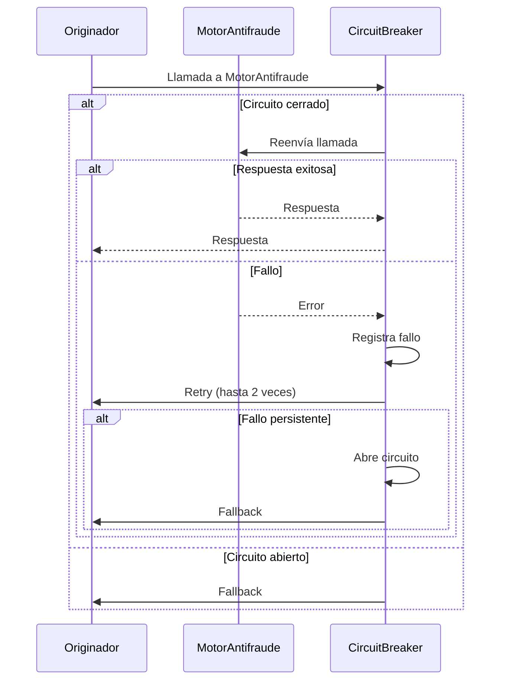

# ADR 004: Estrategias de Resiliencia y Manejo de Fallos

## Contexto

La solución de originación digital de préstamos debe manejar un volumen de 1,500 solicitudes por segundo en hora pico con un tiempo de respuesta máximo de 2 segundos y un SLA de 99.9%. Dado que la solución interactúa con múltiples sistemas externos (motor antifraude, buró de riesgos, core bancario, gateway de pagos, sistema de liquidación), es crítico implementar estrategias de resiliencia que mitiguen los fallos en estas dependencias sin comprometer la disponibilidad del sistema.

Los principales escenarios de fallo identificados incluyen:
- Latencia elevada en respuestas de sistemas externos.
- Fallos transitorios en conexiones de red.
- Indisponibilidad temporal de servicios externos.
- Sobrecarga en el sistema debido a picos de tráfico.

## Opciones Evaluadas

### Opción 1: Circuit Breaker con Retries y Fallback
- **Circuit Breaker**: Interrumpe temporalmente las llamadas a un servicio externo cuando se detectan fallos consecutivos, permitiendo que el sistema se recupere.
- **Retries**: Reintenta operaciones fallidas un número limitado de veces antes de activar el circuit breaker.
- **Fallback**: Proporciona una respuesta alternativa cuando el servicio externo no está disponible.

**Ventajas**:
- Reduce el impacto de fallos transitorios.
- Mejora la disponibilidad del sistema al evitar llamadas bloqueantes.
- Permite degradación elegante del servicio.

**Desventajas**:
- Complejidad adicional en la implementación.
- Requiere configuración precisa de umbrales y tiempos de espera.

### Opción 2: Timeout Fijo sin Circuit Breaker
- **Timeout**: Establece un tiempo máximo de espera para las respuestas de servicios externos.
- **Fallback**: Proporciona una respuesta alternativa si el timeout se excede.

**Ventajas**:
- Implementación sencilla.
- Reduce el riesgo de bloqueos prolongados.

**Desventajas**:
- No previene llamadas repetidas a servicios fallidos.
- Puede generar cascadas de fallos bajo alta carga.

### Opción 3: Colas de Mensajes con Reintentos Asíncronos
- **Colas**: Desacopla las llamadas a servicios externos mediante colas de mensajes.
- **Reintentos Asíncronos**: Los mensajes fallidos se reintentan en segundo plano.

**Ventajas**:
- Mejora la escalabilidad.
- Reduce la latencia percibida por el usuario.

**Desventajas**:
- Aumenta la complejidad operativa.
- No es adecuado para flujos síncronos críticos.

## Decisión

Se adopta la **Opción 1: Circuit Breaker con Retries y Fallback**, complementada con colas de mensajes para operaciones no críticas. Esta decisión se basa en:

1. **Requerimientos de SLA**: El circuit breaker permite cumplir con el SLA de 99.9% al evitar fallos en cascada.
2. **Latencia**: Los retries y fallbacks aseguran que el tiempo de respuesta no supere los 2 segundos.
3. **Degradación elegante**: El fallback proporciona una experiencia aceptable incluso cuando los servicios externos fallan.
4. **Compatibilidad con el dominio**: La originación de préstamos requiere respuestas síncronas para ciertas operaciones críticas (ej. validación de antifraude), lo que hace inviable un enfoque puramente asíncrono.

## Consecuencias

### Positivas
- **Disponibilidad**: El circuit breaker reduce el riesgo de indisponibilidad del sistema debido a fallos en dependencias externas.
- **Latencia**: Los retries y fallbacks aseguran que el tiempo de respuesta se mantenga dentro de los límites establecidos.
- **Experiencia del usuario**: La degradación elegante mejora la percepción del usuario durante fallos.

### Negativas
- **Complejidad**: La implementación requiere configuración precisa de umbrales, tiempos de espera y políticas de retry.
- **Monitoreo**: Se requiere un sistema de monitoreo robusto para detectar y alertar sobre fallos en los circuit breakers.
- **Pruebas**: Es necesario probar escenarios de fallo para validar la efectividad de las estrategias.

### Configuración Propuesta

| Parámetro               | Valor                  | Justificación                                                                                     |
|-------------------------|------------------------|---------------------------------------------------------------------------------------------------|
| Umbral de fallos        | 5                     | Número de fallos consecutivos antes de abrir el circuit breaker.                                |
| Ventana de tiempo       | 10 segundos           | Tiempo durante el cual se monitorean los fallos.                                                 |
| Timeout                 | 1 segundo             | Tiempo máximo de espera para una respuesta de un servicio externo.                              |
| Máximo de reintentos    | 2                     | Número máximo de reintentos antes de activar el fallback.                                        |
| Tiempo de espera entre reintentos | 200 ms       | Tiempo de espera exponencial entre reintentos (backoff exponencial).                            |

### Ejemplo de Implementación

### Fallbacks Propuestos

| Servicio Externo       | Fallback                                                                                     |
|------------------------|---------------------------------------------------------------------------------------------|
| Motor Antifraude       | Aprobar solicitud con riesgo bajo (ej. monto < $1,000) y marcar para revisión manual.      |
| Buró de Riesgos        | Usar score interno basado en datos históricos del cliente.                                  |
| Core Bancario          | Registrar solicitud en cola para procesamiento diferido.                                    |
| Gateway de Pagos       | Notificar al cliente que el pago se procesará en 24 horas.                                  |
| Sistema de Liquidación | Usar valores predeterminados para liquidación y ajustar posteriormente.                     |