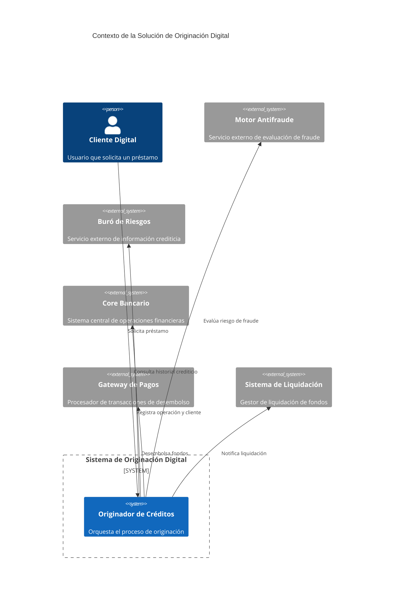

# Arquitectura de la Solución de Originación Digital de Préstamos

## 1. Introducción
Este documento describe la arquitectura de la solución de originación digital de préstamos diseñada para manejar 1,500 solicitudes por segundo en hora pico con un SLA de 99.9% y un tiempo de respuesta máximo de 2 segundos. La solución sigue un modelo basado en componentes con fronteras bien definidas y contratos claros entre ellos.

La arquitectura se estructura en tres vistas principales según el modelo C4:
- **Vista de Contexto**: Muestra la solución en relación con sus actores externos y sistemas adyacentes.
- **Vista de Contenedores**: Detalla los contenedores de ejecución y sus responsabilidades.
- **Vista de Componentes**: Desglosa los componentes clave dentro de cada contenedor y sus interacciones.

---

## 2. Vista de Contexto
La solución interactúa con los siguientes sistemas externos:
- **Cliente Digital**: Aplicación móvil/web que inicia las solicitudes de préstamo.
- **Motor Antifraude**: Servicio externo que evalúa el riesgo de fraude en las solicitudes.
- **Buró de Riesgos**: Servicio externo que proporciona información crediticia de los solicitantes.
- **Core Bancario**: Sistema central que registra las operaciones financieras y clientes.
- **Gateway de Pagos**: Sistema que procesa las transacciones de desembolso y pagos.
- **Sistema de Liquidación**: Sistema que gestiona la liquidación de fondos entre cuentas.



---

## 3. Vista de Contenedores
La solución se despliega en los siguientes contenedores:

| Contenedor               | Tecnología          | Responsabilidad                                                                 |
|--------------------------|---------------------|---------------------------------------------------------------------------------|
| **API Gateway**          | Kong                | Enrutamiento, autenticación, rate limiting y agregación de respuestas.         |
| **Originador de Créditos** | Spring Boot (Java)  | Orquesta el proceso de originación y coordina las interacciones con sistemas externos. |
| **Cache Distribuida**    | Redis               | Almacena datos temporales para reducir latencia en consultas frecuentes.       |
| **Cola de Eventos**      | Amazon SQS          | Gestiona la comunicación asíncrona entre componentes.                          |
| **Base de Datos**        | Amazon Aurora       | Persiste información de solicitudes, clientes y operaciones.                   |
| **Motor de Reglas**      | Drools              | Evalúa reglas de negocio para aprobación/rechazo de solicitudes.               |

```mermaid
C4Container
  title Contenedores de la Solución de Originación Digital

  System_Boundary(boundary, "Sistema de Originación Digital") {
    Container(api, "API Gateway", "Kong", "Enrutamiento, autenticación y rate limiting")
    Container(originador, "Originador de Créditos", "Spring Boot", "Orquesta el proceso de originación")
    Container(cache, "Cache Distribuida", "Redis", "Almacena datos temporales para reducir latencia")
    Container(cola, "Cola de Eventos", "Amazon SQS", "Comunicación asíncrona entre componentes")
    Container(db, "Base de Datos", "Amazon Aurora", "Persiste información de solicitudes y clientes")
    Container(reglas, "Motor de Reglas", "Drools", "Evalúa reglas de negocio para aprobación")
  }

  System_Ext(antifraude, "Motor Antifraude", "Servicio externo")
  System_Ext(buro, "Buró de Riesgos", "Servicio externo")
  System_Ext(core, "Core Bancario", "Sistema externo")
  System_Ext(gateway, "Gateway de Pagos", "Sistema externo")
  System_Ext(liquidacion, "Sistema de Liquidación", "Sistema externo")

  Rel(cliente, api, "Solicita préstamo")
  Rel(api, originador, "Rutea solicitud")
  Rel(originador, antifraude, "Evalúa riesgo de fraude")
  Rel(originador, buro, "Consulta historial crediticio")
  Rel(originador, core, "Registra operación")
  Rel(originador, reglas, "Evalúa reglas de negocio")
  Rel(originador, cache, "Consulta datos temporales")
  Rel(originador, cola, "Publica eventos")
  Rel(originador, db, "Persiste datos")
  Rel(originador, gateway, "Desembolsa fondos")
  Rel(originador, liquidacion, "Notifica liquidación")
```

---

## 4. Vista de Componentes (Originador de Créditos)
El contenedor **Originador de Créditos** se compone de los siguientes componentes:

| Componente                     | Responsabilidad                                                                 |
|--------------------------------|---------------------------------------------------------------------------------|
| **Orquestador**                | Coordina el flujo de originación y maneja las interacciones con sistemas externos. |
| **Servicio de Solicitudes**    | Gestiona la creación, actualización y consulta de solicitudes de préstamo.      |
| **Servicio de Clientes**       | Gestiona la información de clientes y su historial.                             |
| **Servicio de Evaluación**     | Invoca al motor antifraude, buró de riesgos y motor de reglas para evaluar la solicitud. |
| **Servicio de Desembolso**     | Coordina el desembolso de fondos a través del gateway de pagos.                 |
| **Servicio de Notificaciones** | Envía notificaciones a sistemas externos (liquidación) y al cliente.            |
| **Repositorio**                | Persiste y recupera datos de la base de datos.                                  |
| **Cliente Antifraude**         | Invoca al motor antifraude externo.                                             |
| **Cliente Buró**               | Invoca al buró de riesgos externo.                                              |
| **Cliente Core Bancario**      | Invoca al core bancario para registrar operaciones.                             |
| **Cliente Gateway de Pagos**   | Invoca al gateway de pagos para desembolsar fondos.                             |

```mermaid
C4Component
  title Componentes del Originador de Créditos

  Container_Boundary(originador, "Originador de Créditos") {
    Component(orquestador, "Orquestador", "", "Coordina el flujo de originación")
    Component(solicitudes, "Servicio de Solicitudes", "", "Gestiona solicitudes de préstamo")
    Component(clientes, "Servicio de Clientes", "", "Gestiona información de clientes")
    Component(evaluacion, "Servicio de Evaluación", "", "Evalúa solicitudes con sistemas externos")
    Component(desembolso, "Servicio de Desembolso", "", "Coordina desembolso de fondos")
    Component(notificaciones, "Servicio de Notificaciones", "", "Envía notificaciones")
    Component(repositorio, "Repositorio", "", "Persiste y recupera datos")
    Component(antifraudeClient, "Cliente Antifraude", "", "Invoca motor antifraude")
    Component(buroClient, "Cliente Buró", "", "Invoca buró de riesgos")
    Component(coreClient, "Cliente Core Bancario", "", "Invoca core bancario")
    Component(gatewayClient, "Cliente Gateway de Pagos", "", "Invoca gateway de pagos")
  }

  Rel(orquestador, solicitudes, "Gestiona solicitudes")
  Rel(orquestador, clientes, "Gestiona clientes")
  Rel(orquestador, evaluacion, "Evalúa solicitud")
  Rel(orquestador, desembolso, "Coordina desembolso")
  Rel(orquestador, notificaciones, "Envía notificaciones")
  Rel(solicitudes, repositorio, "Persiste datos")
  Rel(clientes, repositorio, "Persiste datos")
  Rel(evaluacion, antifraudeClient, "Evalúa fraude")
  Rel(evaluacion, buroClient, "Consulta buró")
  Rel(evaluacion, reglas, "Evalúa reglas")
  Rel(desembolso, gatewayClient, "Desembolsa fondos")
  Rel(notificaciones, cola, "Publica eventos")
  Rel(orquestador, coreClient, "Registra operación")
```

---

## 5. Fronteras y Contratos
### 5.1. Contratos de API (OpenAPI)
Los contratos de API definen las interfaces entre el **Originador de Créditos** y los sistemas externos, así como entre los componentes internos. Los principales endpoints incluyen:
- `POST /solicitudes`: Crea una nueva solicitud de préstamo.
- `GET /solicitudes/{id}`: Consulta el estado de una solicitud.
- `POST /clientes`: Registra un nuevo cliente.
- `GET /clientes/{id}`: Consulta información de un cliente.

Ejemplo de payload para `POST /solicitudes`:
```yaml
{
  "clienteId": "12345",
  "monto": 5000,
  "plazo": 12,
  "tipoPrestamo": "PERSONAL",
  "datosPersonales": {
    "nombre": "Juan Pérez",
    "identificacion": "123456789",
    "ingresos": 3000
  }
}
```

### 5.2. Contratos de Eventos (AsyncAPI)
Los eventos se publican en la **Cola de Eventos** para notificar cambios de estado en las solicitudes. Los principales eventos incluyen:
- `SolicitudCreada`: Se publica cuando se crea una nueva solicitud.
- `SolicitudEvaluada`: Se publica cuando la solicitud ha sido evaluada.
- `SolicitudAprobada`: Se publica cuando la solicitud es aprobada.
- `FondosDesembolsados`: Se publica cuando los fondos han sido desembolsados.

Ejemplo de payload para `SolicitudAprobada`:
```yaml
{
  "solicitudId": "67890",
  "clienteId": "12345",
  "monto": 5000,
  "fechaAprobacion": "2023-10-01T12:00:00Z"
}
```

---

## 6. Atributos de Calidad y Métricas
La solución debe cumplir con los siguientes atributos de calidad, definidos mediante escenarios, métricas y umbrales:

| Atributo          | Escenario                                                                 | Métrica                          | Umbral               |
|-------------------|---------------------------------------------------------------------------|----------------------------------|----------------------|
| **Disponibilidad** | El sistema debe estar disponible para procesar solicitudes en hora pico. | Porcentaje de tiempo disponible  | 99.9% mensual        |
| **Latencia**      | El sistema debe responder en menos de 2 segundos en el 95% de las solicitudes. | Percentil 95 de tiempo de respuesta | < 2 segundos       |
| **Throughput**    | El sistema debe procesar 1,500 solicitudes por segundo en hora pico.      | Solicitudes por segundo          | 1,500 RPS            |
| **Escalabilidad** | El sistema debe escalar horizontalmente para manejar picos de carga.     | Número de instancias             | 10-50 instancias     |
| **Resiliencia**   | El sistema debe manejar fallos en sistemas externos sin afectar la disponibilidad. | Porcentaje de solicitudes exitosas | 99.9%             |
| **Seguridad**     | El sistema debe autenticar y autorizar todas las solicitudes.             | Porcentaje de solicitudes autenticadas | 100%          |

---

## 7. Trade-offs y Decisiones de Diseño
### 7.1. Sincronía vs. Asincronía
- **Decisión**: Usar comunicación síncrona para las interacciones críticas (ej. evaluación de fraude y buró de riesgos) y asíncrona para las no críticas (ej. notificaciones y liquidación).
- **Trade-off**: La comunicación asíncrona mejora la escalabilidad y resiliencia, pero introduce complejidad en el manejo de estados y eventual consistencia.

### 7.2. Caché Distribuida
- **Decisión**: Usar Redis para cachear datos temporales como el historial crediticio de clientes.
- **Trade-off**: Reduce la latencia en consultas frecuentes, pero requiere estrategias de invalidación para mantener la consistencia.

### 7.3. Cola de Eventos
- **Decisión**: Usar Amazon SQS para gestionar la comunicación asíncrona entre componentes.
- **Trade-off**: Mejora la resiliencia al desacoplar componentes, pero introduce latencia adicional en el procesamiento de eventos.

### 7.4. Motor de Reglas
- **Decisión**: Usar Drools para evaluar reglas de negocio complejas.
- **Trade-off**: Permite flexibilidad en la definición de reglas, pero aumenta la complejidad operativa y requiere mantenimiento especializado.

---

## 8. Riesgos y Mitigaciones
| Riesgo                                                                 | Impacto | Probabilidad | Mitigación                                                                 |
|------------------------------------------------------------------------|---------|--------------|----------------------------------------------------------------------------|
| Fallo en el Motor Antifraude o Buró de Riesgos                         | Alto    | Media        | Implementar circuit breakers y reintentos con backoff exponencial.       |
| Sobrecarga en la Base de Datos durante hora pico                        | Alto    | Alta         | Usar réplicas de lectura y caché distribuida para reducir carga.          |
| Latencia alta en el Gateway de Pagos                                   | Medio   | Media        | Implementar colas de prioridad para procesar desembolsos críticos primero. |
| Inconsistencia en datos debido a eventual consistencia en eventos      | Medio   | Baja         | Usar patrones de compensación para manejar inconsistencias.               |
| Fallo en el despliegue de nuevas versiones del Originador de Créditos  | Alto    | Baja         | Implementar despliegues blue-green y pruebas automatizadas.              |

---

## 9. Estrategia de Migración
La solución se desplegará en paralelo con el sistema actual durante un período de convivencia. La estrategia incluye:
1. **Fase 1**: Despliegue de la nueva solución en un entorno aislado para pruebas de carga y validación funcional.
2. **Fase 2**: Migración gradual de clientes al nuevo sistema, comenzando con un grupo piloto.
3. **Fase 3**: Monitoreo continuo de métricas clave (throughput, latencia, errores) durante la migración.
4. **Fase 4**: Retiro del sistema legado una vez que el nuevo sistema alcance el 100% de adopción.

---

## 10. Conclusión
La arquitectura propuesta cumple con los requerimientos funcionales y no funcionales del sistema de originación digital, incluyendo el manejo de 1,500 solicitudes por segundo, un SLA de 99.9% y un tiempo de respuesta máximo de 2 segundos. La solución se basa en componentes desacoplados con contratos claros, lo que facilita la escalabilidad, resiliencia y mantenimiento. Los trade-offs identificados se mitigan mediante estrategias como caché distribuida, colas de eventos y circuit breakers, asegurando que la solución sea robusta y adaptable a cambios futuros.